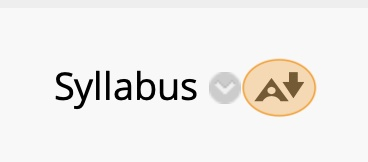
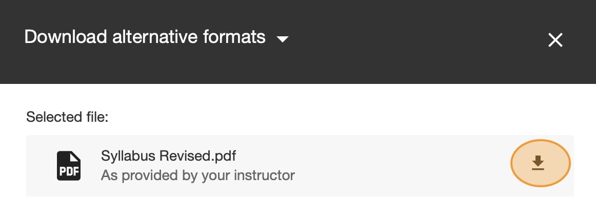

# Access the Syllabus
A course syllabus is a road map for a class, outlining its structure, expectations, policies, and schedule, serving as a contract between instructor and students. It details learning objectives, required materials (textbooks, software), assignment deadlines, grading criteria, and instructor contact info, helping students manage time and stay organized for success. 

1. Navigate to the Digital Earth course on [eLearning.utdallas.edu](elearning.utdallas.edu){:target="_blank"}.

2. On the course homepage, click the **Syllabus** item. 

3. eLearning will open the syllabus file in your browser. You can always come here to quickly review the syllabus when necessary

4. Click the `A` icon next to the Syllabus title (stands for "Alternative Formats").
    

5. Click the download icon next to the PDF file. Save the syllabus in your `digital-earth` folder. 

    

# Complete the Syllabus Quiz

1. Read the Syllabus in its entirety. This document goes over all the course policies and important deadlines for the course. 

    It is critical that you read the full Syllabus, not an AI summary of the syllabus. This document details all important information you need to be successful in the course

2. In the Digital Earth eLearning course, click on `Quizes and Exams` in the sidebar.

3. Click the "Syllabus Quiz" item and review the instructions. Click **Begin** when you are ready to start the quiz.

4. Complete and submit the quiz, using the Syllabus document to find the answers to the questions.

# Check your grade

1. In the Digital Earth eLearning course, click `My Grades` in the sidebar.

2. Find the Syllabus Quiz item and check your grade. If your grade is not 100%, go back and re-take the quiz until you score 100%.

3. Take a screenshot of your `My Grades` page that includes your 100% Syllabus quiz grade. Add this screenshot to your lab report document.