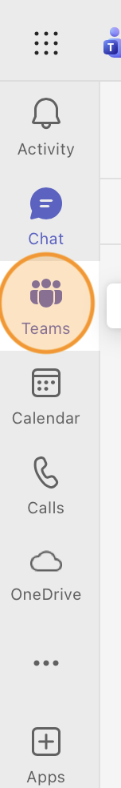
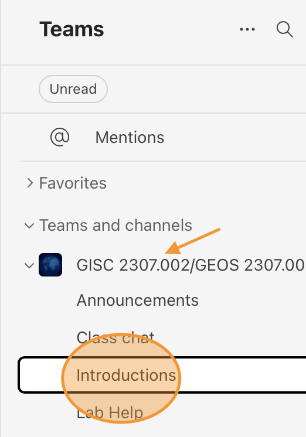
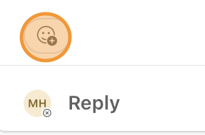
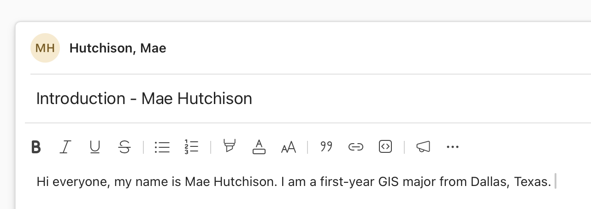
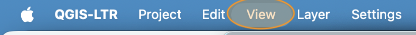
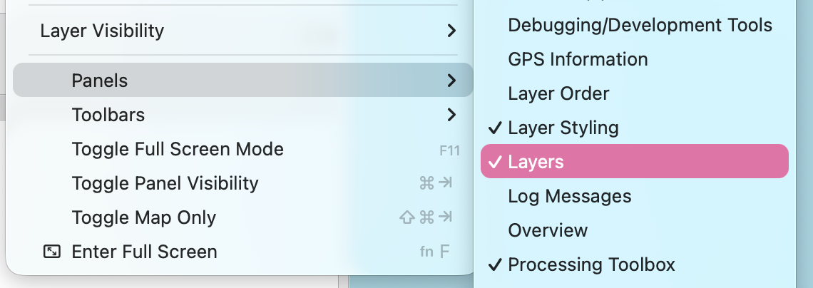
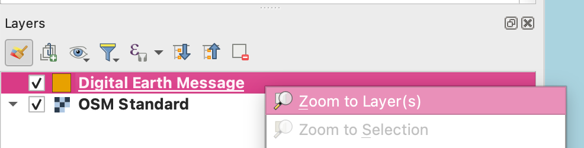

# Class Microsoft Teams Chat
Throughout the semester you can use the class Microsoft Teams Chat to ask questions, get help with your assignments, and study for exams.

1. In your web browser, go to [https://teams.microsoft.com/](https://teams.microsoft.com/)

    **If you are prompted to sign in, use your UT Dallas login the same way you log in to your student email (NetID@utdallas.edu)**

2. On the side bar, click the **Teams** icon

    

3. Find the GISC 2307 Team. There are multiple channels:
    * Announcements - Important class announcements will be posted here

    * Class Chat - Here you can chat with your classmates about any academic related topic

    * Introductions - This chanel is for introducing yourself

    * Lab Help - This channel is for chatting with your classmates and Teaching Assistants about any issues you have with the lab assignments.

    Click on the **Introductions** channel.

    

4. Take some time to read any introductions that are currently in the channel. Practice *reacting* to a message with an emoji by clicking the face icon and selecting an appropriate emoji.

    

5. **Post a <u>short</u> introduction of yourself** in the Introductions channel. At a minimum your introduction should include:
    - your full name
    - your year in school (e.g. first-year, freshman)
    - your major
    - your home city and state/country

    *Optional*: You are welcome to include clubs, hobbies, and career interests in your introduction if you would like.

    
    
6. Take a screenshot of the message you sent in the teams channel and paste it in your lab report. 
    **The screenshot should just be of your message, not an image of your whole computer screen**

    If you don't remember how to take a cropped screenshot, you can watch a tutorial on the [Resources](../../resources) page

# Quantumn Geospatial Information System (QGIS)

QGIS is the mapping software we will use for most assignments this semester. It is **very important** that you install this software in the first week of class so that we can address any issues you may run in to. The installation can take up to **1 hour** to complete.

If you have not installed QGIS yet, do that first before proceeding with this section of the lab. You can find installation instructions for your computer's operating system on our [Software](../../software) page.

1. Navigate to your `lab0` folder that you created in the [set up](part1) section.

2. If QGIS installed correctly, you should see a green icon next to the `scavenger_hunt.qgz` project file. **Double click** this file to open it.

3. QGIS should open automatically. This may take a few seconds to fully open and load the file.

4. In the Menu Bar, click **View**, then hover over the **Panels** options and make sure the **Layers** Panel is checked.
    
    

5. In the Layers panel **Right Click** on the `Digital Earth Message` Layer and select "Zoom to Layer".

    *If you are using a laptop with a trackpad and no mouse button, most laptops use a two-finger click to "right-click"*

    

6. Take a screenshot of your QGIS window with the `scavenger_hunt.qgz` project open and the Digital Earth Message layer visible, and paste the image in your lab report.