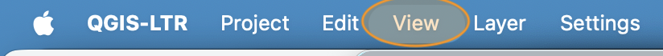
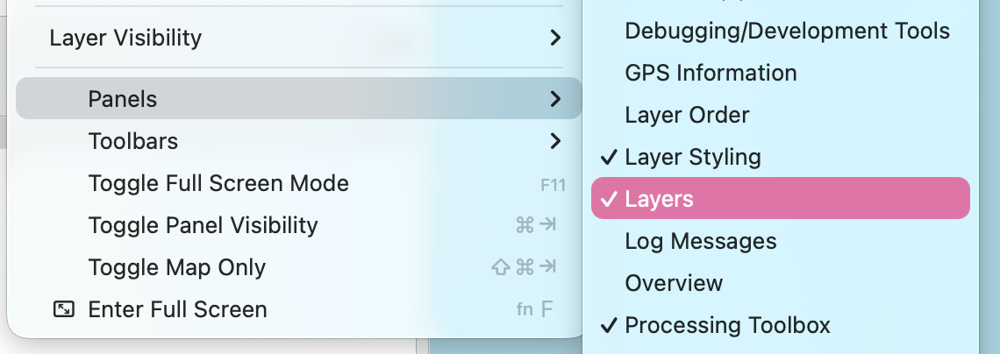
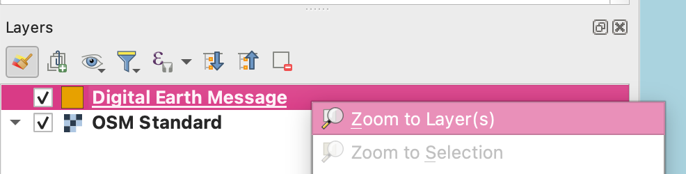

# Class Discussions
Throughout the semester you can use the class discussions to ask questions, get help with your assignments, and study for exams.

1. Navigate to the Digital Earth course at [https://utdallas.instructure.com/](https://utdallas.instructure.com/)

2. On the side bar, click **Discussions** 

3. Find the two pinned discussions:

    * Introductions - This channel is for introducing yourself

    * Class Q&A and Lab Help - This channel is for chatting with your classmates and Teaching Assistants about any issues you have with the lab assignments or questions about the class.

    Click on the **Introductions** discussion.

4. Take some time to read any introductions that are currently in the discussion. You can also reply to any classmates who have shared interests to connect with them.

5. **Post a <u>short</u> introduction of yourself** in the Introductions channel. At a minimum your introduction should include:
    - your first name or nickname (how you would like to be called in class)
    - your year in school (e.g. first-year, freshman)
    - your major
    - your home city and state/country
    - why you registered for this class

    *Optional*: You are welcome to include clubs, hobbies, and career interests in your introduction if you would like.
    
6. Take a screenshot of the message you posted in the discussion and paste it in your lab report. 
    **The screenshot should just be of your message, not an image of your whole computer screen**

    If you don't know how to take a cropped screenshot, you can watch a tutorial on the [Resources](../../resources) page

# Quantum Geospatial Information System (QGIS)

QGIS is the mapping software we will use for most assignments this semester. It is **very important** that you install this software in the first week of class so that we can address any issues you may run in to. The installation can take up to **1 hour** to complete.

If you have not installed QGIS yet, do that first before proceeding with this section of the lab. You can find installation instructions for your computer's operating system on our [Software](../../software) page.

1. Navigate to your `lab00` folder that you created in the [set up](part1) section.

2. If QGIS installed correctly, you should see a green icon next to the `scavenger_hunt.qgz` project file. **Double click** this file to open it.

   If you can't see the `.qgz` at the end of the file, that means you do not have file extensions visible. **It is highly recommended that you turn on file extension display for this course.** You can watch a tutorial on how to do this on the [Resources](../../resources) page

4. QGIS should open automatically. This may take a few seconds to fully open and load the file.

5. In the Menu Bar, click **View**, then hover over the **Panels** options and make sure the **Layers** Panel is checked.
    
    

6. In the Layers panel **Right Click** on the `Digital Earth Message` Layer and select "Zoom to Layer".

    *If you are using a laptop with a track pad and no mouse button, most laptops use a two-finger click to "right-click"*

    

7. Take a screenshot of your QGIS window with the `scavenger_hunt.qgz` project open and the Digital Earth Message layer visible, and paste the image in your lab report.
