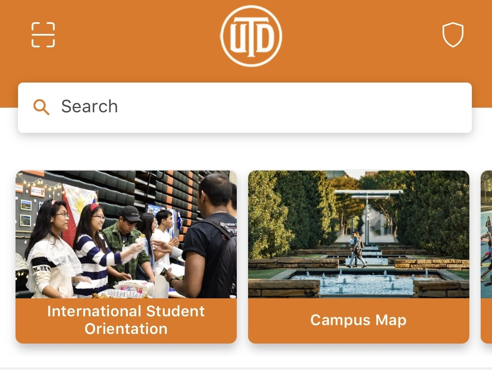
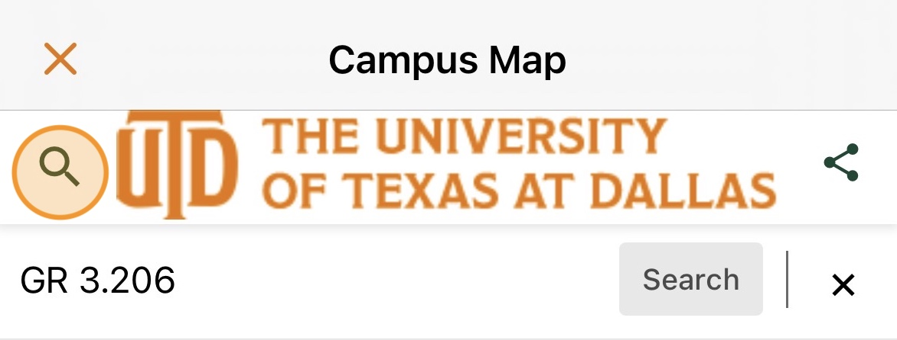
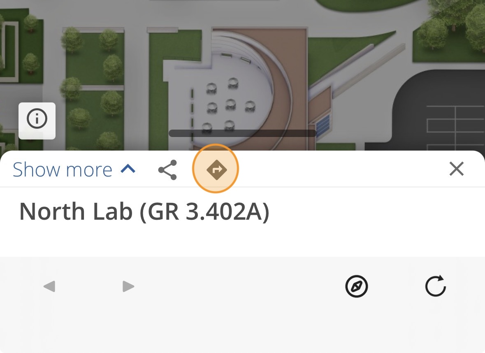

# Find locations and plan a route
You can use the UT Dallas online interactive map to easily find rooms on campus.

1. On your computer, navigate to [https://map.utdallas.edu](https://map.utdallas.edu){:target="_blank"} in your browser. 

2. In the search bar, search for the **room number** of each of the scavenger hunt locations. Not all named rooms have their name in the UT Dallas map, so it's best to allways search by room number. A UTD room number consists of a building code (two letters) followed by the floor number, a decimal point, and then a room number. Make sure to include the **full** room identifier when searching for each room.

    Find all four of these locations on the online map

    Computer Labs in Green Hall with QGIS:
    - Arlington Lab, room GR 3.206
    - Dallas North Lab, room GR 3.402A

    Technology Support Desks:
    - TechKnowlogy Bar, room SU 1.204
    - Sonora Lab Service Desk, room MC 1.314

3. Make a plan for the order you will go to each location based on where each room is on campus. You may also want to check the available hours that each location is open.

    - Green Hall Computer lab hours will be posted on eLearning, and are posted outside the door of each lab.
    - TechKnowlogy Bar Hours: [https://oit.utdallas.edu/servicedesk/techknowledgybar/](https://oit.utdallas.edu/servicedesk/techknowledgybar/){:target="_blank"}
    - Service Desk Hours: [https://oit.utdallas.edu/servicedesk/service-desk-hours/](https://oit.utdallas.edu/servicedesk/service-desk-hours/){:target="_blank"}

# Navigate using the UT Dallas map on mobile
Next we will learn how to navigate to the locations using a smartphone.

1. On your smartphone, download the UT Dallas app from the App store or Google Play store.
    

2. Once installed, open the app and tap on the Campus Map icon.
    

3. Tap on the magnifying glass to open the search bar, then type in the *room number* of the first location you want to go to and select the room.
    **Double check that the room number is correct before you select it**
    

4. Click the arrow directions icon. Enter your starting point (the easiest way is to select "Use my location" if your location settiings are enabled). You can also enter the room number for your current location instead. 
    

5. Click **Begin Route** and follow the directions to find the selected location.

6. Take a photo of yourself at the location. Make sure your face and the location are clearly visible.
    - When visiting the computer labs, make sure that you can access the lab with your Comet Card and are able to log in to the computers.
    - **DO NOT** enter the Green Hall computer labs when a class is in session in the lab. You must wait until outside of class hours to use the lab.

7. Repeat steps 2 through 6 for the remaining three locations.

8. Add your photos to your lab report. If you aren't sure how to tranfer photos from your phone to your computer, you can use the instructions on the class [Resources](../../resources) page. **Make sure to label each photo and resize each photo appropriately so that it fits on the page**