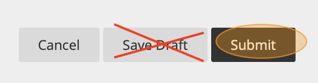

# Submit your lab report

1. Use the checklist at the top of the report document to double check that you completed all required items. Type your initials next to each item that you successfully completed. If there were any items you were unable to complete, do not write your initials next to that item.

2. Save and close your lab report document.

3. In the Digital Earth eLearning course, navigate to the Assignments > Lab 0 - Scavenger Hunt folder.

4. Click the "Lab 0 Report" item to open the assignment submission page.

5. Click "Upload files" then click "Browse Local Files". Navigate to your `Lab0` folder and select your completed `Lab_0_Report.docx` file. Click **Upload**.

6. Click **Submit** to submit the assignment. DO NOT click "Save Draft" as this will make it look like you have submitted the assignment but will not allow the Teaching Assistants to see or grade your assignment. 

    

7. If the submission is successful you should see a confirmation banner at the top of the page and you will receive a confirmation email. **If you did not receive a confirmation email, the assignment did not submit successfully**

    Always save your confirmation emails for your records until final grades are posted at the end of the semester. 

8. If you made any mistakes in the submission, you can always re-submit for no penalty until the assignment deadline. **Only the last submission is graded**.
