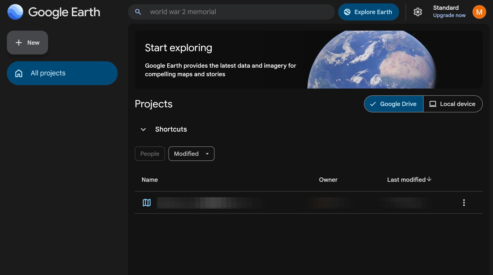
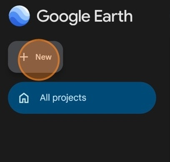
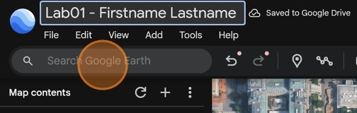
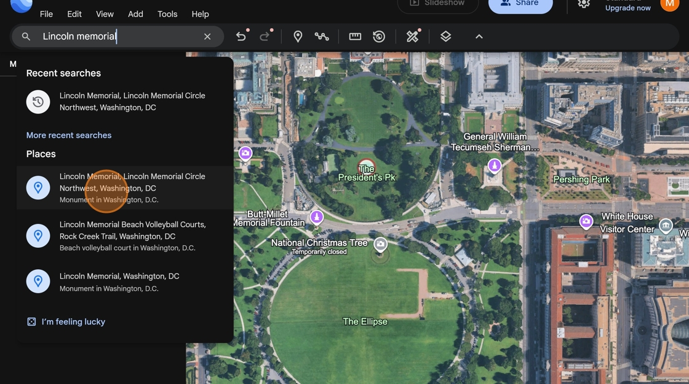
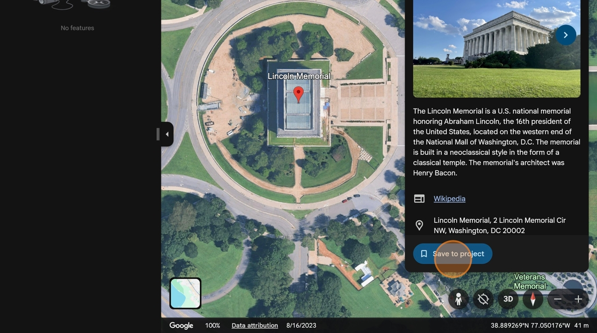
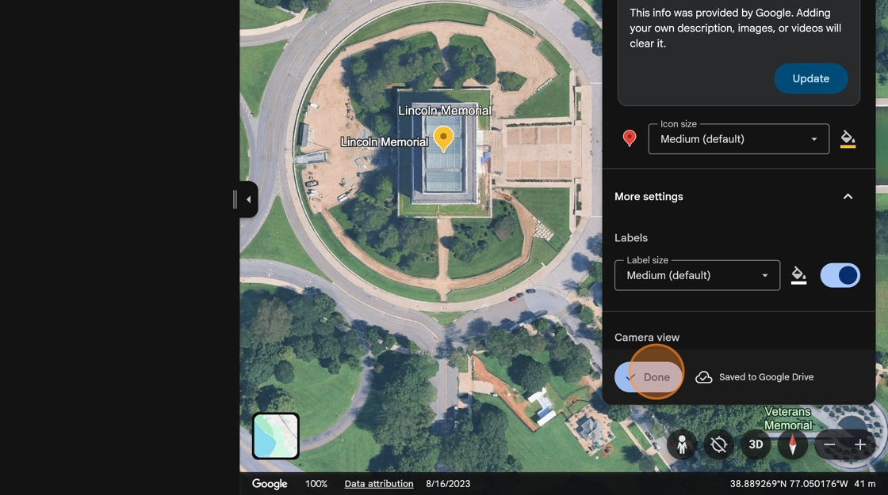
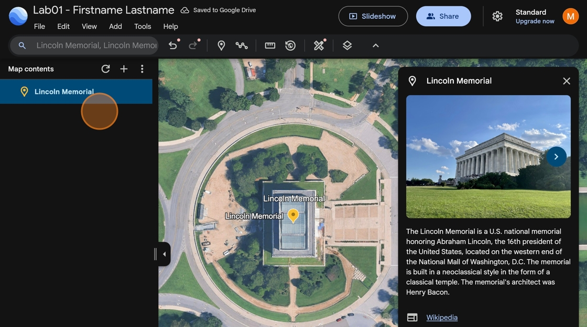

# How to create a new Google Earth project
**Before starting, make sure you have a Google account**

1. Navigate to [https://earth.google.com/web](https://earth.google.com/web/){:target="_blank"}. Sign in to your Google account if you haven't already.

    

2. Click **New**

    

3. Click **New project**

    

4. Click the title field.

    

5. Type "Lab01 - *Firstname Lastname*". Replace *Firstname* and *Lastname* with **your** first name and last name.

    

# How to add points to your project

1. Click **search Google Earth**.

    

2. Type "Lincoln Memorial" and click the Monument in Washington, D.C.

    

3. Click **Save to project**.

    

4. Click **"Done"** to save the point information.

    

5. Now the Lincoln Memorial has been added to your map project

    

6. **Add these five points** located in Washington, DC to your map project:

    - Lincoln Memorial
    - The White House
    - Washington Monument
    - United States Capitol
    - Thomas Jefferson Memorial

7. Take a screenshot of your **map view** (not the Map Contents) showing the locations of all five points and add it to your report.