# How to use map controls

1. Click the compass icon to show heading and tilt controls

    

2. Drag the Heading and Tilt bars to adjust the camera's heading and tilt.

3. Scroll with your mouse to zoom in and out.

4. Click **Reset to north** to set the Heading to 0°

    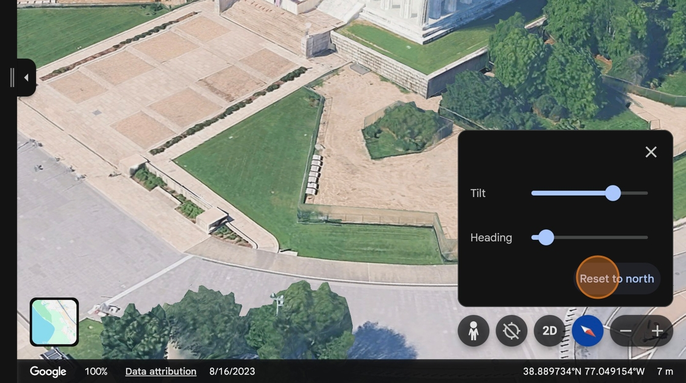

    If you can't see the 3D models of buildings and trees, check that 3D buildings are turned on by going to View &gt; Base map settings &gt; 3D Buildings and make sure the toggle is on.

5. Click the **Settings** gear icon.

    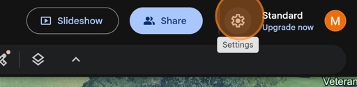

6. Turn on **On-screen navigation controls**, then click **Done**

    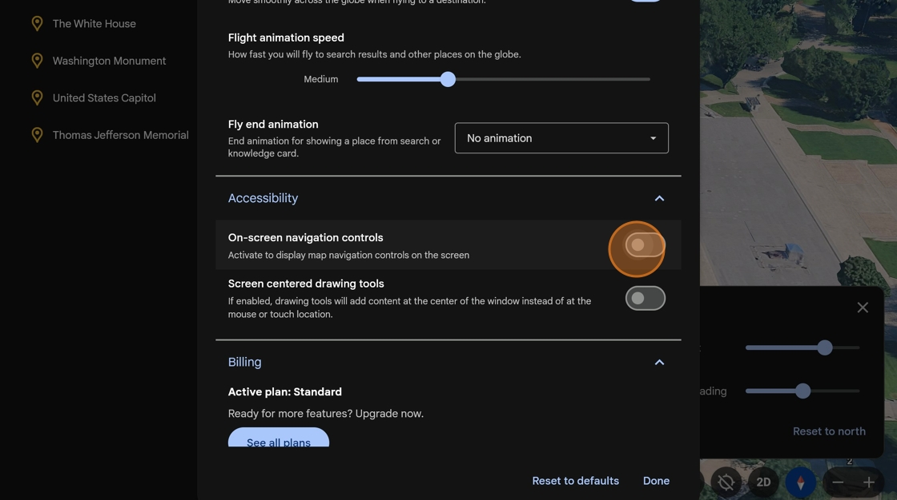

7. Now, there's a navigation controls option on our screen. **Click it** to open the Nav Control Panel.

    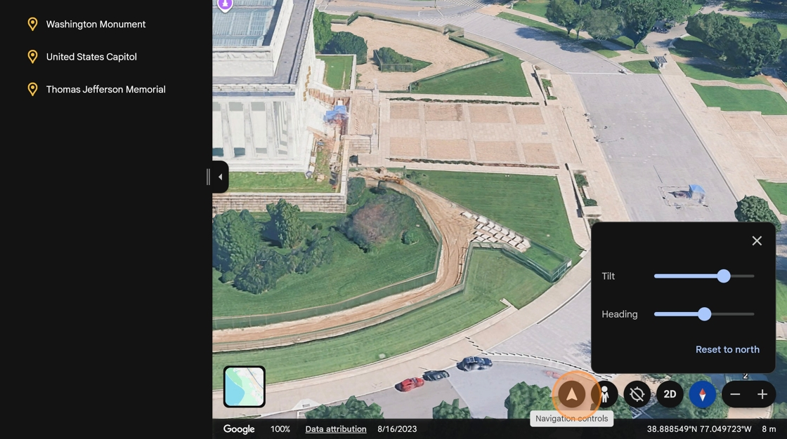

8. Practice using the controls to navigate the map.

    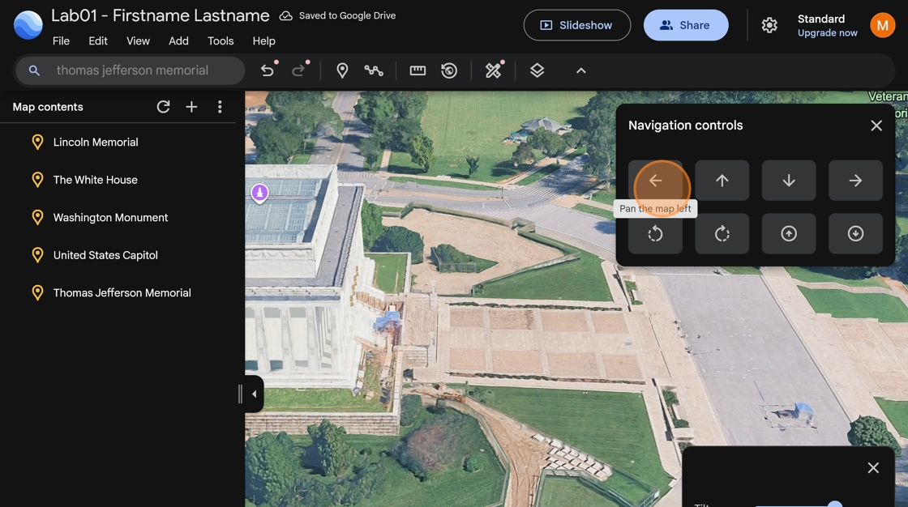

    Tip! To control the camera without on-screen controls, hold the **control (ctrl)** key and drag your mouse. You can tilt the map by holding the **shift** key and dragging your mouse

9. Navigate the map so that you can see the 3D model of Abraham Lincoln inside the memorial.

    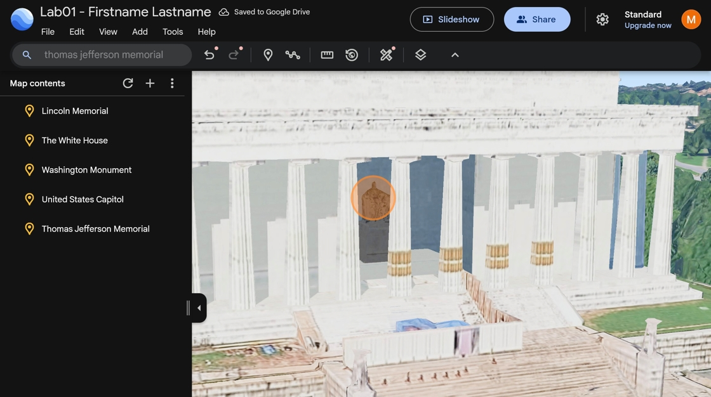

# How to save a camera view to a point

1. With your camera still pointed at the inside of the memorial, click the Lincoln Memorial point in the Map Contents.

    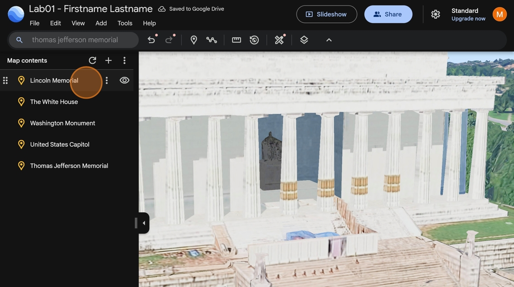

1. Click **Edit**.

    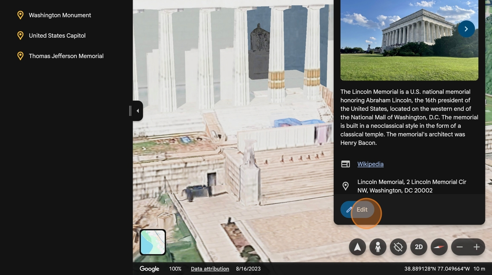

2. Scroll down in the options and then click **capture this** **view.**

    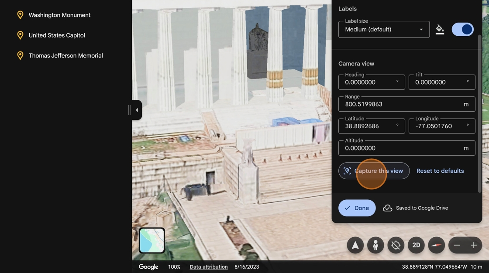

3. Notice the camera information has changed.

    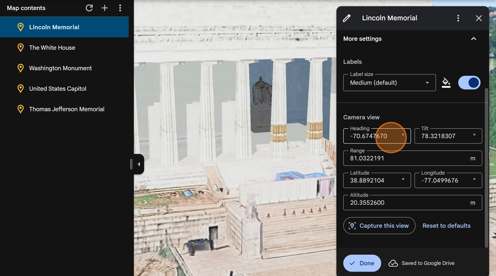

4. Click **done** to save the view

    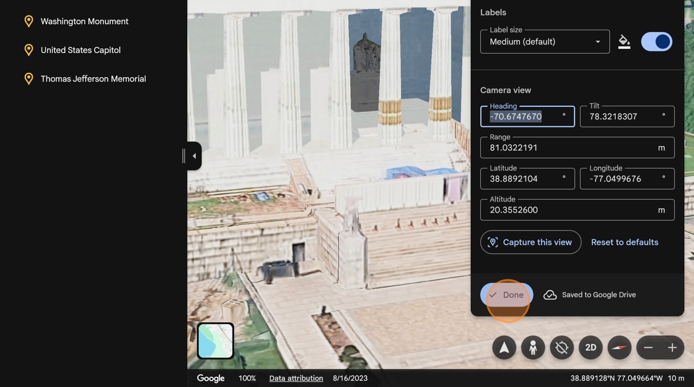

5. Now zoom out to look at the wider city.

    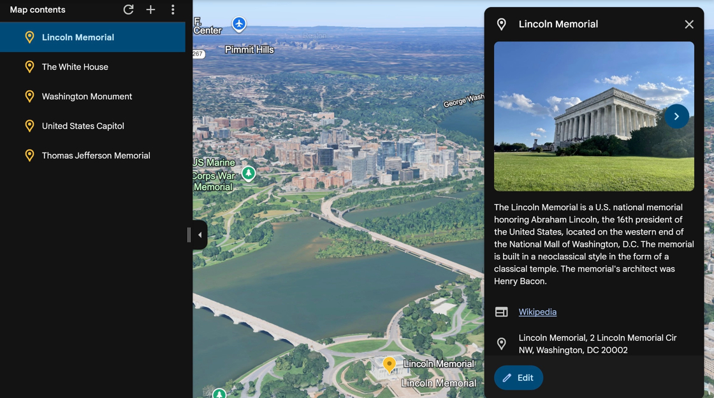

6. Click the three dots next to the Lincoln Memorial point in the contents menu, and then click **zoom to fit**. The camera pans back to our original view that we saved just a minute ago.

    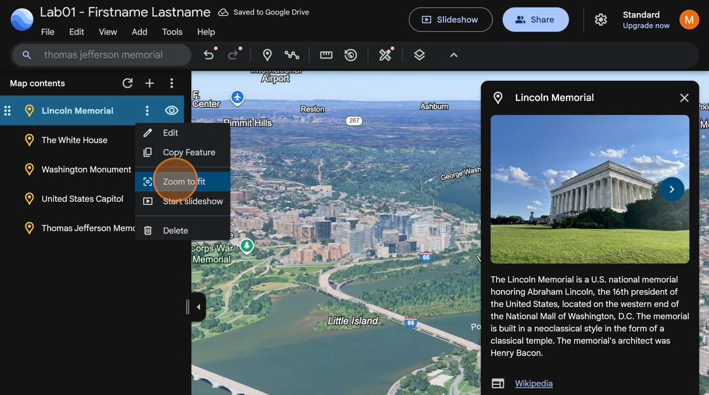

7. **Take a screenshot** of the Lincoln Memorial 3D model so that you can see the model of the statue inside. Paste this image in your lab report.