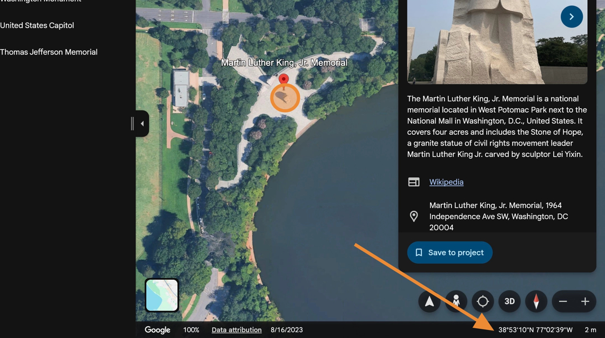
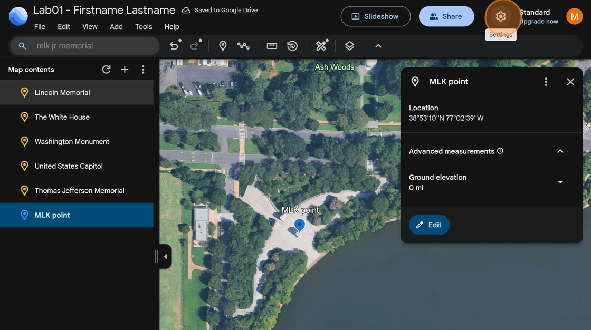
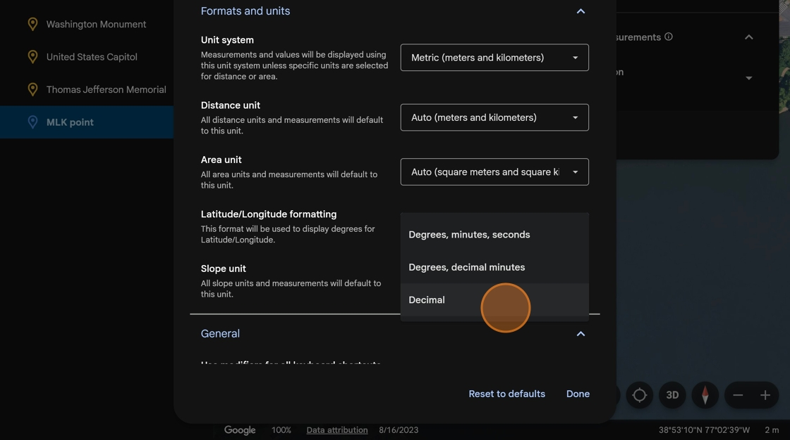
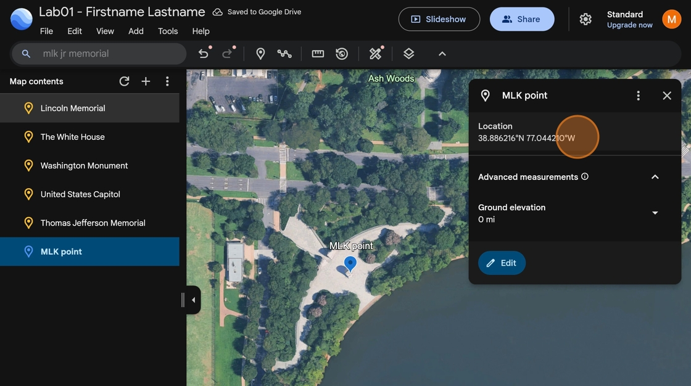
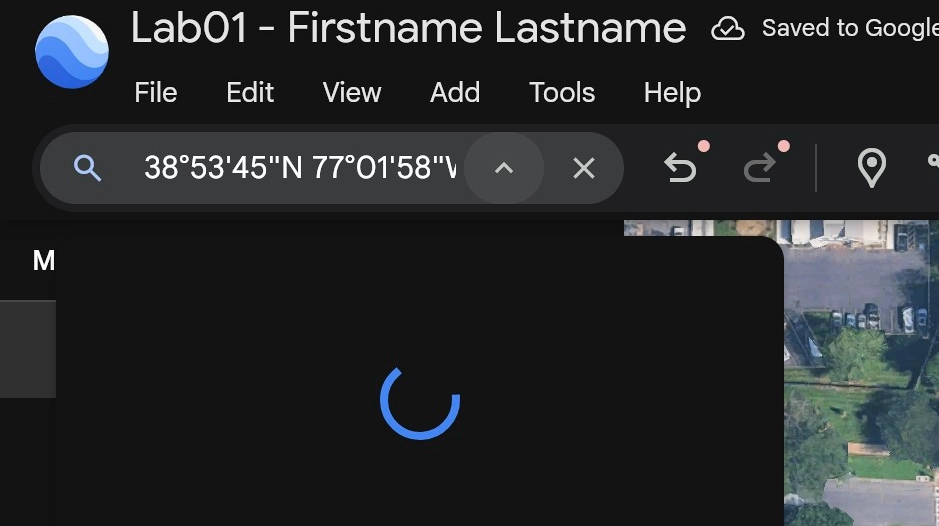

# How to find the coordinates of a selected point

1. In the search bar of your Google Earth project, search for **MLK Jr Memorial**

2. When we hover over the memorial, we can see the coordinates in the bottom right of the screen.

    

3. Click the **add place mark** icon (map pin icon) in the toolbar. Place the pin as close the monument as possible.

4. Name your point and click done.

5. Click the location coordinates to copy them to your clipboard

    

    Pay Attention! Google Earth, like most navigational map systems, lists coordinates in the order of Latitude (y-value), then Longitude (x-value)
    

6. Add the Latitude and Longitude of the **MLK Jr. Memorial** and the **Watergate Hotel** to your lab report, **using Degrees, minutes, and seconds notation**

Watch Out! Before you **save** the point, the coordinates displayed in the edit menu will always be displayed in **decimal degrees**, regardless of your preferred units you have selected in settings.

# How to change your preferred units

1. Click the settings gear.

    

2. Scroll down to Latitude/Longitude formatting and select **Decimal.**  Click **Done** to save this setting. Now points will be displayed in **Decimal Degrees**.

    

3. Close and reopen the point to reset the coordinate display.

    

    Pay attention! Google Earth displays decimal degrees with cardinal directions instead of signs (+/-). Remember that **North and East** correspond to **positive (+) signs** and **South and West** correspond to **negative signs (-)**

    Tip! If you can't remember which sign corresponds with a direction, click the **Edit** button to see the raw values of the point coordinates which use +/- signs.
    

4. Add the coordinates to your lab report for the **World War II memorial** and the **Pentagon** in **signed decimal degrees**

# How to find a point using coordinates

1. You can also search directly by coordinates. Try searching **38°53'45"N 77°01'58"W**

    

    Tip! If you are using a Mac, you can easily type the ° symbol by pressing **option+shift+8** at the same time on your keyboard.
    

2. Notice that Google Earth plots the point for us. We can see the nearest place name is the **World War I Memorial**

    

3. Add the place names for the below coordinates to your lab report:

- 38°53'45"N 77°01'58"W
- +38.887929° -77.012898°

Both points are in the **Washington D.C. area.** If you end up in another part of the world, you may have copied the points incorrectly or in the reverse order.
