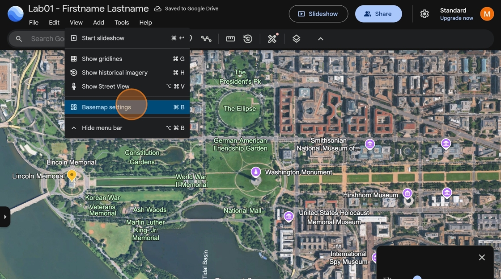
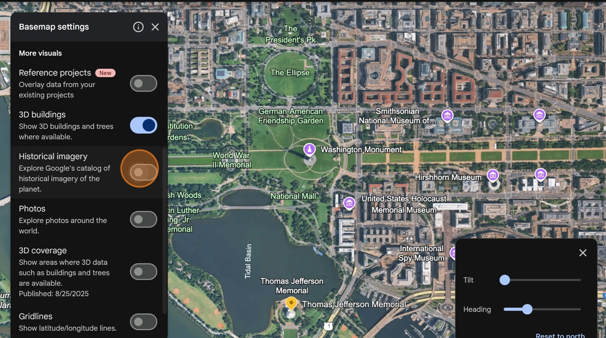
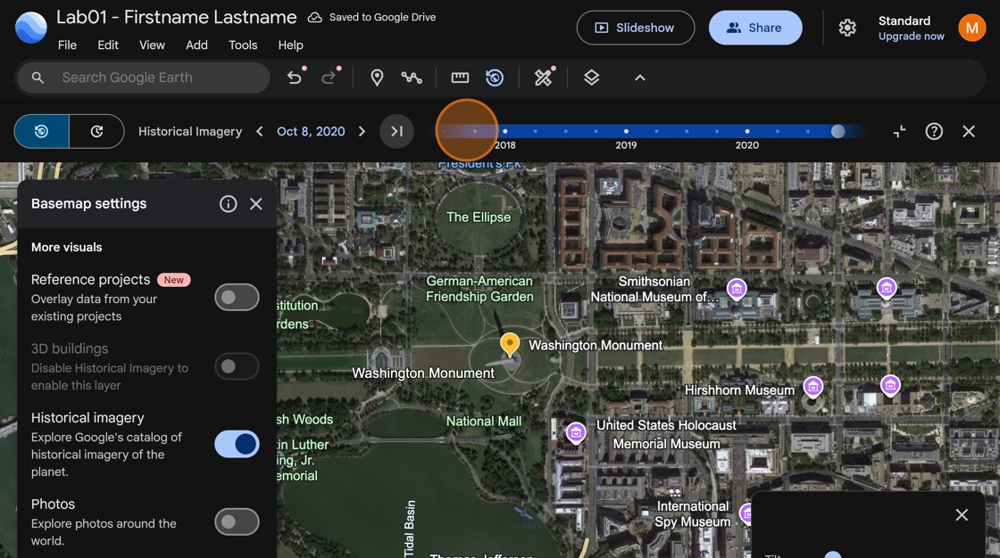
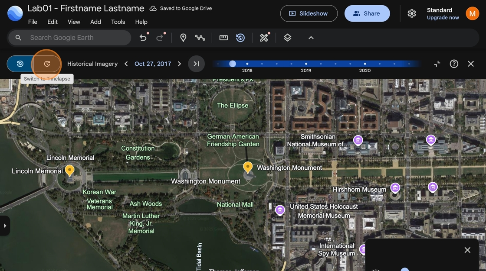
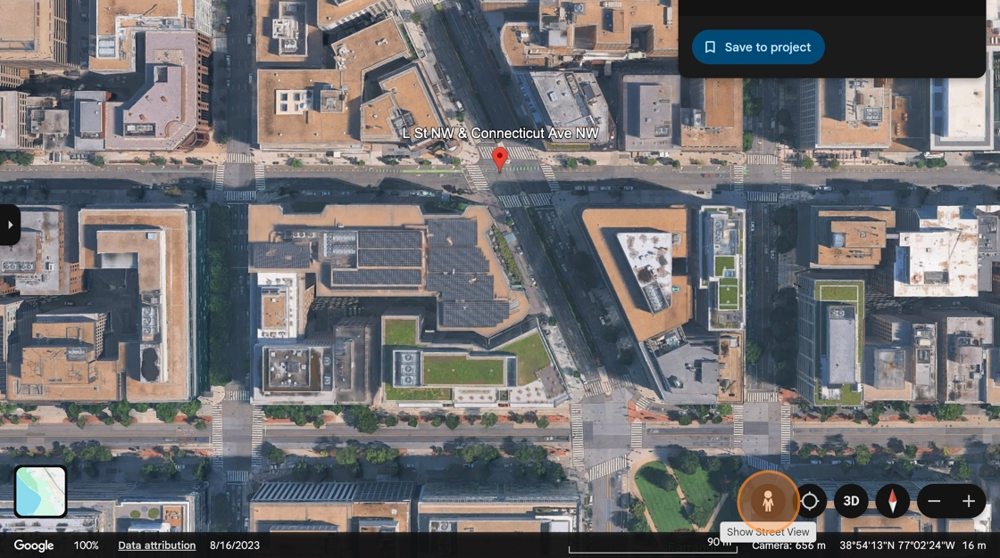
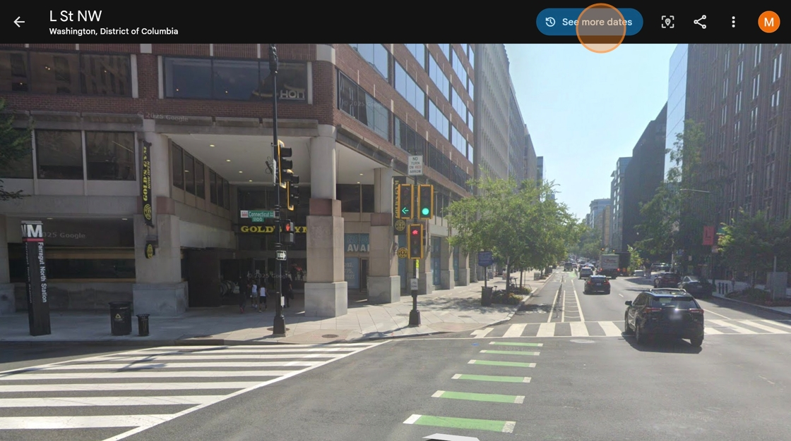
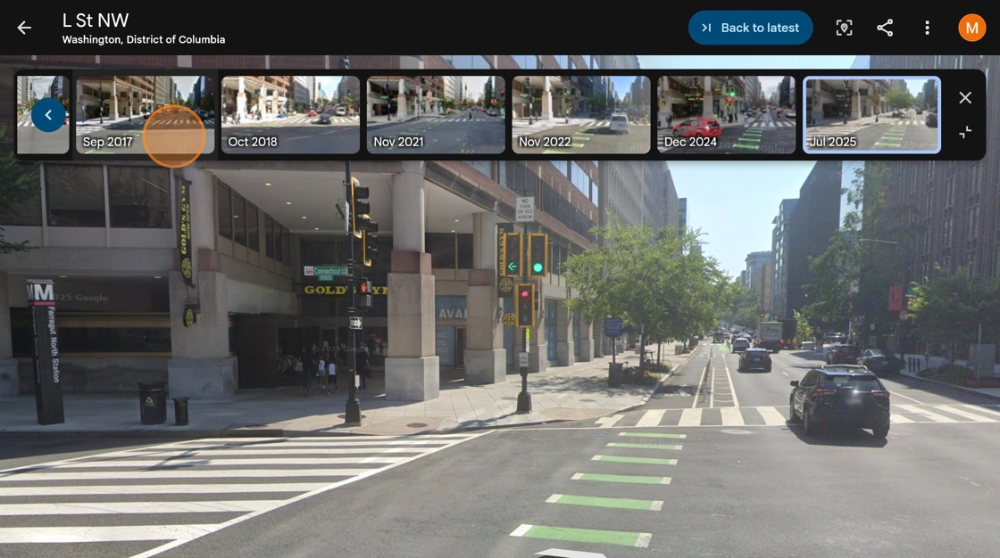

# How to Examine historical imagery

1. Click **View** then **Base map settings**

    

2. Turn on **Historical imagery**

    

3. Use the timeline to select satellite images from different dates

    

4. Click the **time lapse** button to automatically scroll through all historical images

    

5. In the Google Earth search bar, type "Connecticut ave and L st"

6. **Turn on Street View** by clicking the person icon in the bottom Roland corner and select a highlighted location somewhere in the intersection.

    

7. Briefly explore the street view here. Then click **See more dates**

    

8. Explore how this area changed over time by selecting different Street View collection dates.

    

9. Show one angle of the street view of the intersection of L St. and Connecticut Ave. for 2021 and 2024. Briefly describe one or two changes you notice between the two images.

 If you don't see any photos from 2021 or 2024, try moving around the intersection until these dates become visible