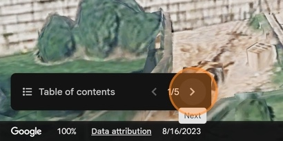
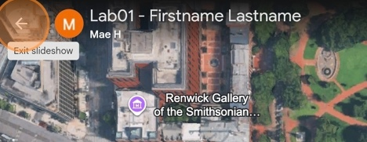
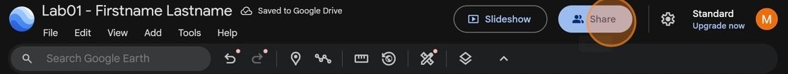

# How to Share Your Map Tour on Google Earth

1. Make a **new** Google Earth Project

2. In an area different than Washington DC, **save 5 to 6 points** to your project that all fit a shared theme.

3. Name your project with an appropriate title that describes your collection of points (example: "Coffee shops I love", "Best vacation spots", "world capitals" etc.)

    You should **NOT** use the same points used in this example. Each student should submit a different map tour based on their own points they selected

4. Make sure all the points you want to share are visible, and any points you don't want to share are removed from the **Map Contents**

5. Click **Slideshow** to see how your map tour will appear when shared.

6. The camera automatically pans to the last saved viewpoint for each point in **Map Contents**. Use the arrow buttons to scroll through each point.

    

7. Click the back arrow to return to your project

    

8. Click **Share**

    

9. Change the General access to "Anyone with the link" can **view**

10. Click "Copy link" to save the access link to your clipboard and paste this link in your lab report.

If you do not change the access permissions, no one else will be able to see your map tour, even with access to the link. It's always good to check your work by pasting the access link into a different browser where you are not logged in to Google, to see if you can access the project map tour.
