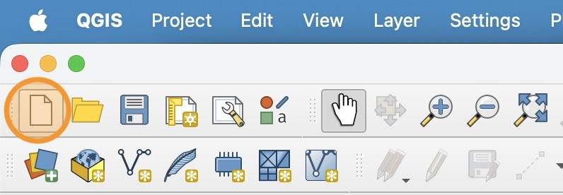
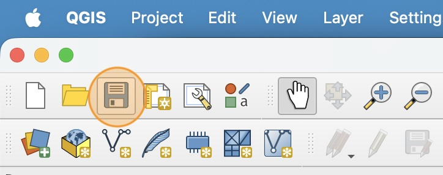
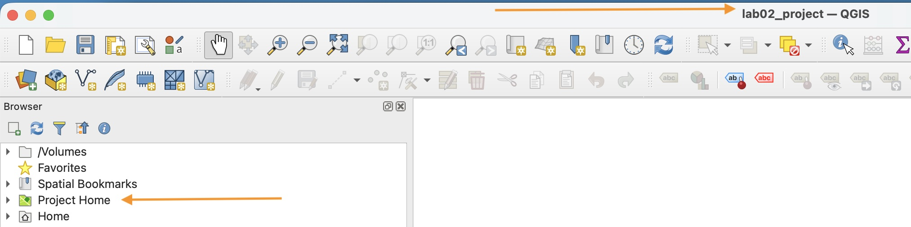
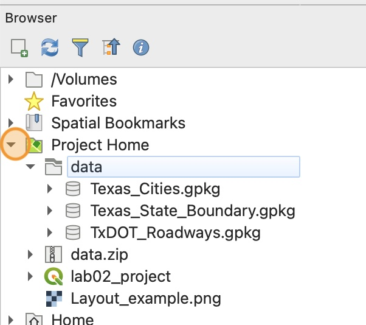
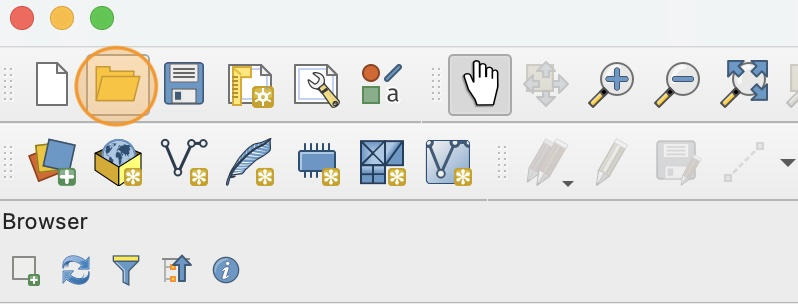

Before continuing, make sure you have installed QGIS, downloaded the lab 2 data folder, and saved & extracted the data folder to your `lab2` folder on your computer

# How to create a new QGIS project

1. Open **QGIS** on your computer
2. Click the "New Project" icon on the tool bar. This will open a blank project.

    

3. Click the "Save" icon on the tool bar. This will open the save window. 

    

4. Name the project `lab02_project` and save it in your `lab02` folder. This should be **the same folder** that you saved and extracted the data folder in.

5. Once you save the project, you can see the project name at the top of the window. You should also be able to now see a "Project" folder in your Browser panel.

    

    If you don't see your Browser panel, you can re-open it by going to `View > Panels > Browser` in the menu bar.

6. In the Browser panel, click the arrow next to your `Project` folder to expand the contents. Make sure you can see the unzipped `data` folder. Also expand the `data` folder. Make sure you can see three data files.

    

    If you can't see these files, you did not save the project in the correct place. Go to `Project > Save As` in the menu bar and make sure to save the project in the correct location.

# How to open an existing project
We will review three ways to open an existing project.

## Method 1: Open from the file manager.

This method is the most reliable. You should already be familiar with this method from Lab 0. 

1. Navigate to your `lab02` folder using your file manager.

2. Identify the QGIS project file. The file should end with the extension `.qgz`.

    If you can't see the file extensions in your file manager, you can find a tutorial on how to change this setting on the class [Resources](../../resources) page

3. Double-click on the project file. QGIS should open automatically and load the project.

Close the project again and practice opening it with the next two methods.

## Method 2: Recent projects panel

1. Open QGIS from your Start menu or Spotlight Search

2. Projects you recently opened will display under the "Recent Projects" panel. 

3. Click the name of the project you want to open.

Close the project again and practice opening it with the next method.

## Method 3: Open project menu

1. Open QGIS from your Start menu or Spotlight Search

2. Click the "Open Project" icon in the tool bar.

    

3. Use the open project window to navigate to the folder where you saved the file, select the project file and click "Open".
