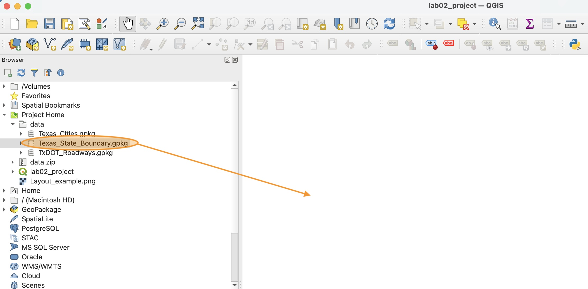
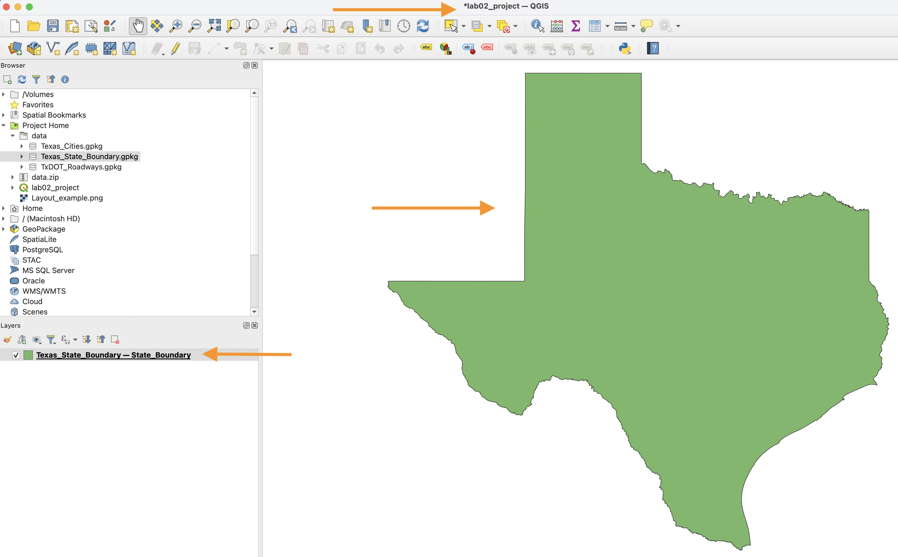
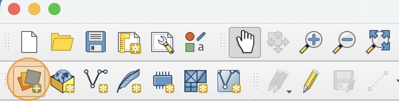
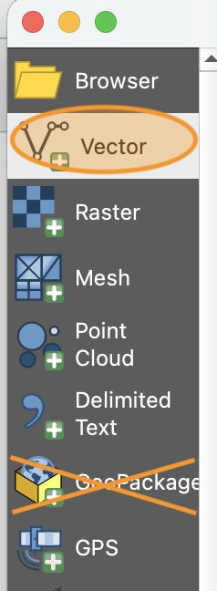
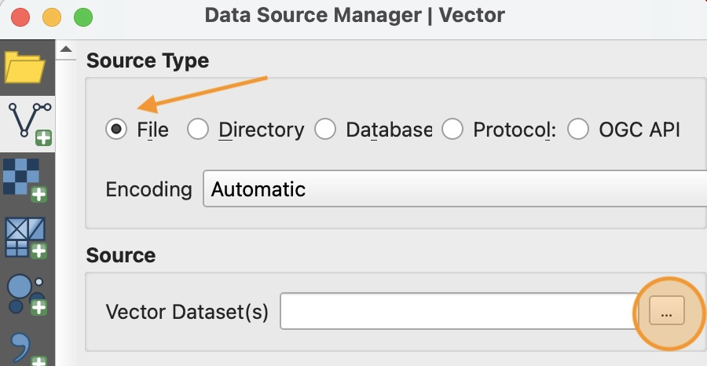
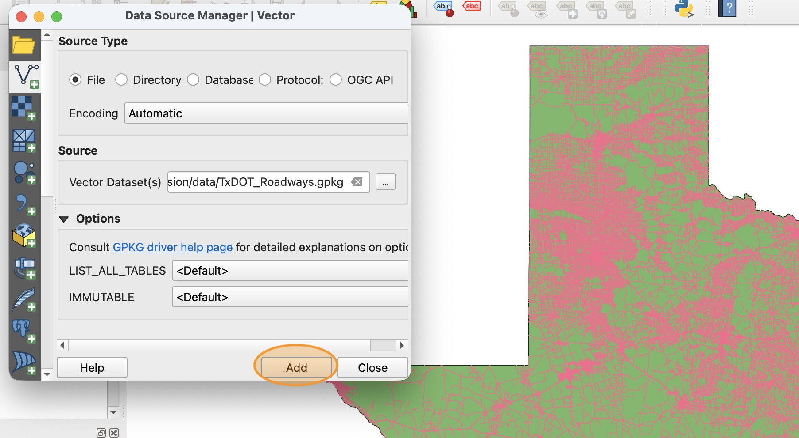
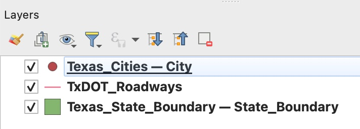
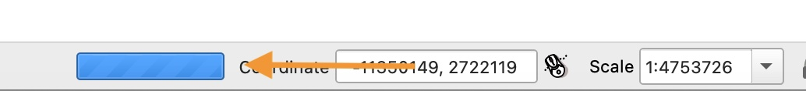

# Method 1: How to add data using the Browser Panel
First we will add one layer using the Browser panel. This is the easiest way to add data.

1. In the Browser Panel, find the file in your data folder called `Texas_State_Boundary.gpkg`. Click and drag this file into the center of your window.

    

    `.gpkg` is the file extension for a GeoPackage, which is an open-source file type for vector data sets.
    

2. Three things should change in the QGIS window:
    * The Texas state boundary should appear in your **Map View** in the center of the window. Note that the color is randomly assigned and may be different than the example shown here.
    * A new layer has been added to your **Layers Panel**.
    * A `*` symbol appears in front of your project name. This means that you have unsaved changes in your project.

    

3. Click the "Save" icon in the tool bar to save your changes. The `*` indicator in the project name should disappear after saving. **You should regularly save your work when working in QGIS**. If the program crashes or your laptop powers off, only the work from before the last save will be maintained.

# Method 2: How to add data using the Data Source Manager
Now we will practice using the Data Source Manager. This is the most versatile way to add data since you can add data from anywhere on your computer or hosted publicly on the Internet.

1. Click the **Open Data Source Manager** icon in the tool bar.

    

2. Next we need to select the type of data we are importing. We want to import a single layer GeoPackage, which is a type of vector data set. Select `Vector` in the Data Source Manager window.

    

    In this lab, we will not be using the GeoPackage specific import option. That is a more advanced input method that is not covered in this lab.

3. In the Data Source Manager window, make sure that the **Source Type** selected is `File`. Then click the three dots next to the **Vector Data Set** field to select the file.

    

4. In the file window that opens, find the `TxDOT_Roadways.gpkg` GeoPackage in your `data folder. Select this file and click "Open". 

5. Click **Add** one time. The Data Source Manager window will not close, but the layer will start loading in the background automatically. This is a large file, so it may take a few seconds to fully load all the roads.

    

6. Choose your preferred method and add the last layer to your project: `Texas_Cities.gpkg`.

We just made several changes to the project. Don't forget to save your project before continuing!

# How to arrange data using the Layers Panel

1. Examine the **Layers Panel**. This panel shows all the data we have added to our project. It also indicates the *order* that the layers are drawn. The layer at the bottom is drawn first, then the layers above it are each drawn in order, starting from the bottom and moving up.

    

2. Practice moving the order of the layers by clicking and dragging each layer to a different place in the list. Notice how the map view changes to "re-draw" every time you make a change. 

    There is a loading bar at the bottom of the map view whenever QGIS is re-drawing a view. It's best not to make changes until the view has fully loaded.

    

3. You can hide a layer from view by unchecking the box next the layer name. Practice hiding and unhiding each layer now, and notice how the map changes.

# How to remove layers

It's possible to accidentally add the same layer twice, or maybe you want to remove a layer that you are not using anymore. In these cases, you can easily remove a layer from the layer Panel.

1. Practice removing a layer from the layer panel by **Right-clicking** the name of a layer and selecting the "Remove layer" option. The map will re-draw without this layer.

2. Add back any missing layers and re-arrange the order as necessary so that you have exactly three layers:
* Texas Cities
* TxDOT Roadways
* Texas State Boundary