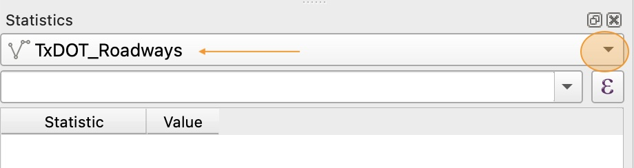
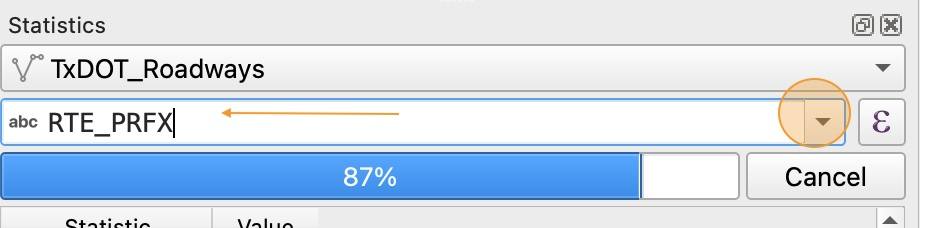
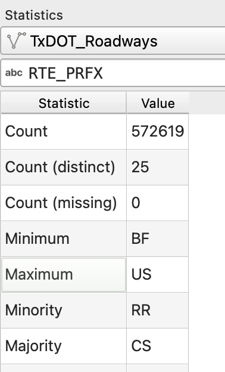
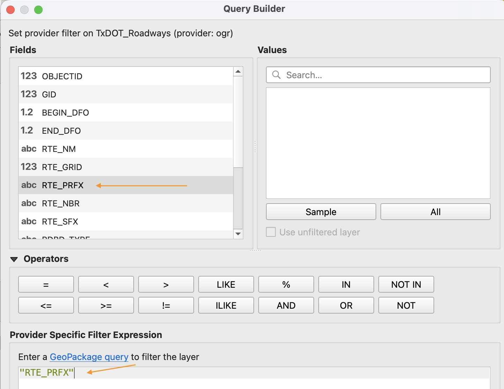
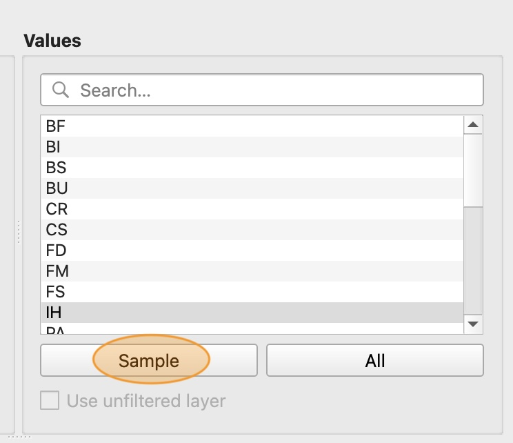
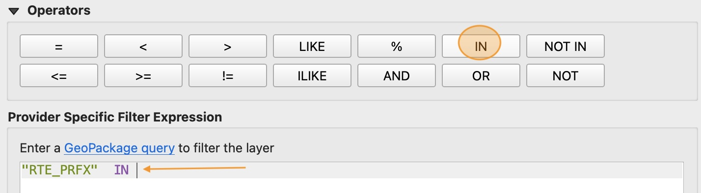
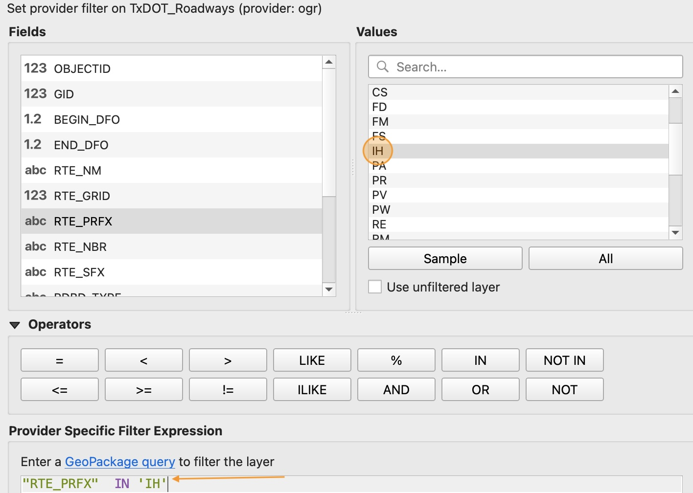
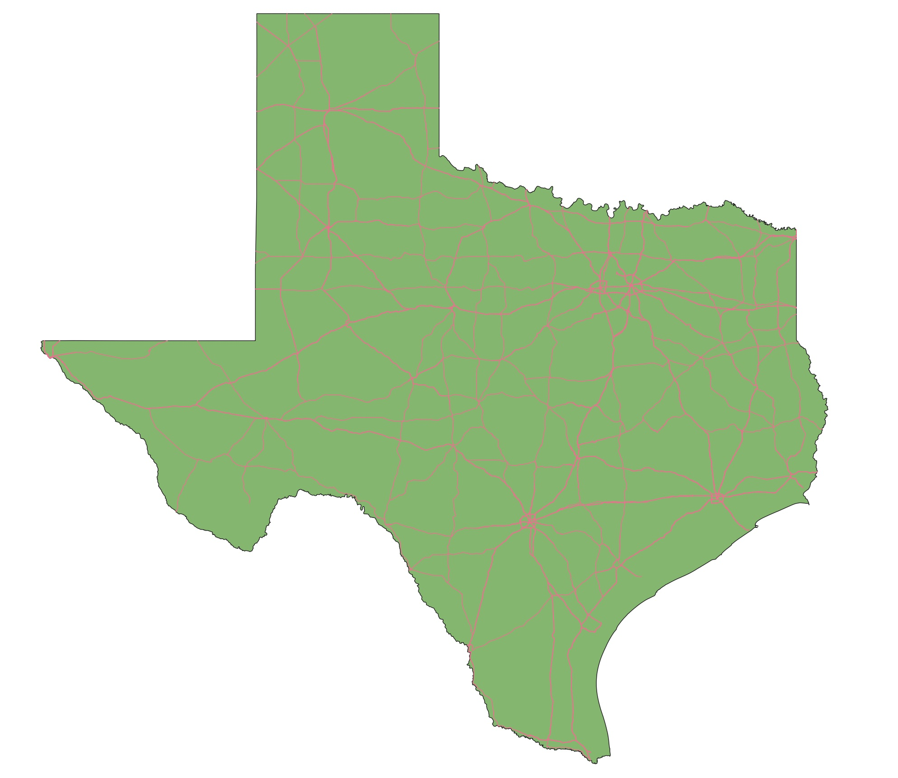

# How to use the statistics panel
1. Click the "Show Statisticcal Summary" icon on the tool bar.
    

2. In the Statistics panel, use the first drop down menu to select the layer you want to examine. For now, select `TxDot_Roadways`

    

3. The second dropdown menu lets you select the attribute you want to analyse. These usually have abbreviated titles. For now, select, `RTE_PRFX`, which stands for "Route Prefix". Wait for the statistcs summary to laod.

    

4. Examine the statistics summary.
    

    **Count** refers to the count of feautures. This summary shows over 500-thousand road features in this data set.

    **Count (distinct)** refers to the count of unique Route Prefixes. 

    **Majority** and **Minority** show us the most common and least common prefixes respectively. 

    Because `RTE_PRFX` is a text variable (also called a String variable), **Minimum** and **Maximum** refer to the alphabetical order of the observed values. Minimum represents the first value when all prefixes are listed alphabetically, and maximum represents the last value.

# How to filter layers by category attribute
Here we will learn how to filter the `TxDOT_Roadways` layer to only show major roads.

1. Right-click on the `TxDot_Roadways` layer and select "Filter". This will open the filter query builder.

2. In the query builder we can define exactly how we want to filter the roads layer. In the **Fields** selector, double click the `RTE_PRFX` field. The text `"RTE_PRFX"` will appear in the expression window at the bottom.

    

    In QGIS expressions, text strings surrounded by **"double quotes"** refer to fields that store the attributes for each feature.

3. In the **Values** selector, click the "Sample" button. This will sample our selected field for example attribute values.

    

    These two-letter codes represent the different possible route prefixes for the roads in our data set.

4. In the **Operators** selector, click the `IN` button. Notice that the word `IN` appears in our expression window.

    

5. Back in the **Values** selector, double click the `IH` item. Notice that `'IH'` in single-quotes appears in our expression window.

    

    In QGIS expressions, text strings surrounded by **'single quotes'** refer to text (string) values.

6. Our current expression would filter for roads that start with the prefix `IH` (Interstate Highways). We also want to include US Highways, which have the prefix `US`. Re-type the expression to include both prefixes.

    `"RTE_PRFX"  IN ( 'IH' , 'US' )`

    **Make sure your expression matches the above EXACTLY**. Notice how we had to add parentheses around our list of values, and separated each value by a comma. These are called *syntax rules* and they help QGIS accurately parse exactly what you are asking for.

7. Click **OK** and wait for the filter to apply. When it's done, your road layer should look similar to the example below. *It may help to temporarily hide the cities layer by unchecking its box in the layer panel*

    

# How to filter layers by numerical attribute

1. Make sure your `Texas_Cities` layer is unhidden and you can see it in your map view. **Right-click** on this layer and select "Filter".

2. This time we will write an expression to filter cities by their **population**. For this we will use the `POP2022` variable, which represents the city population in 2022.

    Copy this expression exactly into the filter expression input:

    `"POP2022"  >= 100000`

    This will filter for cities with a population greater than or equal to 100,000
    
3. Click **OK** to apply the filter. You should now see only a few dots representing cities on the map.
