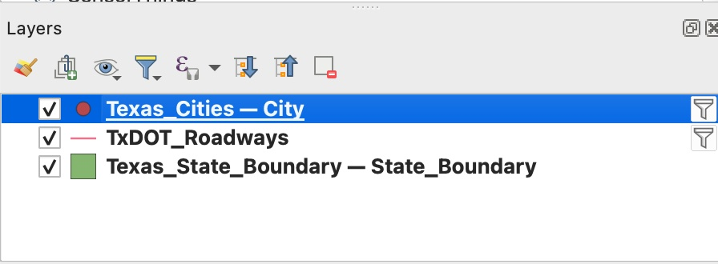
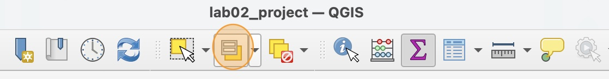
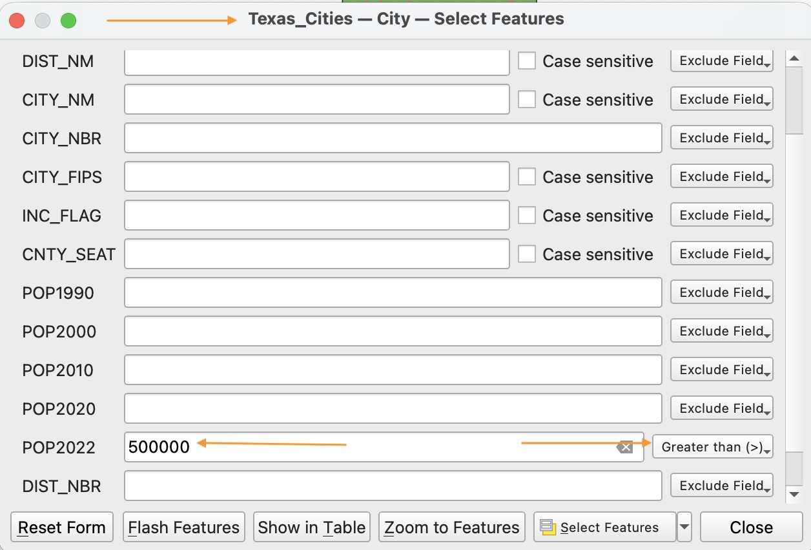
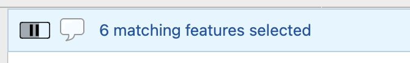
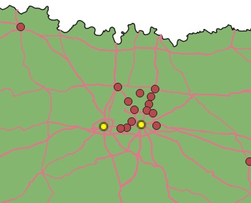
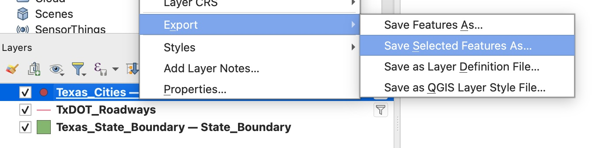
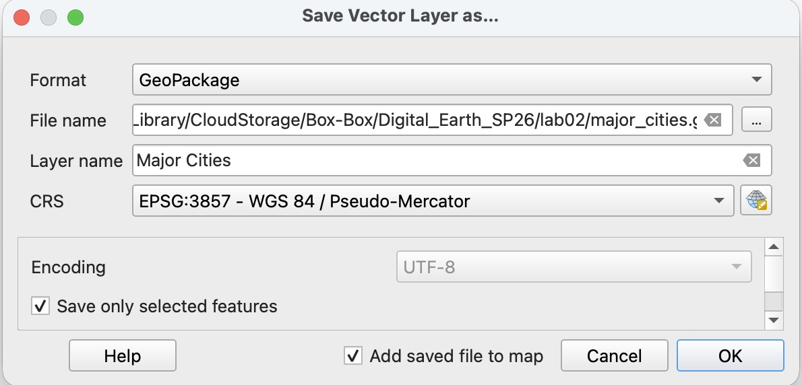
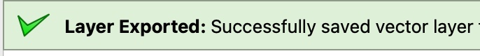
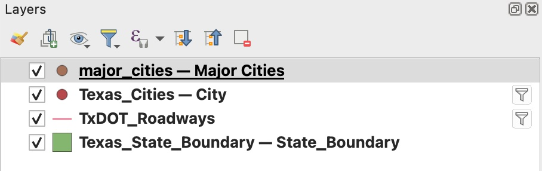

We still have a lot of cities on our map. We want to highlight the major cities. To do that we need to make a seperate layer of just major cities.

# How to select by attribute

1. First, make sure the `Texas_cities` layer is visible. Click on the layer name in the Layers Panel to select it.

    
    
2. Click the "Select features by value" icon in the tool bar

    

3. Double check that you have the right layer (`Texas_Cities`) selected at the top of the window. Then scroll down to the `POP2022` field and set the expression to look for cities with a population of more than half a million.

    

4. Click "Select Features". A temporary message should appear at the top of your map window indicating how many features were selected.

    

5. Notice that some of the cities have a different color now. These yellow dots represent the selected cities.

    

# How to export a selection
We need to export our selection to save it and use it later.

1. Right click on the `Texas_Cities` layer and select Export > **Save selected features as...**.

    

    If this option is disabled (grey unclickable text), it is because you don't have any features selected in this layer. Go back to the top of this page and try the selection again before proceeding.

2. In the "Save Vector Layer As..." window, click the three dots next to the **File** input. Navigate to your `lab02` folder and save the file under the name `major_cities`.

3. Set the layer name to `Major Cities` and make sure the **Format** is set to "GeoPackage". Keep the "Save only selected features" and "Add saved file to map" options checked. Clik **OK** to save the new layer.

    

4. If the export is successful, you should see a green message at the top of your map window and the new layer should appear in your Layers panel.

    
    