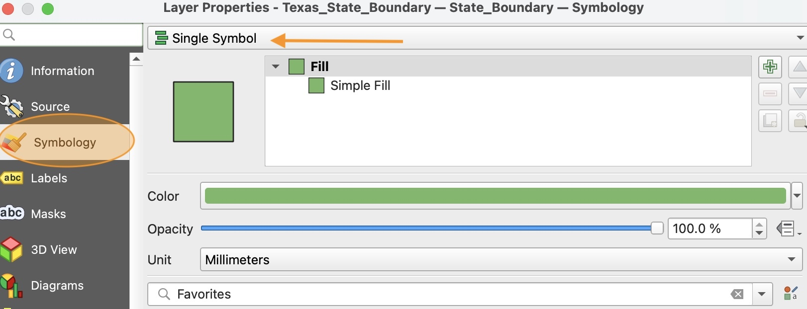
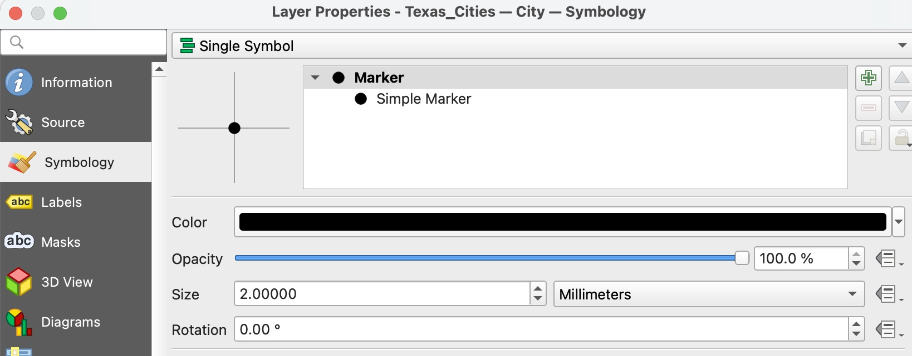
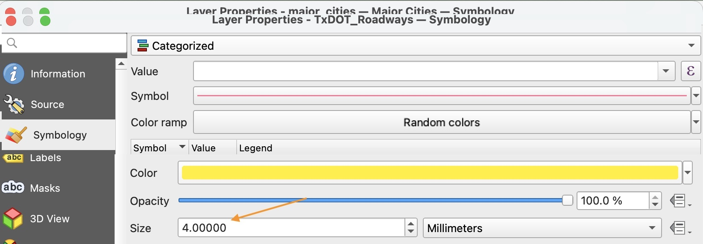
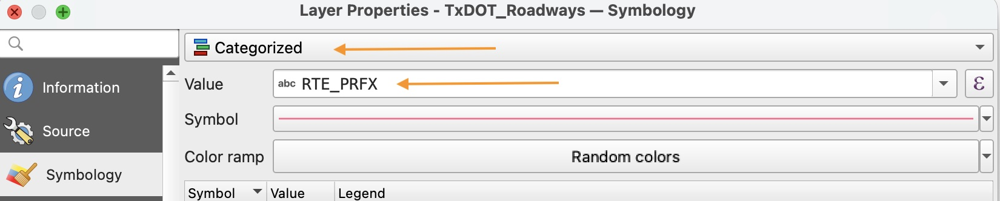
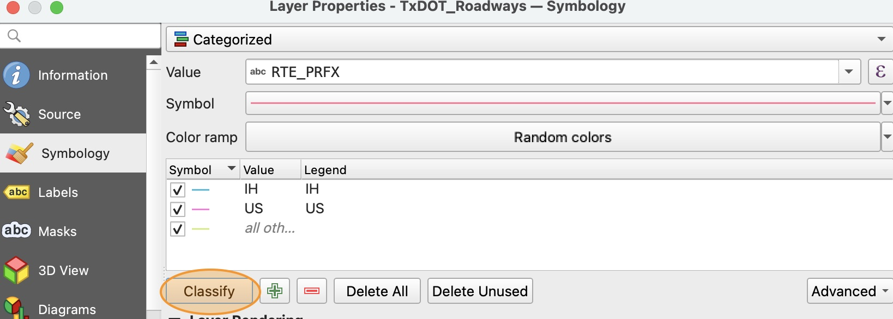
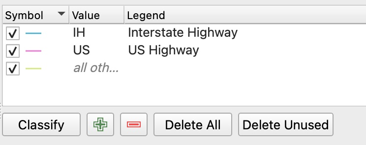
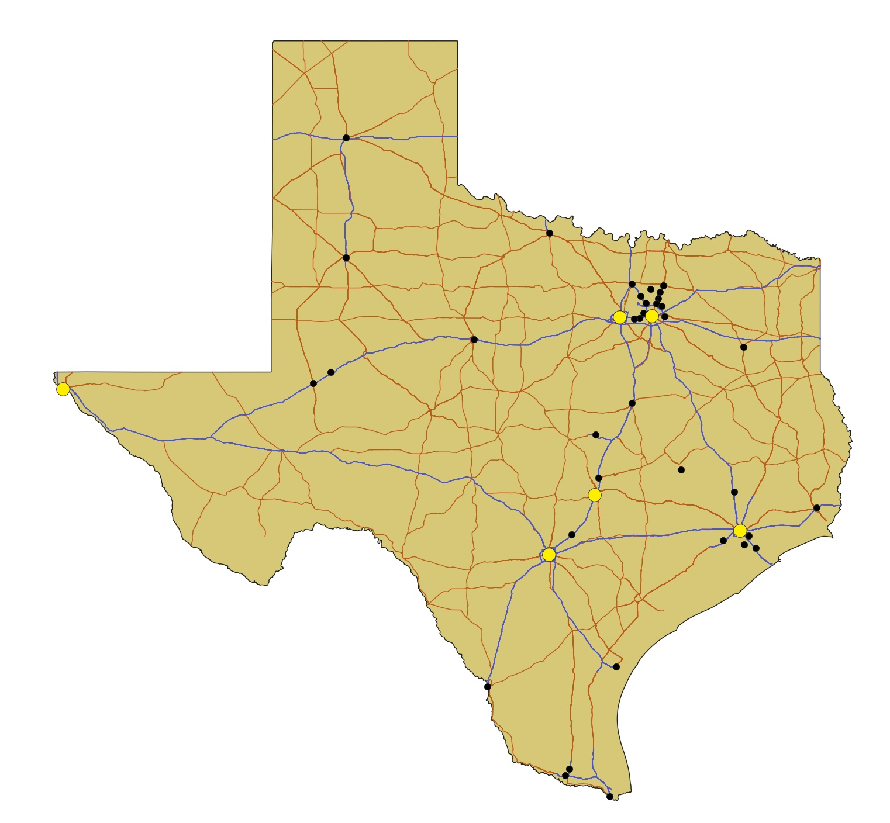

**Symbology** refers to the symbols we use to represent features on maps. We should always use symbology to help the user read the map more easily.

# Applying single symbology

1. Double-click on the `Texas_State_Boundary` layer to open the layer properties window.

2. Click the "Symbology" section in the side-bar. Notice that by default, this layer is already set to Single-symbol.

    

3. Use the dropdown menu next to the Color input to select a new fill color for the state of Texas. For this map, a light, neutral color is best. Click **OK** to apply the changes and close the layer properties window.

4. Open the layer properties window of the `Texas_Cities` layer and go to the Symbology section. Notice that it looks slightly different than the boundary layer's symbology window.

    

    This is because the cities layer is a *point* layer, where each feature is represented by a single point, not a shape.

5. Choose a dark color of your choice for this layer and click **OK** to apply it.

6. Modify the color of the points in the `major_cities` layer. Choose a bright color that stands out. Change the Size of the marker to 4mm.

    

# Applying Category-based symbology

1. Open the Symbology section of the layer properties window for the `TxDOT_Roadways` layer.

2. Use the top dropdown menu to change the symbology type to `Categorized`. Use the second dropdown menu to select `RTE_PRFX` for the Value.

    

3. Click the **Classify** button to automatically generate categories. 

    

    Three categories should appear:
    * IH
    * US
    * all others

    If more than three categories are generated, it means you did not properly filter the roadways layer. Go back to [Part 3](part3) and correct the filter before proceeding.

4. Double-click on the text in the Legend column to edit it. Update the names of both categories to have clear labels:
* IH &rarr; Interstate Highway
* US &rarr; US Highway

    

5. Single-click on the "all others" layer to select it, then click the red minus symbol (-) to remove this category.

6. Double-click on the line symbol next to the IH category to edit the symbol. Choose a distinct color that goes well with your color scheme. Do the same for the US category. 

7. Click **OK** to apply the symbology. Your map should look similar to the example below; although you may have chosen different colors.

