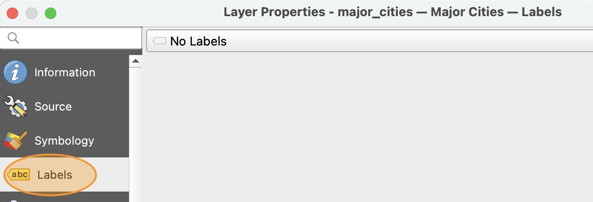
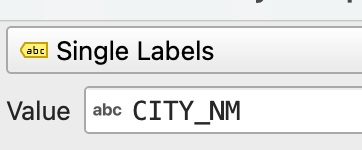
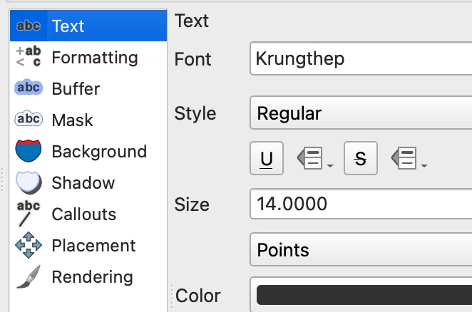
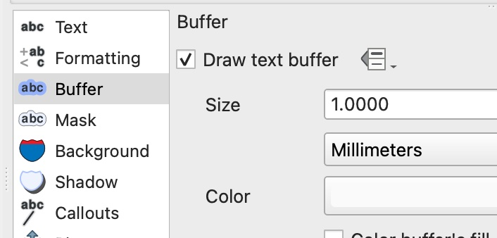

It will be helpful to label the major cities on our map. This page shows you how you can automatically add labels to features based on attribute values.

# Adding labels

1. Open the layer properties window for the `Major_Cities` layer and go to the "Labels" section. Notice that by default, the layer is set to "No Labels".

    

2. Change the label type to "Single Labels" and the Value to `CITY_NM` (short for City Name).

    

3. in the **Text** options, change the font to any *legible* font of your choice (do not use the default). 

    Adjust the text size to 14-point

    

4. Click the **Buffer** section and turn on the text buffer. This provides an outline around your text that makes it easier to read.

    

5. Click **OK** and make sure you like the way your text labels look. Adjust as necessary.