For standard map layouts, there are several key elements that are typically included:
* Scale
* North Arrow
* Legend
* Title
* Data Source
* Map Author 
* Date created
* Coordinate Reference System (CRS).

# How to create a custom layout
1. Before making a layout, make sure your map view is centered and zoomed appropriately by right-clicking the `Texas_State_Boundary` layer and selecting "Zoom to layer".

2. Click the "New Print Layout" icon in the tool bar.

    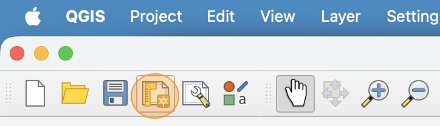

3. In the Create Print Layout window, name your layout `Texas Roads and Cities` and click **OK** to create it.

4. Notice that by default the layout is set to an A4 landscape (horizontal) page. This is the standard printer paper in most of the world, although it is not typically used in the US. 
    
    Also notice that the name of the layout is at the top of the window, and a `*` symbol indicates unsaved changes.

    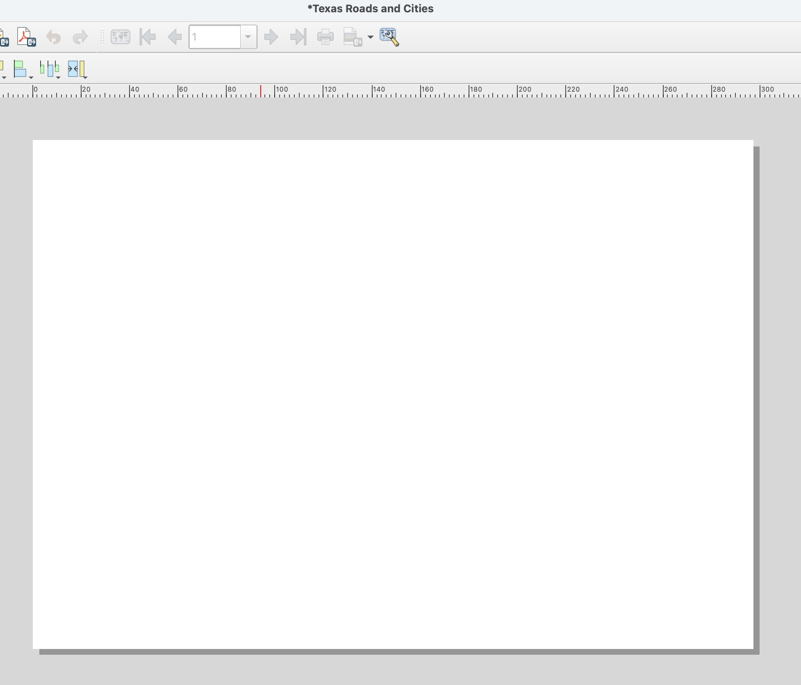

5. Click **Layout** > "Page properties" in the menu bar to open the page properties panel.

    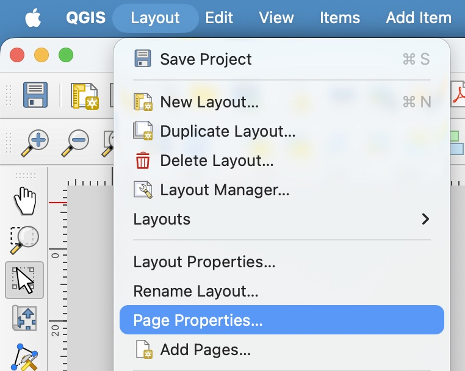

6. In the Page properties panel, set up a custom page size that is a square with **8 inch** sides.

    Pick a non-white background color that goes with the colors you picked for your map. A light color is usually best.

    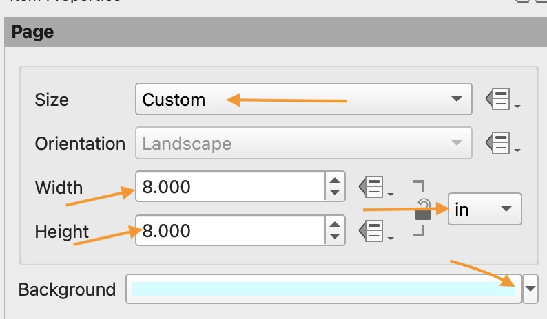

7. Don't forget to click the Save Project icon in the tool bar to save your work.

    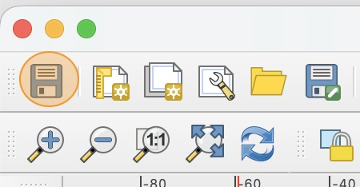

    Make sure to always save your work regularly!

# How to open and manage saved layouts 

1. Close the Print Layout window and go back to your main QGIS window.

2. Whenever you want to open a previously saved layout, you can access it by selecting **Project** > "Layouts" in the menu bar and then select the name of the layout you want to open. 

    Practice opening the Texas Roads and Cities layout in this way. Then close the print layout window again.

3. Open the **Layout Manager** by selecting **Project** > "Layout Manager" in the menu bar.

4. Examine the Layout Manager window. From this window, you can rename, copy, or delete existing layouts.

    

5. Double-click the `Texas Roads and Cities` layout name to reopen it.

# How to add a map view
1. Click the **Add Map** icon in the Toolbox on the left side of the window.

    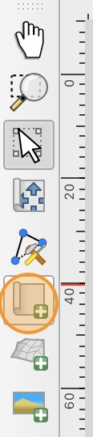

2. Notice that your cursor icon has changed from a pointer to a cross-hairs. This indicates you are in creation mode.

    Click and drag on your layout page to make a large square. The map will start to render as soon as you release your mouse click.

    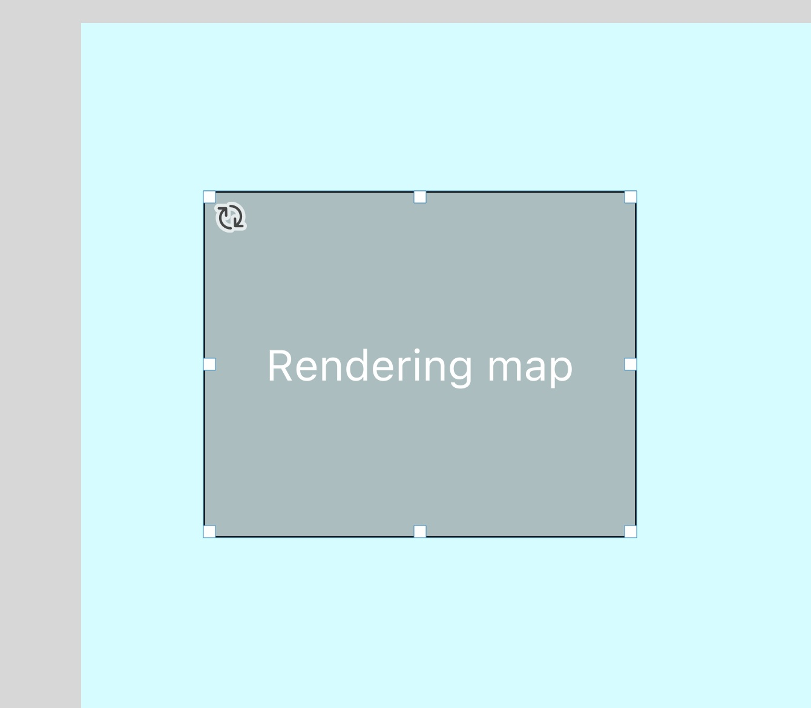

3. Once the map renders, click the map to select it. You can click and drag the squares around the edge to re-size the map, and you can click and drag the center of the map to move the whole element. Practice doing this now.

    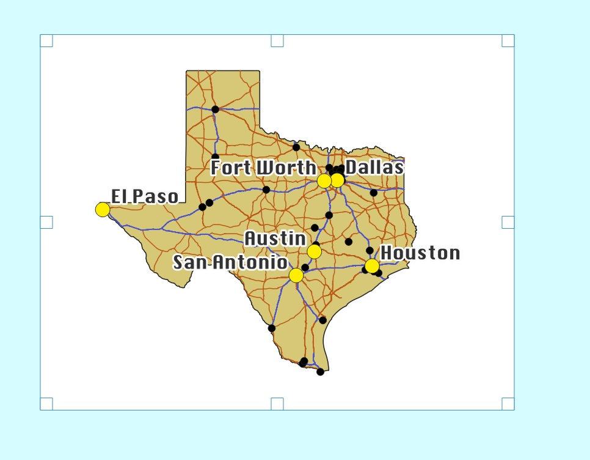

4. Right click on the map and select "Item Properties"

5. In the item properties panel, scroll down to the item called "Background" and uncheck the box next to it. This will turn off the map background so that you can see the page color.

    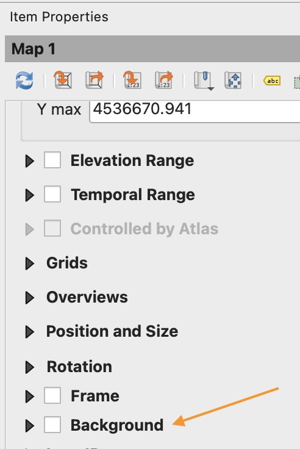

6. Click the **Move Item Content** icon in the Tool Box. This tool lets you interact with you map the same way you do in the main QGIS map view.

    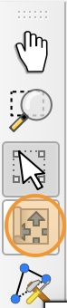

    Practice interacting with the map element by moving the map and zooming in so that the map fills the frame and takes up most of the page.

7. To go back to selection mode, click the **Move/Select item** icon in the Tool box.

    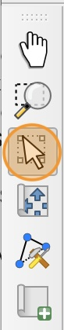

# How to add linked map elements

1. In the Tool box, select the **Add North Arrow** icon, then click and drag on your layout to create a small north arrow icon

    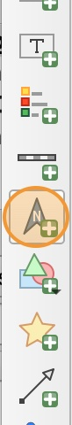

2. Right click on the north arrow on your layout and select "item properties". Scroll down to the **Image Rotation** section and notice the linked Map

    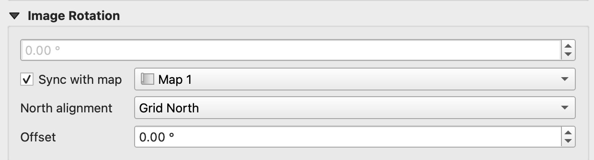

    By default, linked map elements such as north arrows, scale bars, and legends, will automatically link to the last map you added to the layout.

3. In the Tool Box, select the **Add Scale Bar** icon, then click and drag on your layout to create a small scale bar.

    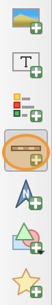

4. Right click on the scale bar and select "item properties." Notice in the **Main Properties** section that the item is linked to our Map 1 we created. Change the scale bar units to *miles*. You can also adjust the length of each scale bar segment and number of segments in the **Segments** section. **Adjust the length and number of segments to any appropriate values that fit with the theme and use of your map**

    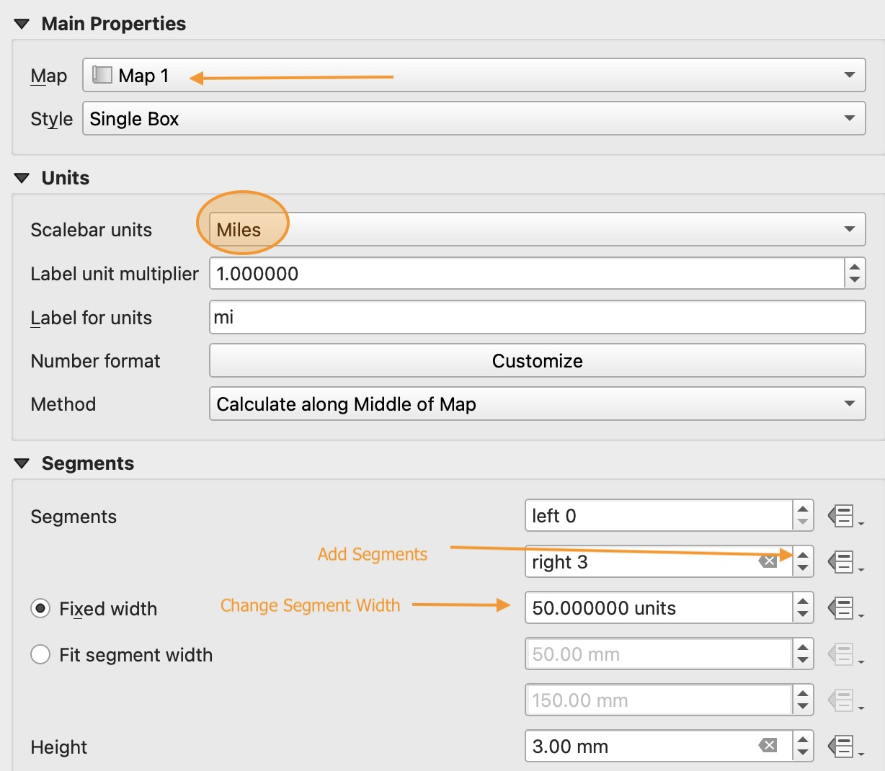

5. In the Tool Box, click the **Add Legend** icon, then click and drag on your layout to create the legend.

    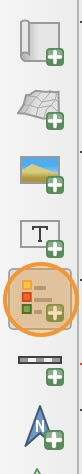

6. Right click on the legend and open the item properties. Notice that the legend has been linked automatically to our map. By default, the legend does not look very nice. We need to rename the layer labels to make this easier to read.

7. In the **Legend Items** section, uncheck the "Auto update" option. This enables us to edit the legend items directly.

8. Right click on the `TxDOT_Roadways` subgroup header and change the visibility to "Hidden".

    If there are any extra road groups on your legend aside from Interstate Highway and US highway, you can remove them by selecting the group you want to remove and then clicking the red minus symbol at the bottom of the Legend Items section.

9. Double click on each remaining item to update its label to a clear, professional, and easy to read label.

    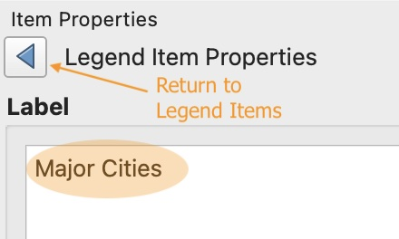

10. Scroll down to **Background** and turn off the legend background. An example of what your legend will look like is shown below. You may have chosen different colors or slightly different labels.

    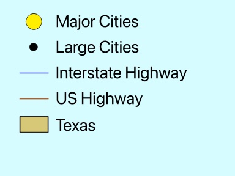

# How to add static text

1. In the Tool Box, click the **Add Label** icon, then click and drag on your layout to create a text box.

    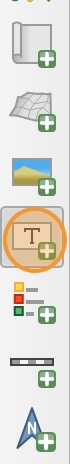

2. Open the item properties for the text box. In the **Main Properties** section, change the default text to an appropriate title for your map. 

    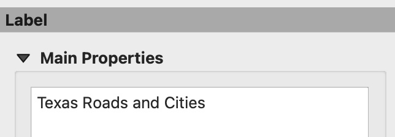

3. In the **Appearance** section, click the "Font" menu to open the font settings. Adjust the title to be size 36, and choose the font that matches your Major Cities label font.

4. Create a second text box on your layout and add your name, the date, and the map data source. Adjust the font to match the rest of your map and set the size to 14.

    

# How to add dynamic text

We can also add text that updates automatically using map and project properties. 

1. Create another text box at the bottom of your map layout. In the item properties, erase the default text.

2. We will use dynamic text to add the Coordinate Reference System (CRS) Name. This gives us information about how the map was projected. We will learn more about CRS later in the semester. 

    Select "Dynamic Text"> Map Properties > Map 1> CRS Name

    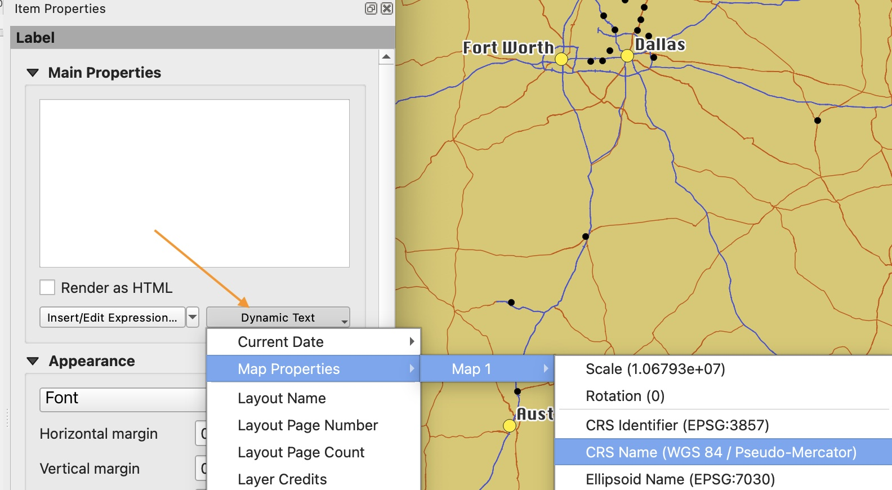

3. Notice that the Main Properties content fills with an auto-generated dynamic text code, but the text displayed on the layout is the name of our map's CRS

    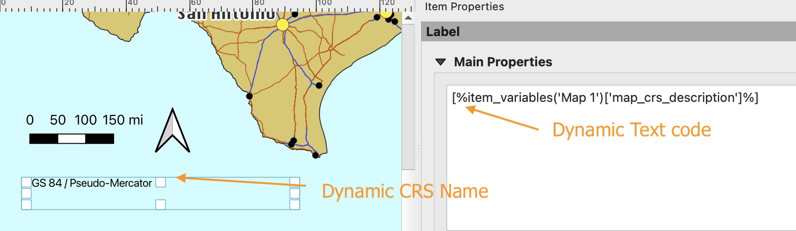

4. In the item properties, change the CRS text font to be size 12 and in the same font as your name and date text.
