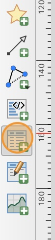
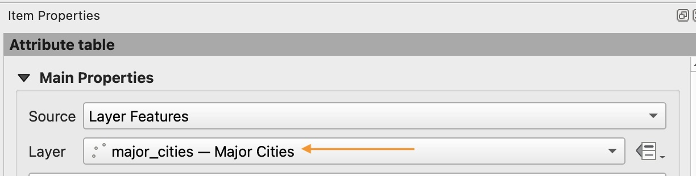
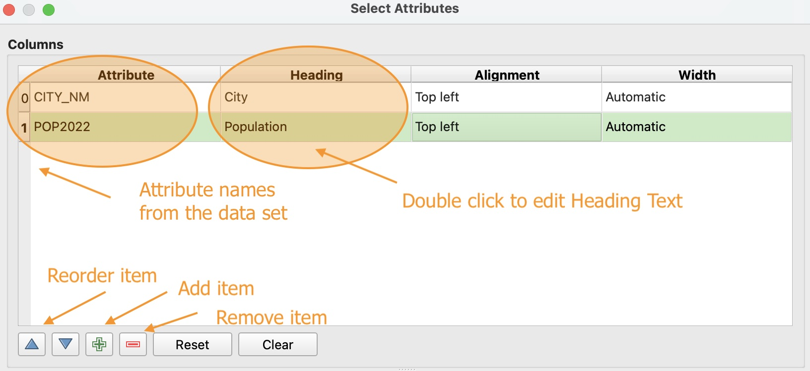
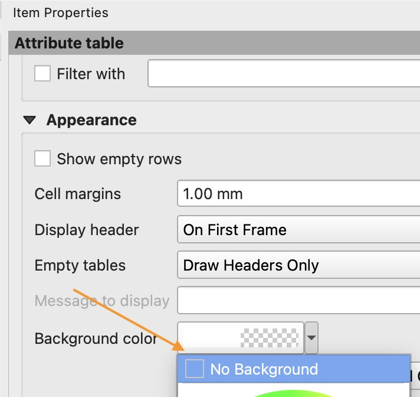
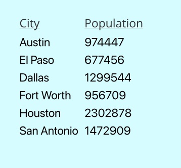
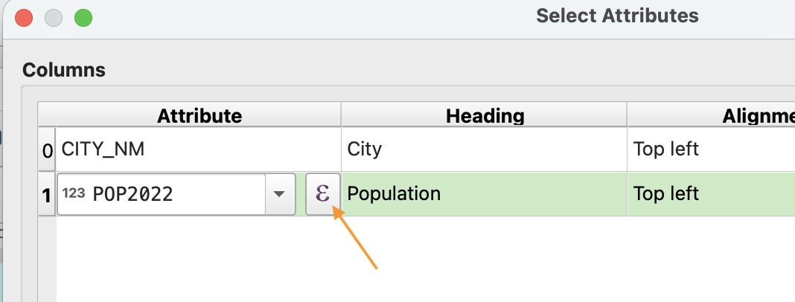
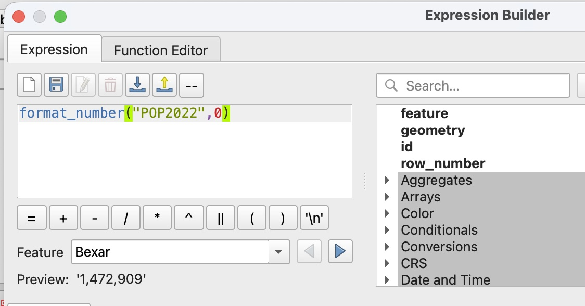

# How to add a data table to a layout

1. In the toolbox of your Layout window, click the **Add Attribute Table** icon. Then click and drag on your layout to create the table.

    

2. In the attribute table item properties, in the **Main Properties** section, change the source layer to the `Major_Cities` layer that you created earlier. Notice that the table in the layout will automatically update to only show the six cities in that layer.

    

3. Click the "Attributes" button in the **Main Properties** section.

4. Use the red minus button to remove all attributes except `CITY_NM` (City name) and `POP2022` (Population 2022). Rename the headings for these attributes to be appropriate, professional titles.

    If you accidentatlly remove an attribute you need, you can add it back with the green plus button. You can reorder the attributes using the blue arrows.

    

5. In the **Appearance** section, change the background color to "No Background."

    

6. Uncheck the "Show Grid" option.

7. In the **Fonts and Text Styling** section, change the Heading font to a bold or underlined font. Change both the heading and contents font to match the same font as your city labels and to be at size 14.

8. Notice that the large population numbers are hard to read quickly because all the numbers are next to each other with no separation. 

    

    We can fix this with formatting. Reopen the **Attributes** window (Hint: click the Attributes button at the top of the itme properties).

9. Double-click the `POP2022` field, then click the purple epsilon (this opens Expression Builder).

    

10. In the Expression Builder window, we will "wrap" our population attribute in a formatting function. Copy this expression **exactly** into the expression field. 

    `format_number("POP2022",0)`

    `format_number` is the name of the function. The parenthesies `()` wrap around the *arguments* or *inputs* to the function. The first input is our attribute we want to format, `"POP2022"`. The second input is the number of decimal places we want displayed, `0`.

    If you entered the function correctly, you should see a preview at the bottom of the window.

    

11. Click "OK" on the Expression Builder window to apply the function, then click "OK" on the Attributes window to apply your changes to the table in your layout.