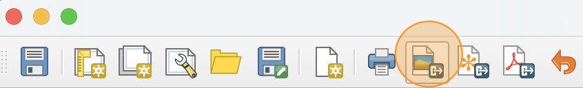
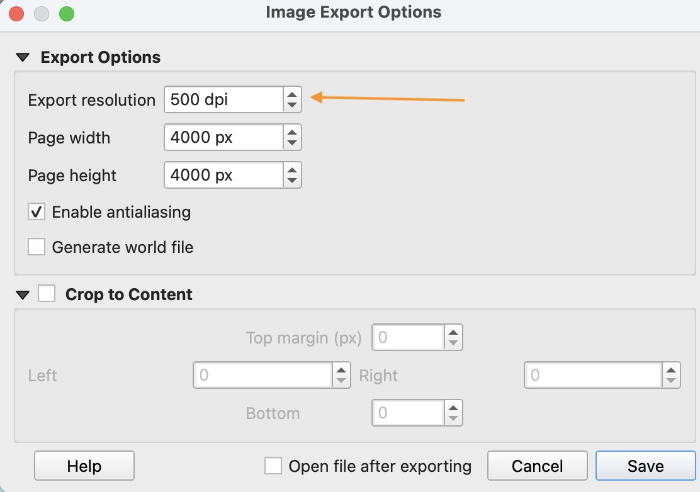

# How to export a map layout as an image

1. In the Menu Bar of the Map Layout window, click the **Export as image** icon.

    

2. In the file explorer window, navigate to your `Lab02` folder and save the file under the name "Texas Cities and Roads". Make sure the file type is set to **PNG**. PNG stands for Portable Network Graphics and is a versatile file type for saving high-resolution images.

3. In the **Image Export Options** window, set the DPI (dots-per inch) to **500**. Click **Save**.

    

4. In your file explorer, navigate to your `Lab02` folder where you saved the image and open the file to see your exported image.