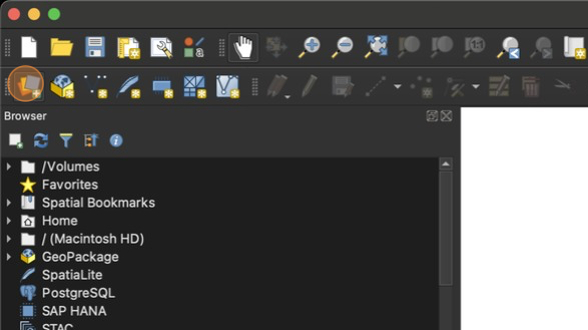
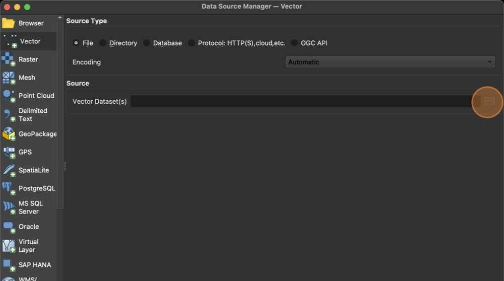
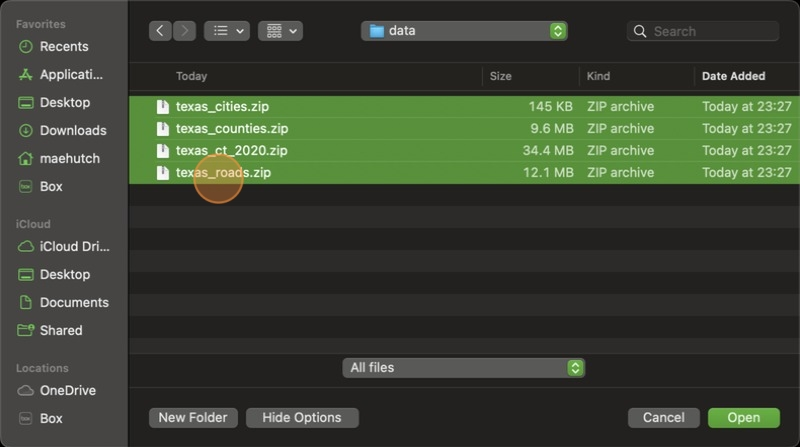
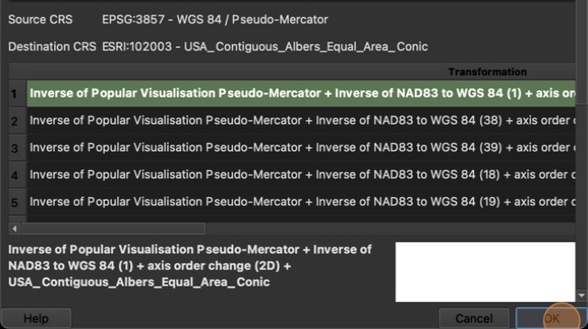
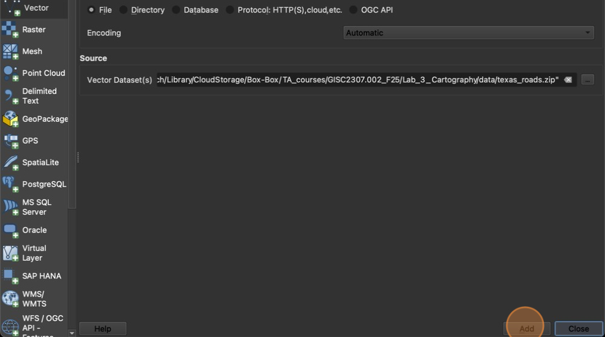
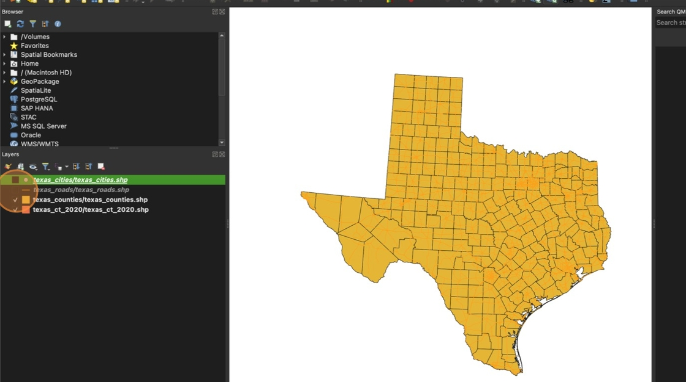
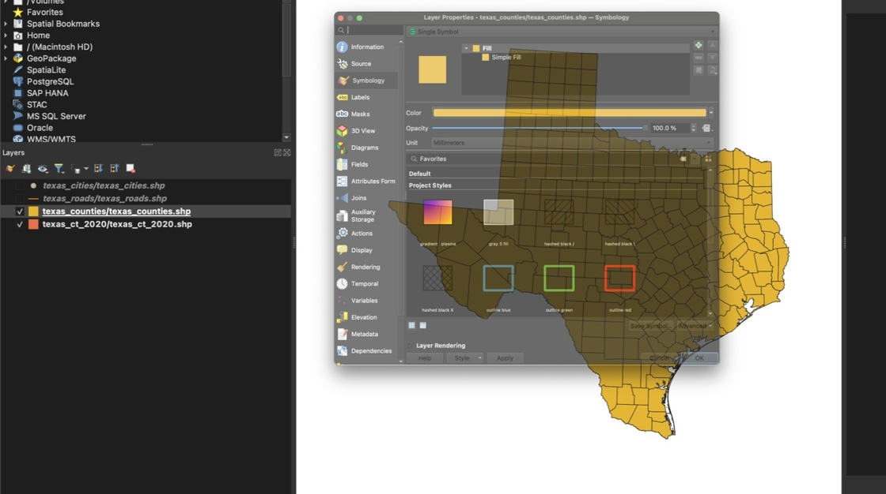
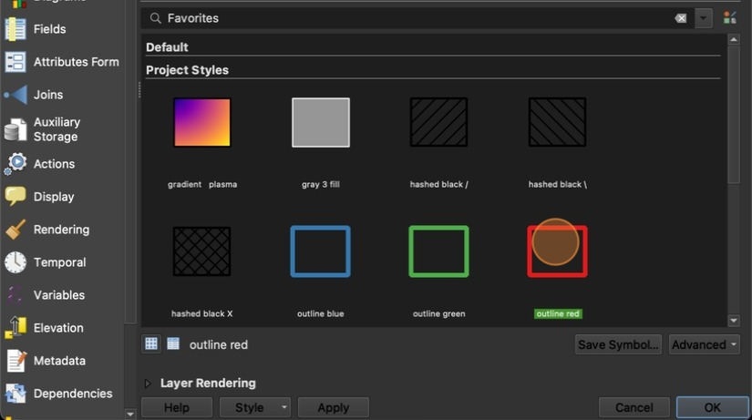

# Lab 3 QGIS Setup

1. Create a new empty project in QGIS

2. Click "Data Source Manager"

    

    3. Click "…"

    

    4. Navigate to your data folder and select all four data files by holding the `Shift` key and clicking each file. You do not need to unzip these files. Then click "**Open**"

    

    5. If prompted, select the first CRS and click "OK"

    

    6. Click "**Add**" only one time, then click **"Close**"

    

    7. In the **Layer** pane, drag the layer names to rearrange the layers to be in this order:

        - texas_cities (top layer)
        - texas_roads
        - texas_counties
        - texas_ct (bottom layer)

    8. Click the checkbox next to the cities and roads layers to temporarily hide these layers

    

    9. Double click "texas_counties/texas_counties.shp"

    

    10. In the Symbology section, click "**outline red**" then "**OK**"

    

Don't forget to save your project!