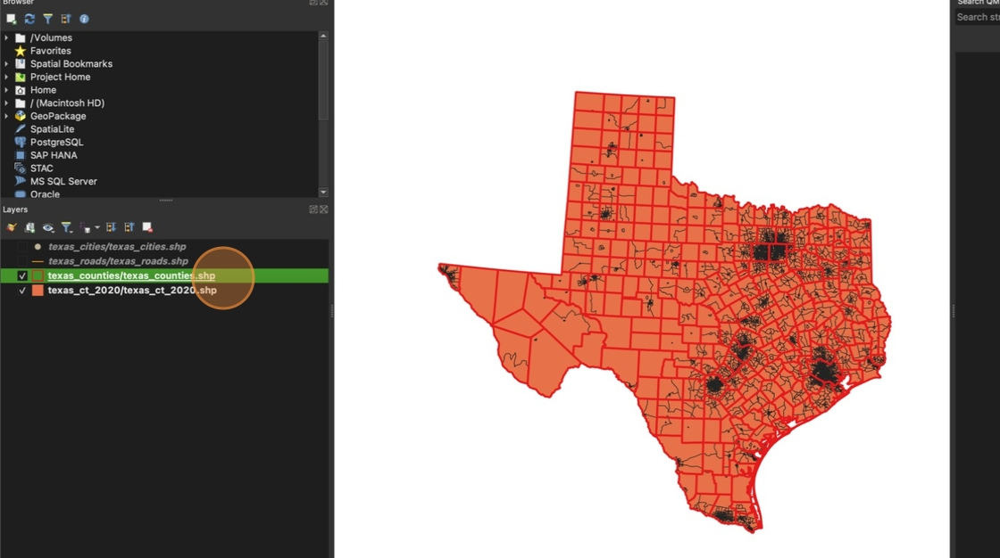
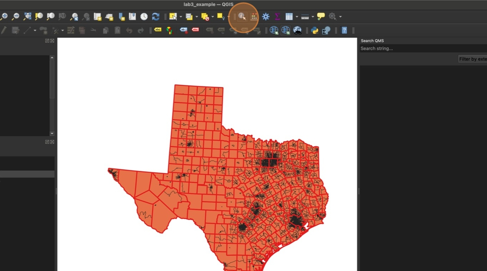
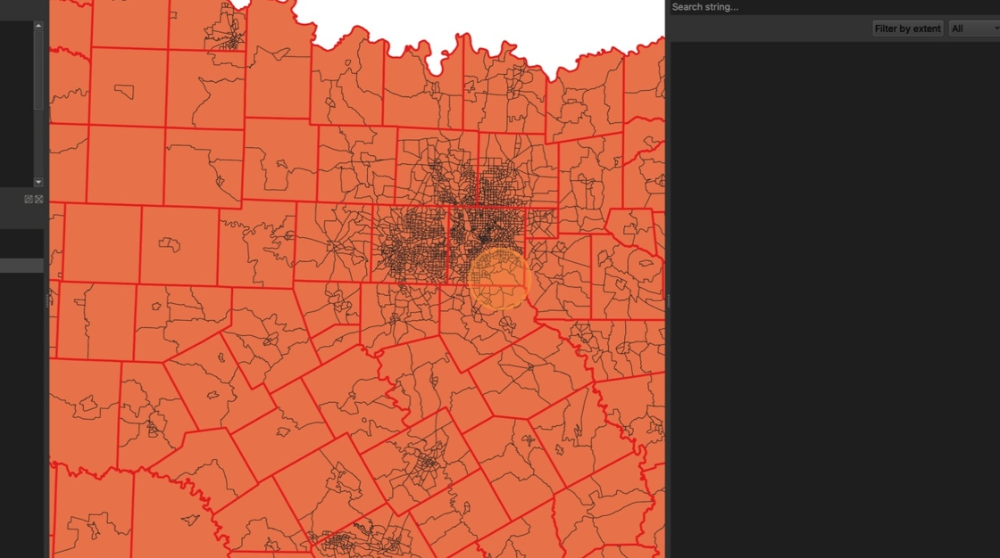
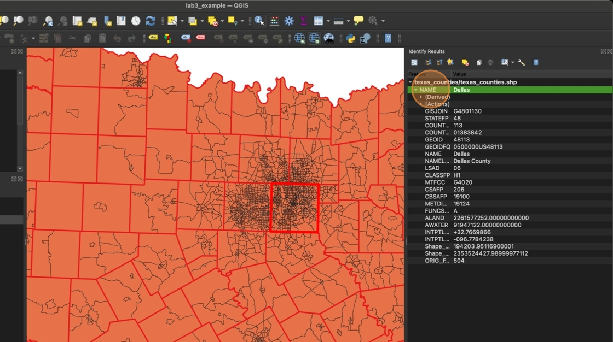
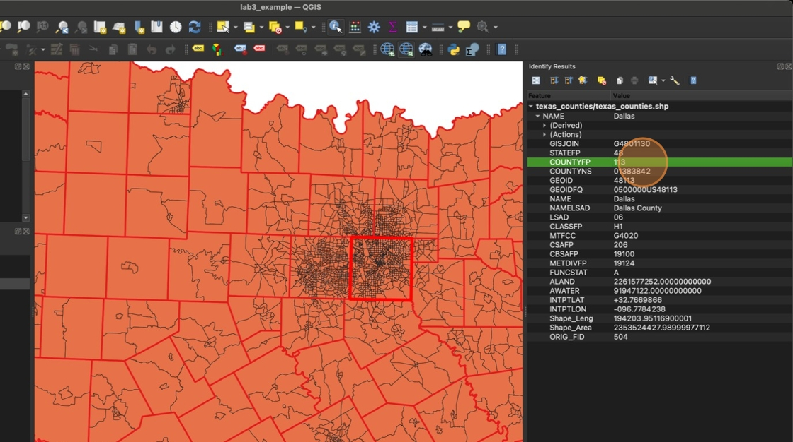
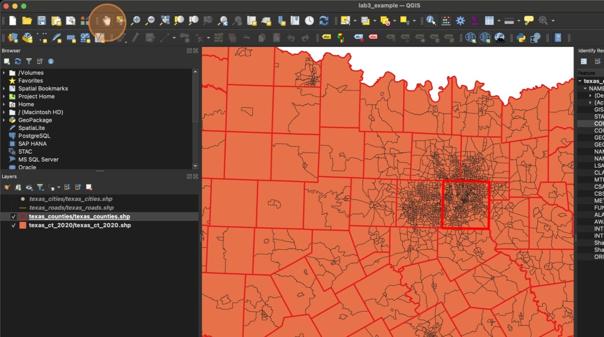

# Using the Identify Features Tool

1. Make sure "texas_counties/texas_counties.shp" is selected in the layer pane

    

2. Click "Identify Features"

    

3. Click inside a county you are interested in studying. Even though we can see the census tract layer, the Identify features tool knows we are looking for counties because that's the layer we have selected in the Layer pane.

    

4. The Identify Results panel will open showing the information of the feature you selected.

    

5. Note the **COUNTYFP** number for the county you selected

    

6. Click "Pan Map" to stop using the identify tool and return to the regular cursor

    

Take some time to explore the map and find a county you are interested in. For this report you must select a county with at **least three census tracts** and you **cannot choose Dallas County**

