# Creating a Highlight Map

1. Click the blank area at the bottom of the layer pane to deselect the counties layer.

    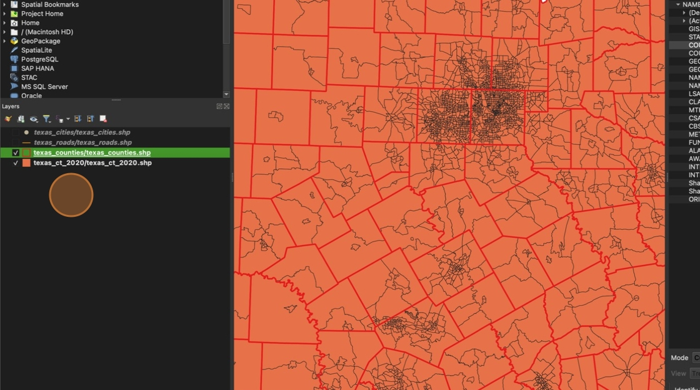

2. Click "Add Group"

    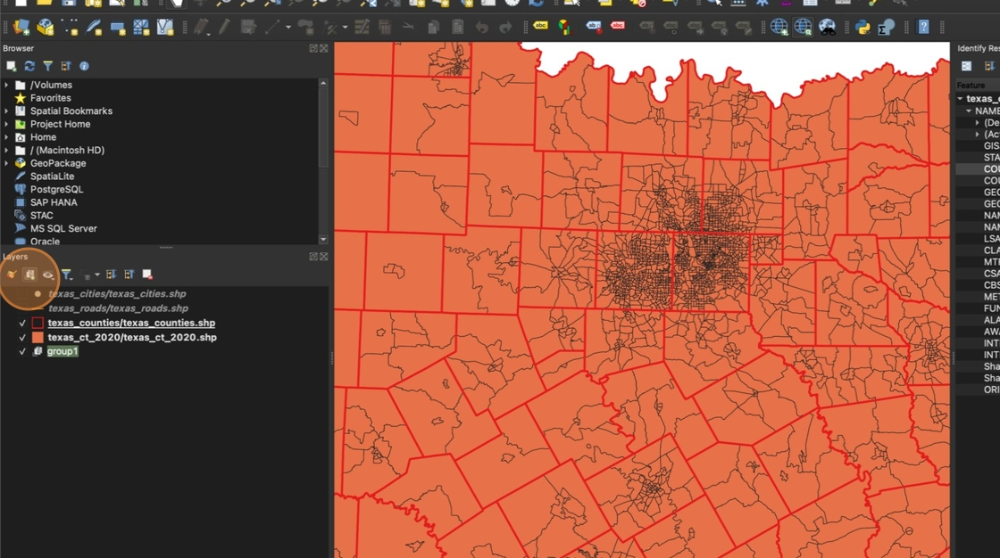

3. Double-click "group1" and change the name to **"Highlight Map"**

    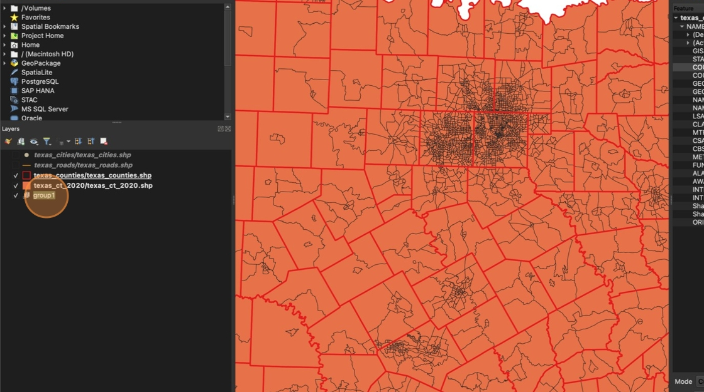

4. Right click the county layer and click **"Duplicate Layer"**

    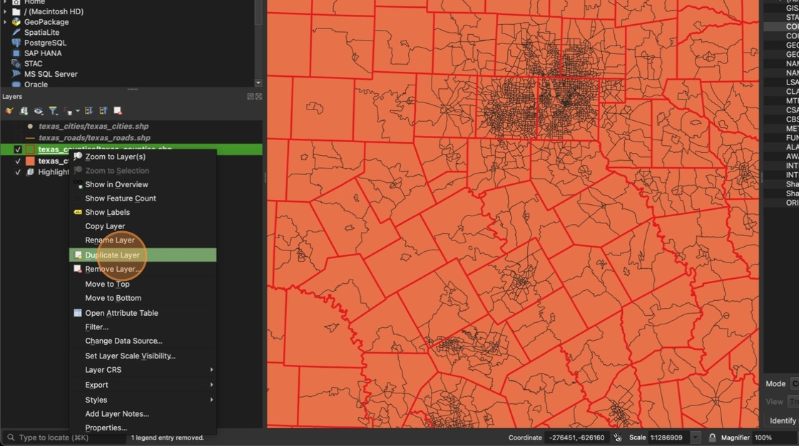

5. drag the copy of the county layer into your new group

    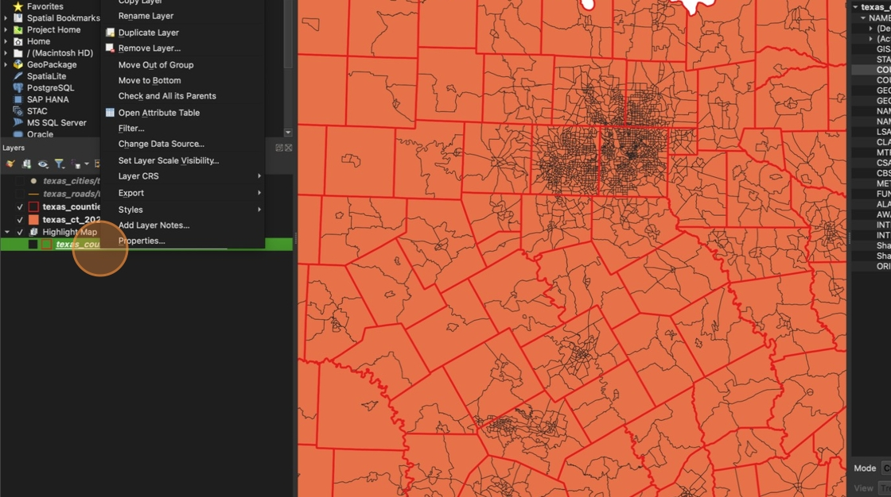

6. Right click the copied layer and rename it to "highlight_counties"

    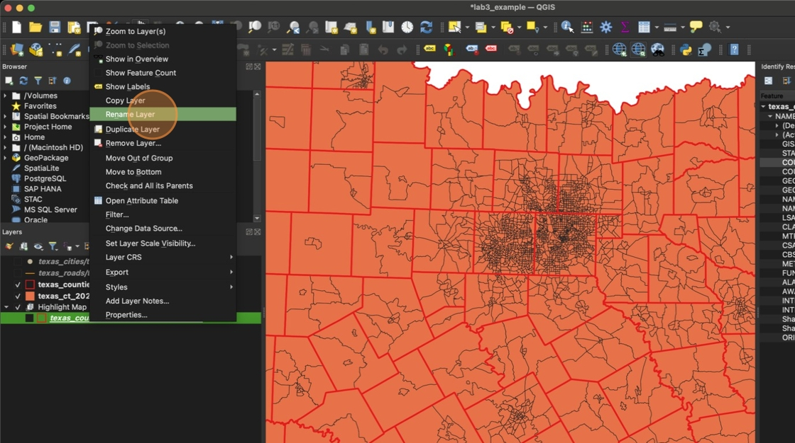

7. Click "highlight_counties"

    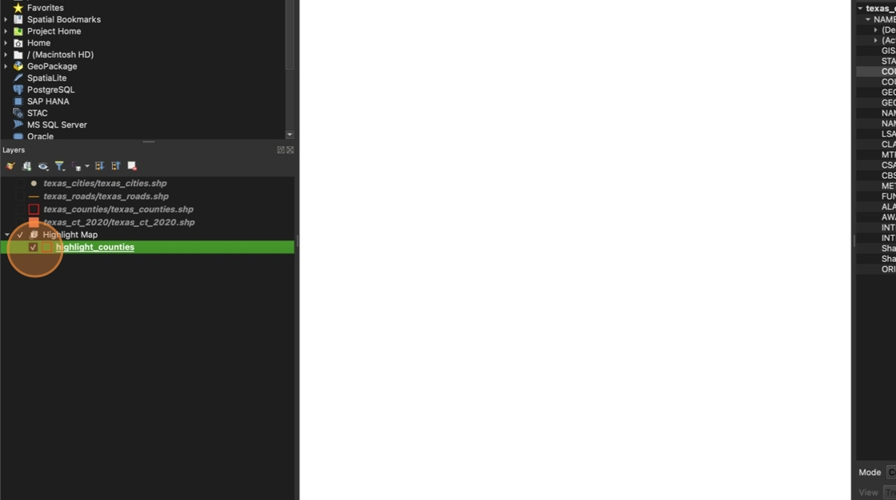

8. Use the check boxes next to each layer to unselect all the layers outside the Highlight Map group and check all the layers inside the group

    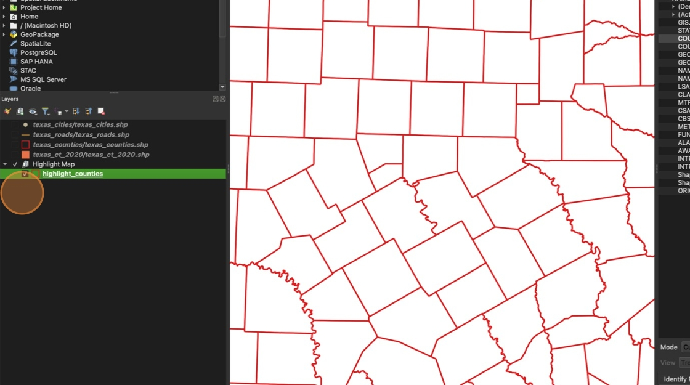

9. Double click the **highlight_counties** layer to open the properties. In the **Symbology** section, change the color to a neutral color (medium gray is best)

    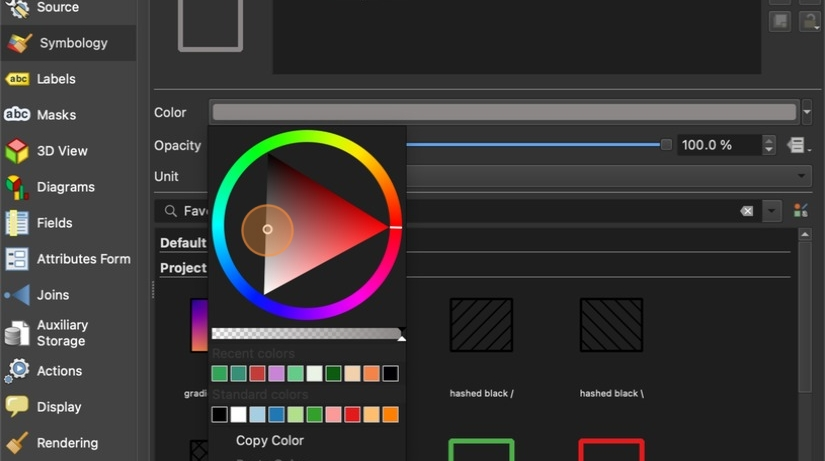

10. Click "Apply". You should be able to see the color you selected update on the map. Do not close the properties window.

    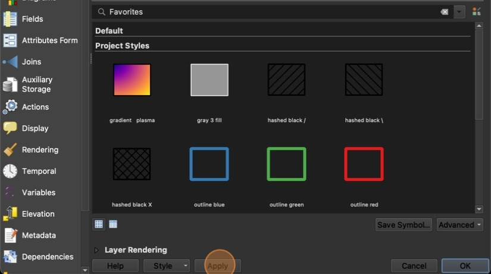

11. Change "**Single Symbol**" to **"Rule-based"**

    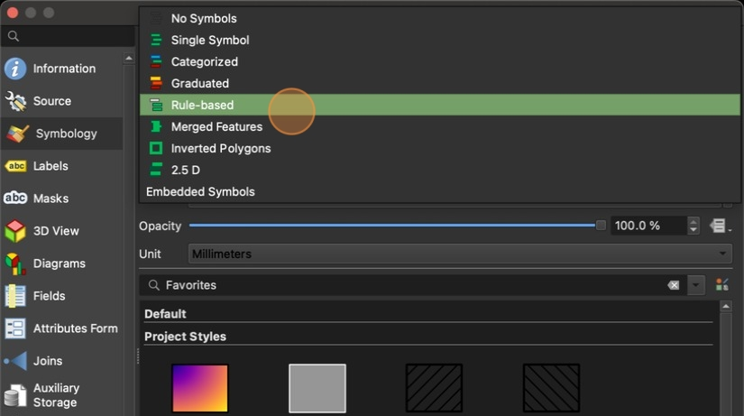

12. Click "Add rule"

    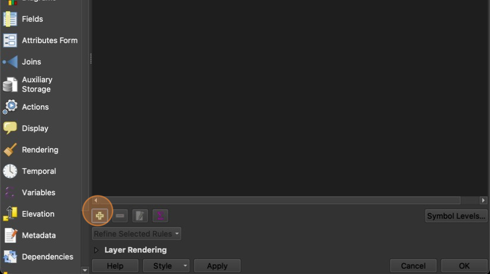

13. Click the build filter button

    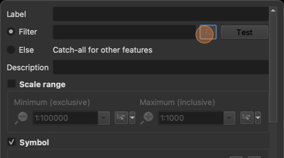

14. Click the arrow next to "Fields and Values"

    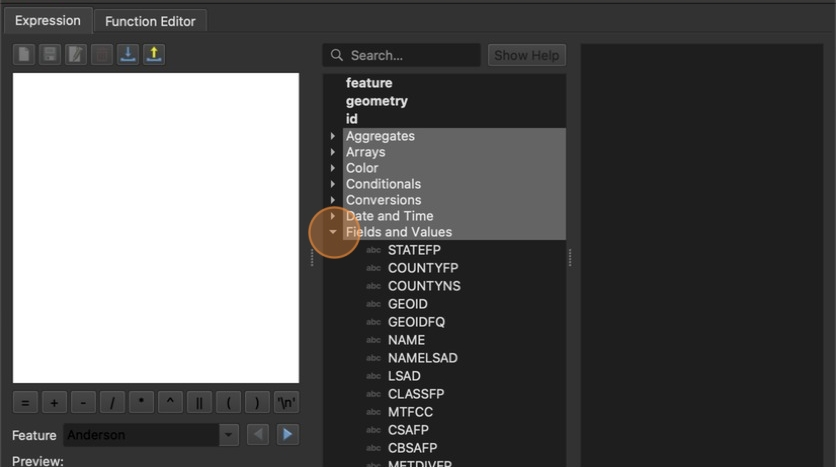

15. Double click "COUNTYFP"

    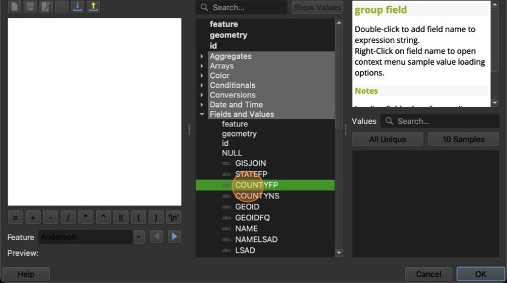

16. Click "="

    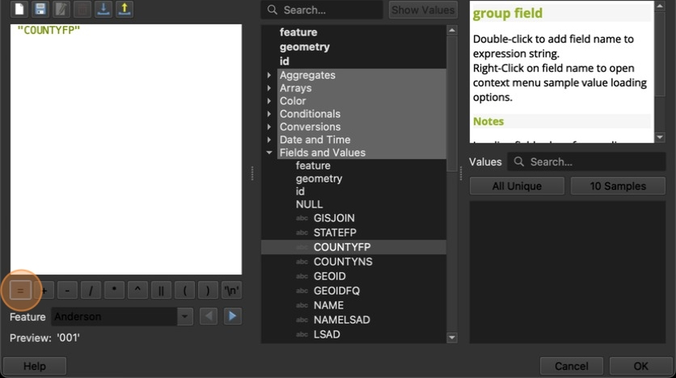

17. Type the county FP number you noted in the previous step. Dallas county's FP number is **113**, but you should type the FP number for your chosen county instead.

    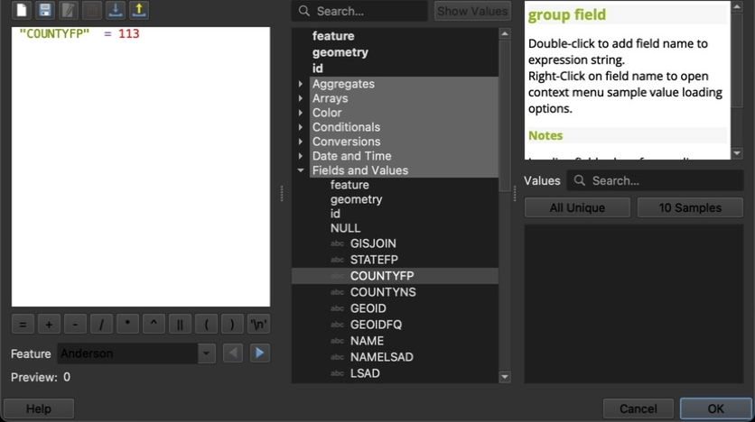

18. Click **OK**

    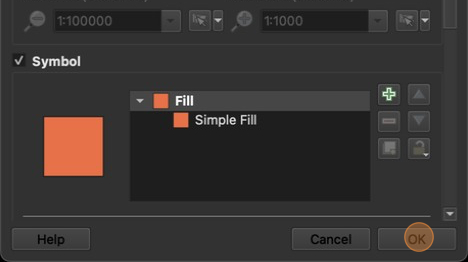

19. Click "Test"

    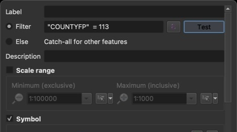

20. Your filter should only return 1 feature. Click **OK** to close and **OK** again to close the filter menu

    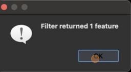

21. Right click on your new rule and select **Change Color**

    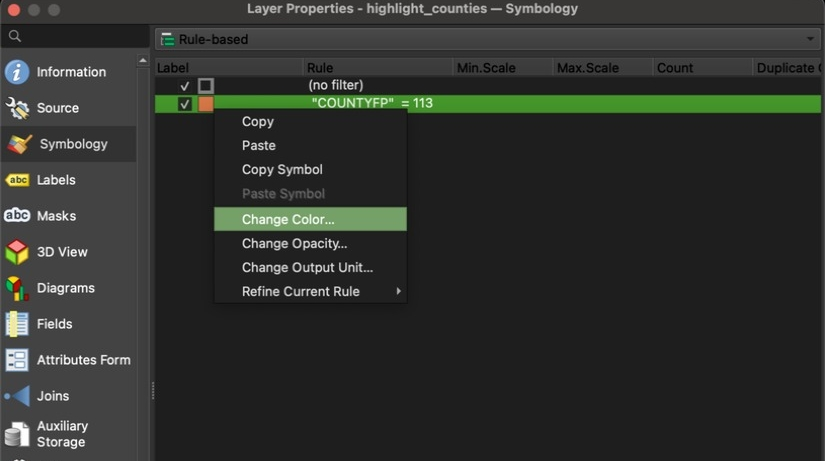

22. Choose a bright highlight color, then click **OK**

    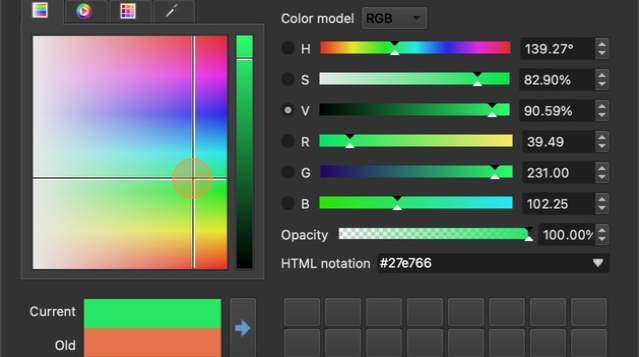

23. Click "Apply" then click "OK"

    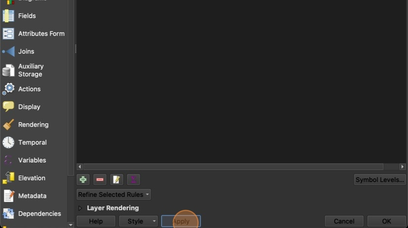

24. Your selected county should now be highlighted on the map

    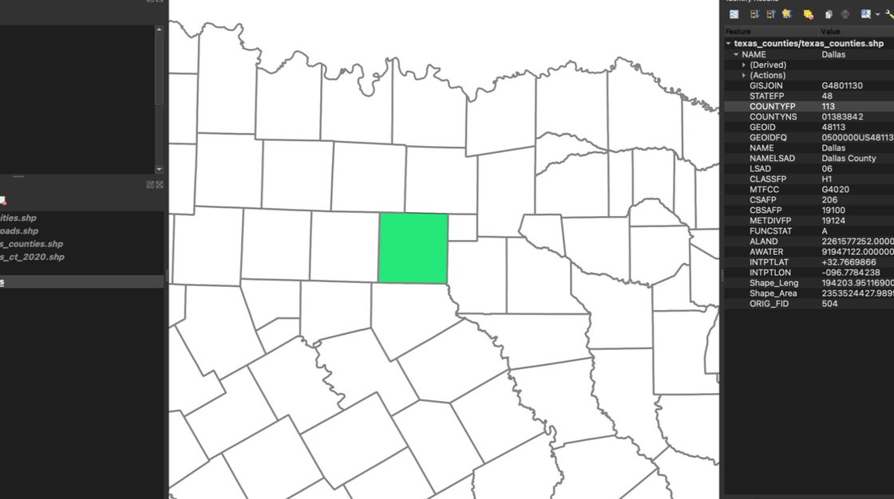

25. Zoom out by scrolling to see the full state of Texas.

    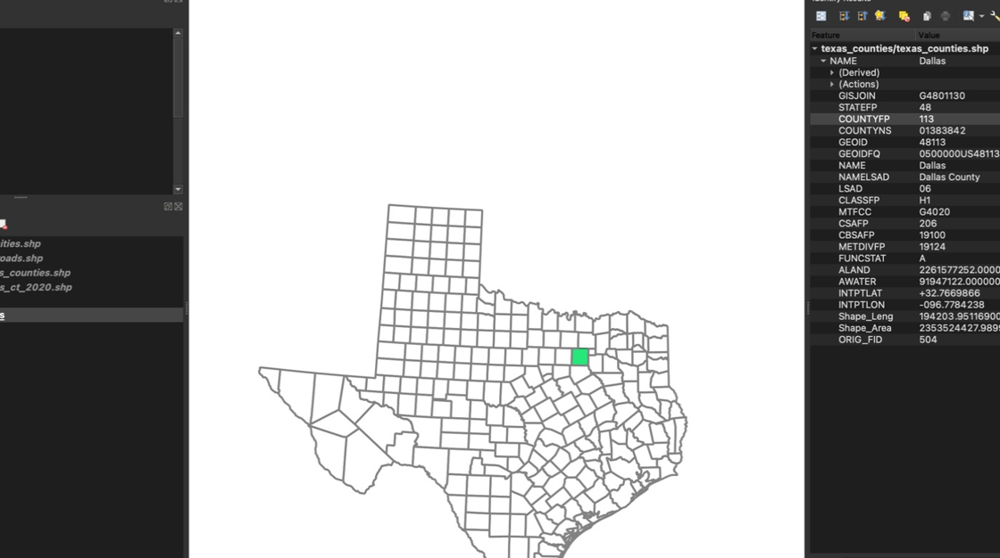

