# Filter Layer by Attribute

1. Select all four layers outside of the Highlight Map Group by holding the `Shift` key and clicking each layer name.

    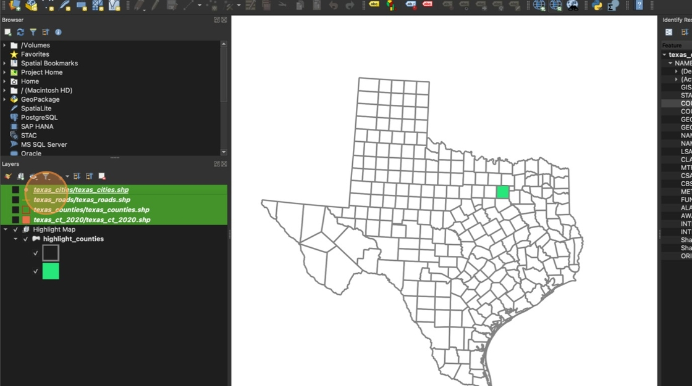

2. Click "Add Group"

    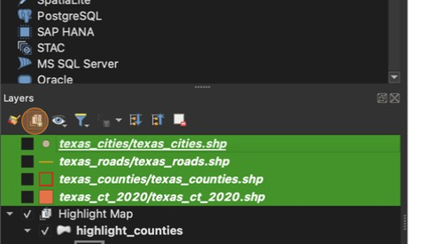

3. Name the group "Population Map"

    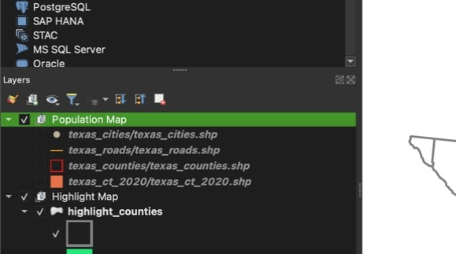

4. Click the checkbox next to "texas_ct_2020/texas_ct_2020.shp" and "texas_counties/texas_counties.shp" layers to display the Census Tract and County layers

    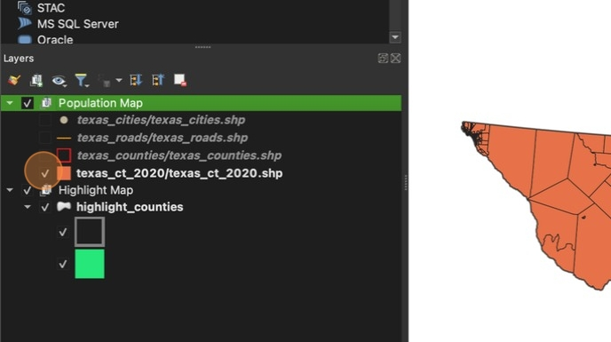

5. Uncheck the box next to "Highlight Map" group to hide the highlight map

    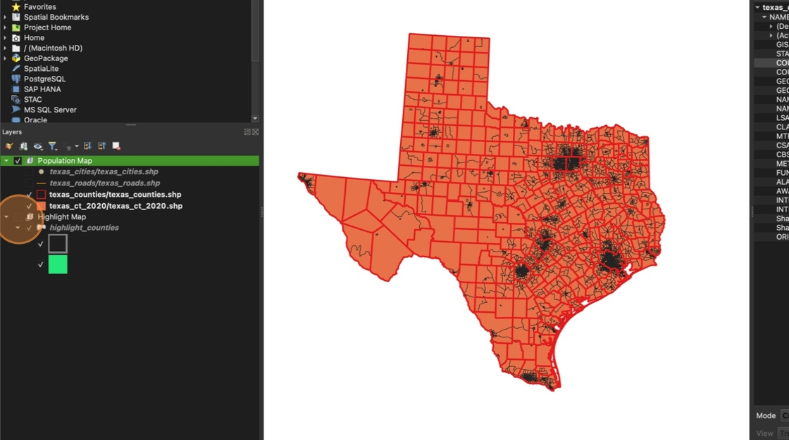

6. Right click "texas_ct_2020/texas_ct_2020.shp"

    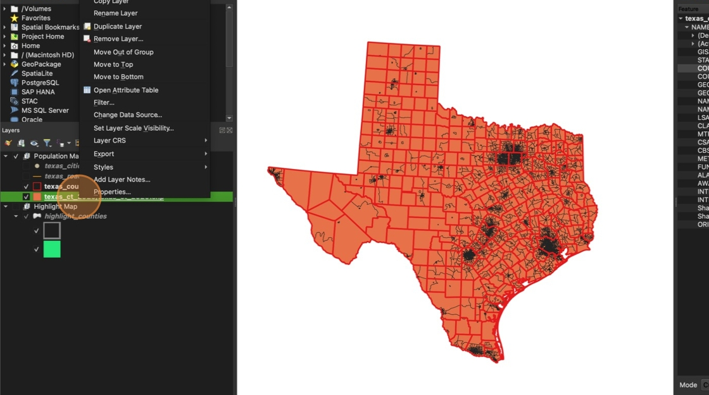

7. Click **Filter**

    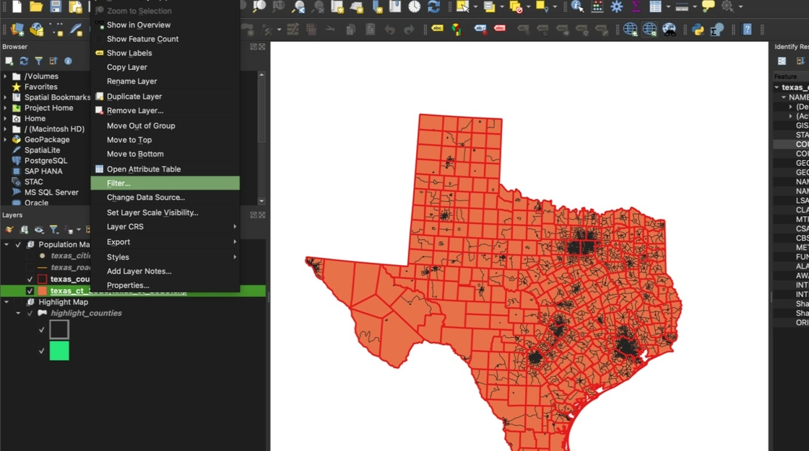

8. Double-click "COUNTYFP"

    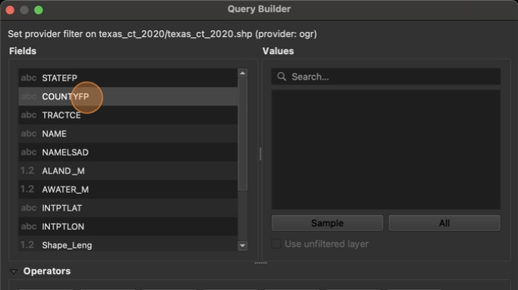

9. Click "="

    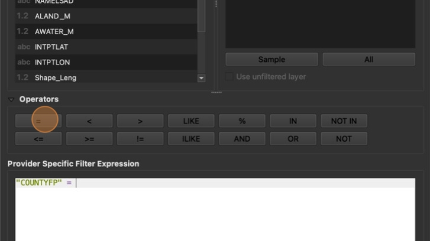

10. Type your county's FP number in quotation marks. **Dallas County** **FP** is '113' but your county number will be different. Click **OK** when you're done

    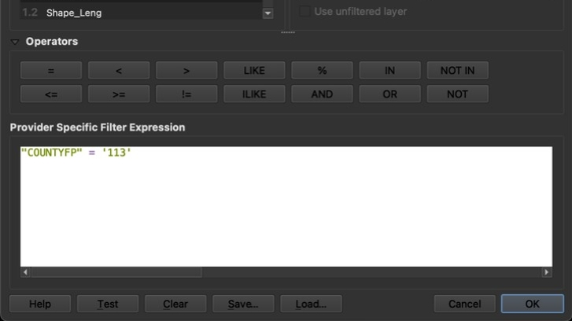

11. Repeat step 6 through step 10 on the texas_counties layer. Now only your chosen county should be visible.

    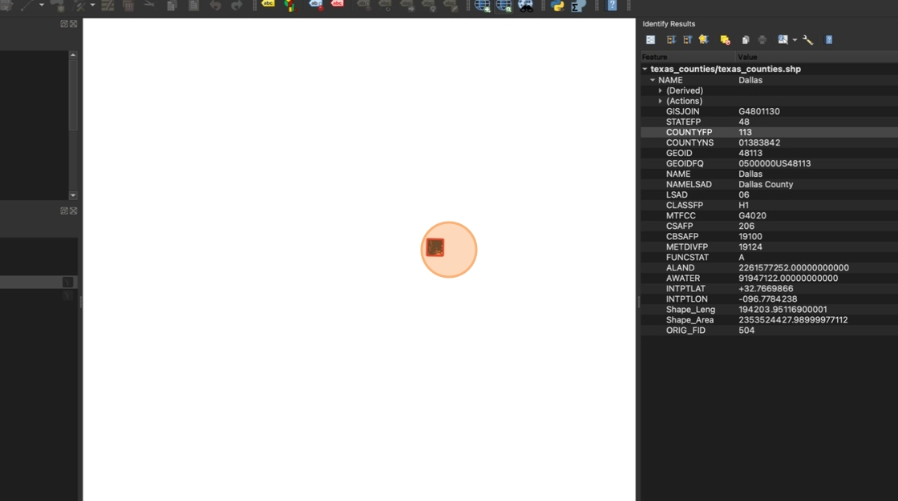

12. Right click "texas_counties/texas_counties.shp" and click "Zoom to Layer(s)"

    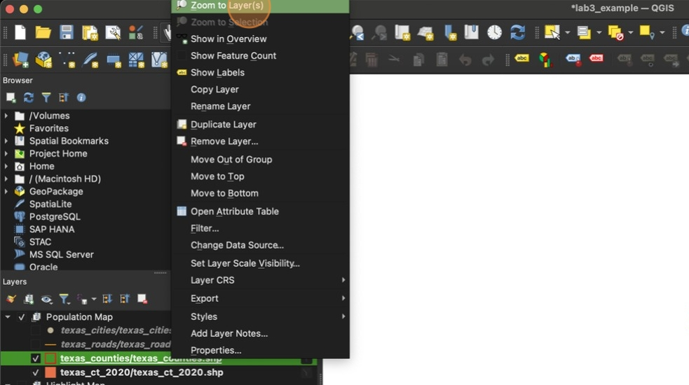

