# Filter Layer by Location

1. Click the check boxes next to "texas_roads/texas_roads.shp" and "texas_cities/texas_cities.shp" to make these layers visible

    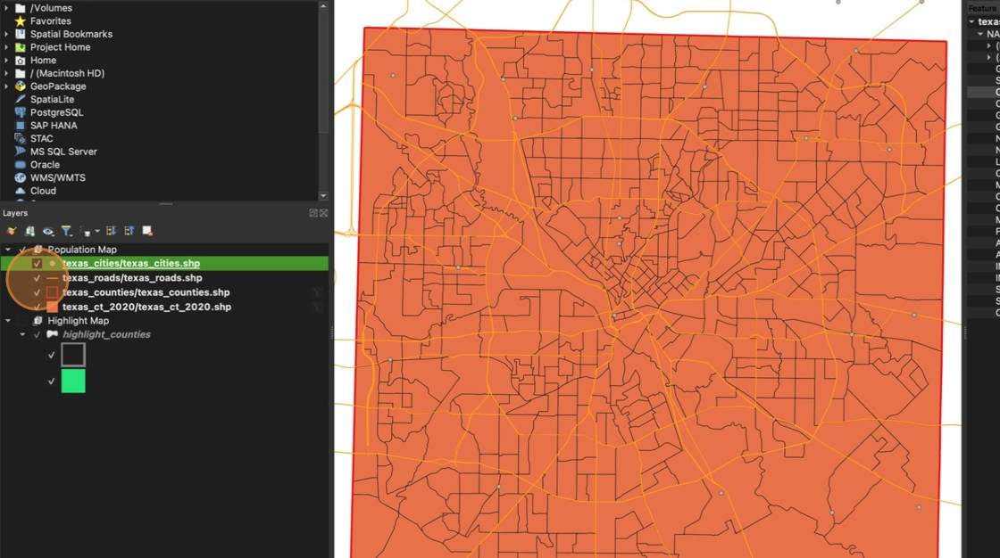

2. In the top menu, click **Vector**. Hover over **Research Tools** and click **Select by Location**

    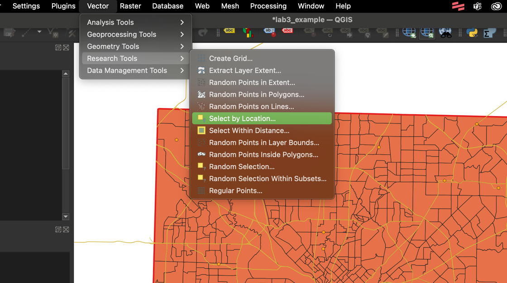

3. Select features from your **texas_cities** layer. Keep the **intersect** option checked. In the "By comparing to the features from" field, select the **texas_counties** layer (NOT the highlight_counties layer!)

    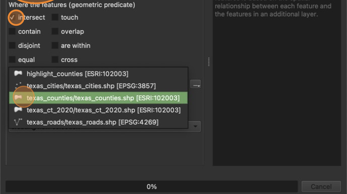

4. Click "**Run"** then click **"Close"**

    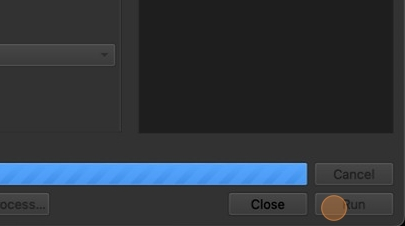

5. Your selected features should now be visible in yellow.

    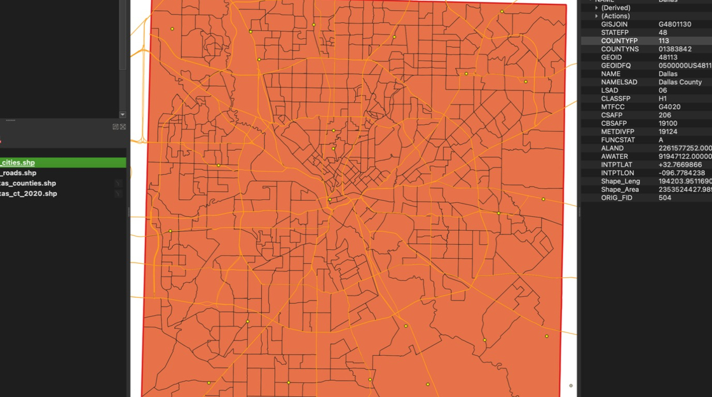

6. Right click the **texas_cities** layer and select Export &gt; **Save Selected Features As ...**

    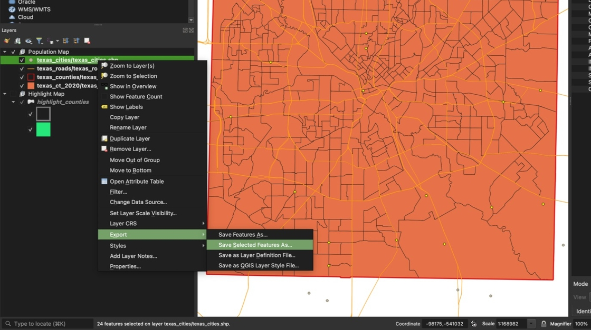

7. In the Save Vector Layer window, click "…"

    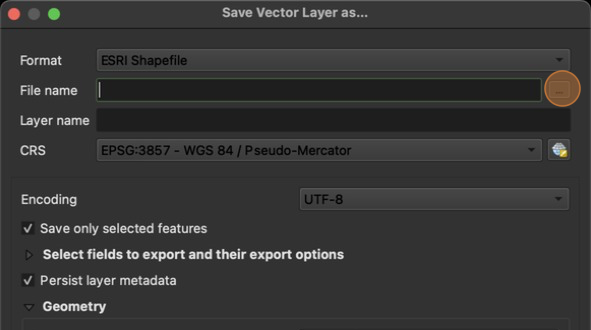

8. Navigate to your lab folder and save the file as **my_cities.shp.** click **Save.**

    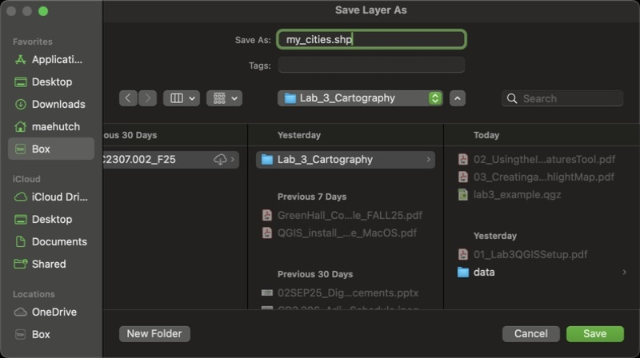

9. Keep all other defaults and click **OK**

    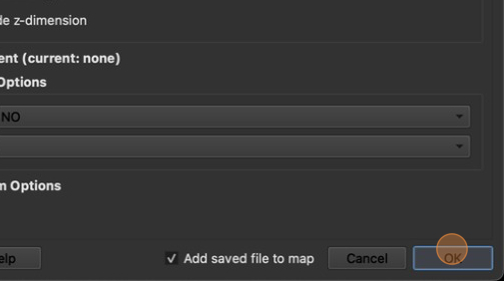

10. Click  the box next to "texas_cities/texas_cities.shp" to hide the layer. Now only cities in your selected county should be visible.

    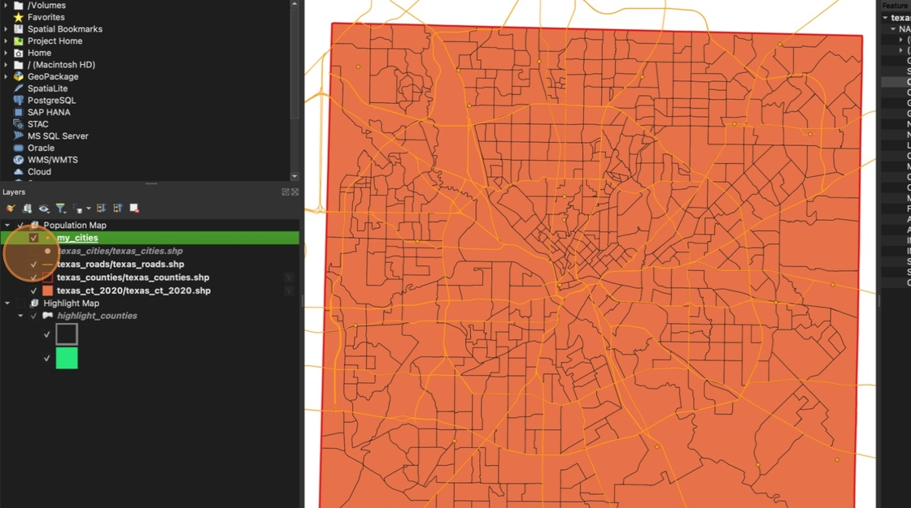

11. Repeat steps 2 through 10 on the **texas_roads** layer. It is OK if you have some roads that extend past your county boundaries, but roads that do not intersect with your county should not be visible

    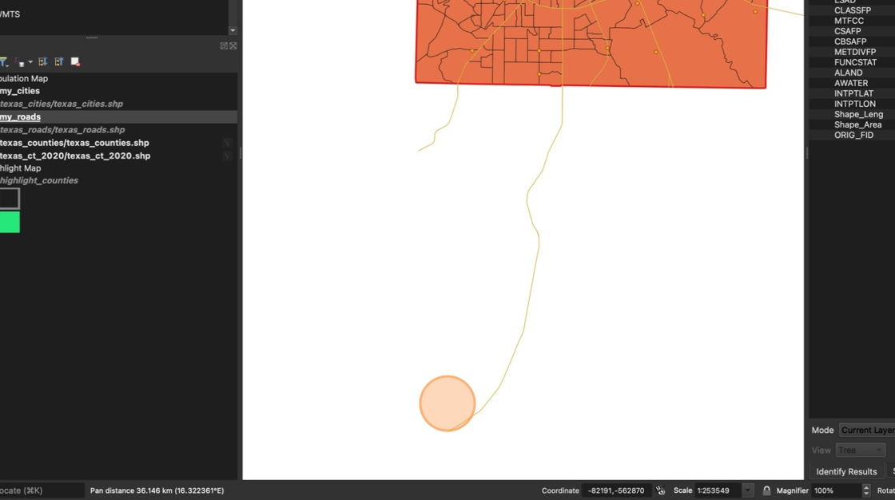
