# Make a Population Density Map

1. Double click your Census Tract layer ("texas_ct_2020/texas_ct_2020.shp")

    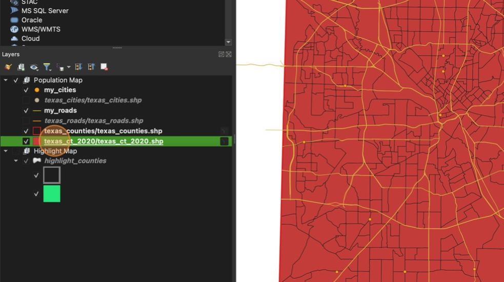

2. In the **Symbology** section, change "Single Symbol" to **"Graduated"**

    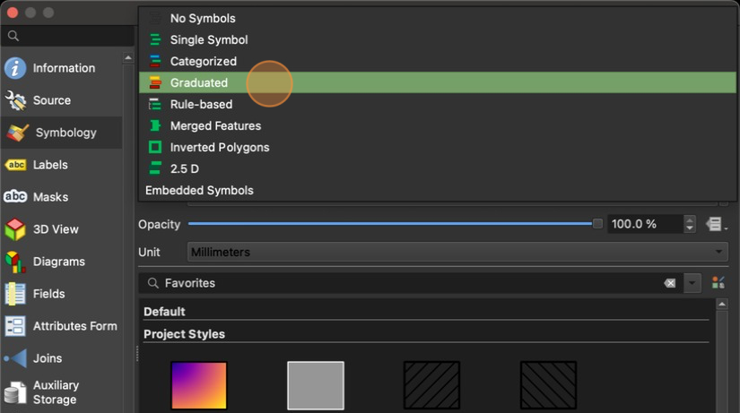

3. In the **Value** box, select the **population** field

    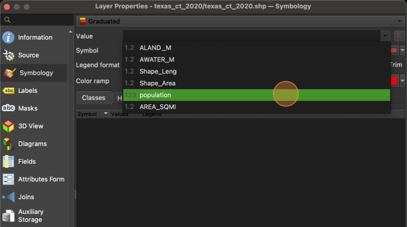

4. Click **"Classify"** to auto generate class categories. You are welcome to choose any **Mode** in order to make your map look how you think best communicates your data. Make sure you have at least 4 categories and no more than 8 categories

    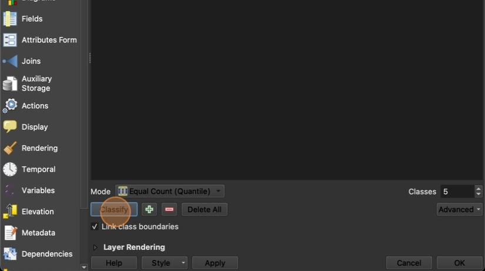

5. Click "Apply"

    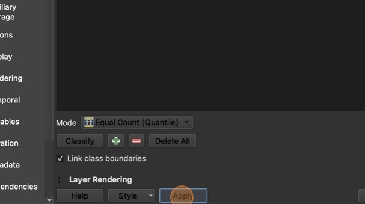

6. Take some time to look at your raw population map. Notice that the larger tracts tend to have more people living in them. It is very rare that you will ever need a raw population map as it does not give us much information. What would be much more useful is a **population density map**

    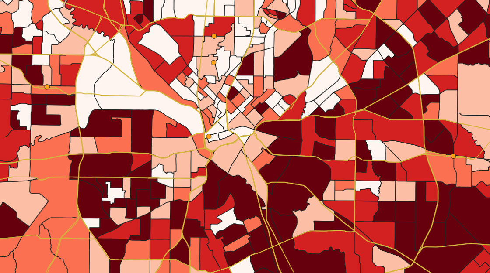

7. In the Symbology window, click the Purple equation sign next to **Population**

    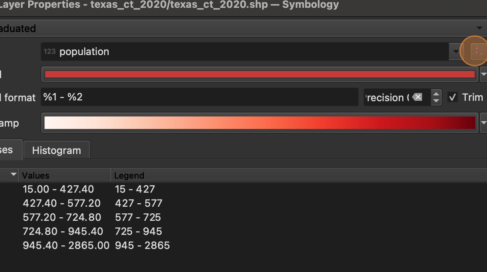

8. Click "/" to indicate division

    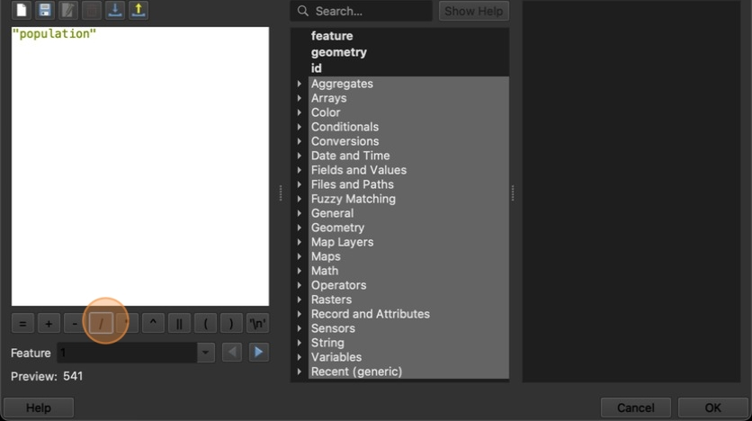

9. Click the arrow next to **"Fields and Values"** then double-click **"AREA_SQMI".** Then click **OK**.

    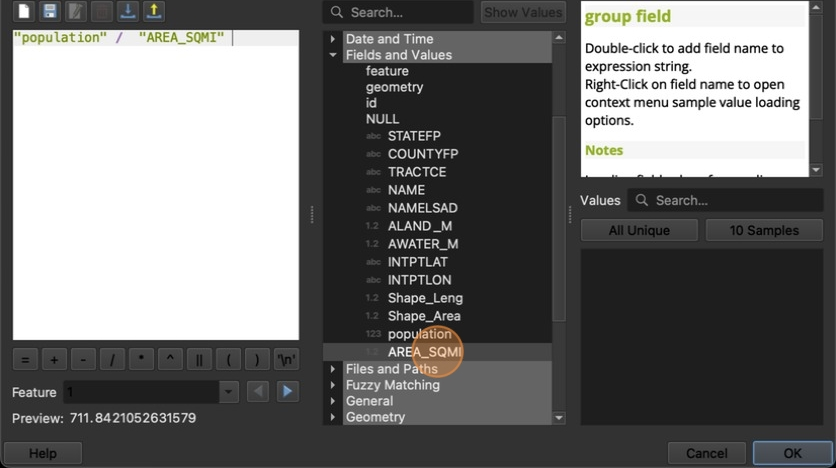

10. Click **"Classify"** then click **Apply**

    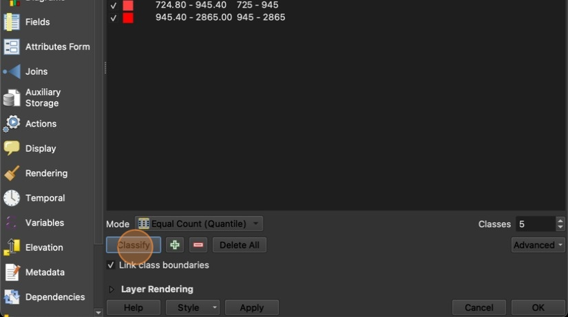

11. Take some time to examine how your map has changed. Is it easier to identify where the most "Crowded" areas are now?

12. In the Layer Properties window, select a Color ramp that best illustrates your data

    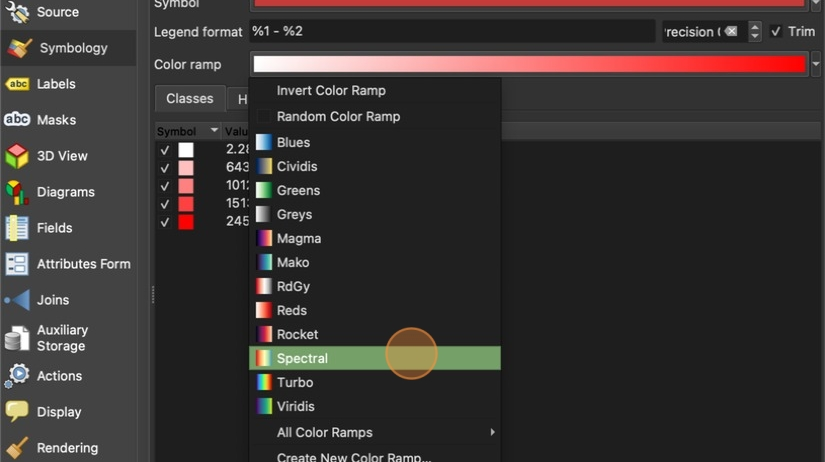

13. Note that in the U.S., **warm colors** (reds and oranges) are associated with crowdedness and high density while **cold colors** (blues and greens) are associated with low density. You may need to **invert your Color Ramp** to align these natural associations with your categories correctly.

    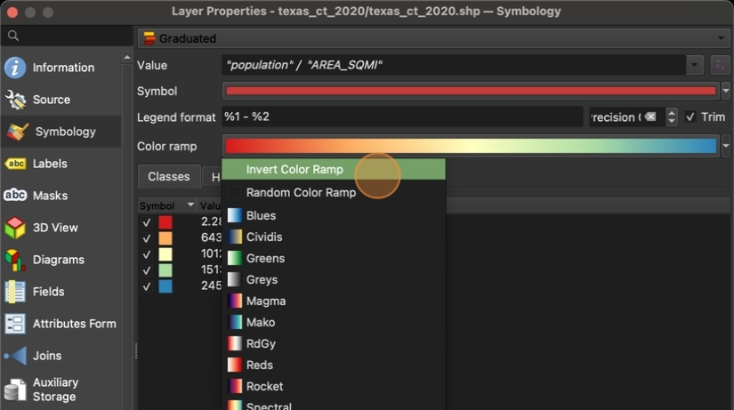

