# Make a print layout with two maps

1. Using what you learned in **Lab 2**, add city name labels and update the symbology and layer names for all the layers on your Population Map. Remove the original city and road layers that you are not using. 

    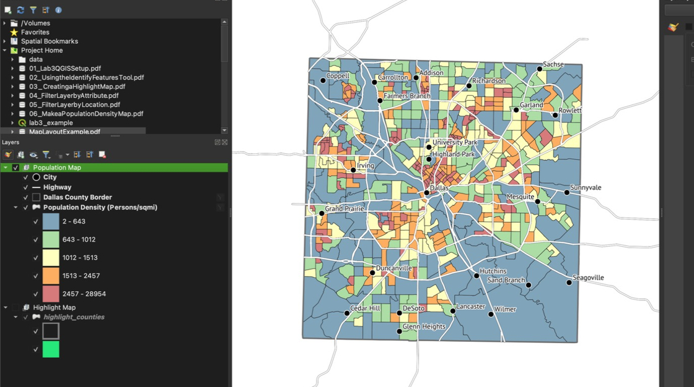

2. Click the checkbox to hide the Population Map and click the checkbox to view **"Highlight Map"**

    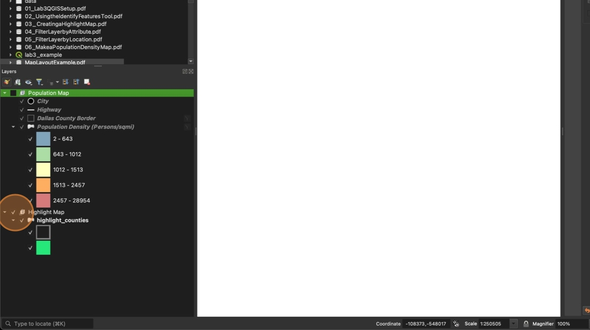

3. Right click the **Highlight Map** layer and click "**Zoom to Group".** Adjust the map frame to center the state of Texas in your view so that you can see all counties.

4. Click the "New Print Layout..." Icon and name your layout "\[COUNTY NAME\] Population Density", replacing \[COUNTY NAME\] with the name of your county you chose to map.

5. Click **Layout** then **Page Properties**

    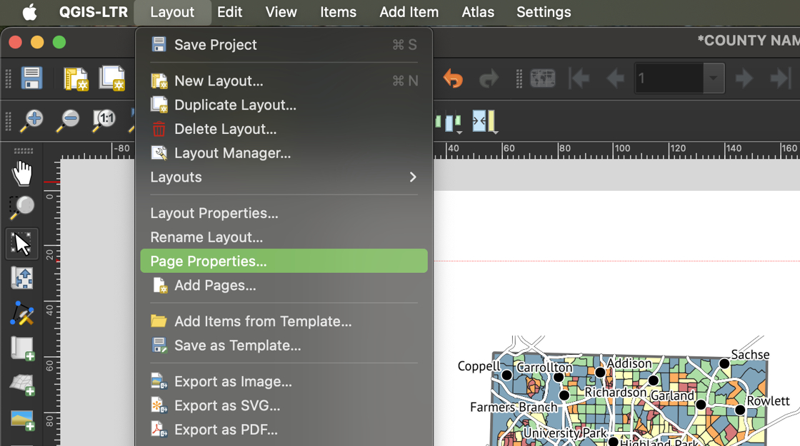

6. In the Item Properties window, change the **size** to **Letter**.

    You can also change the orientation of the paper in this window, if you want to. The rest of this lab manual uses the **Portrait orientation** for the example layout

7. Click "Guides"

    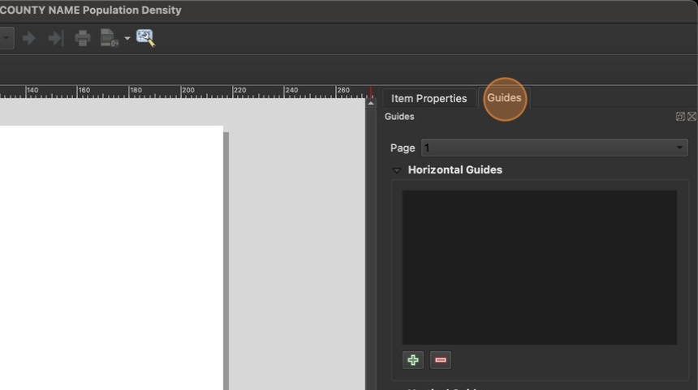

8. Click the + button under "Horizontal Guides"

    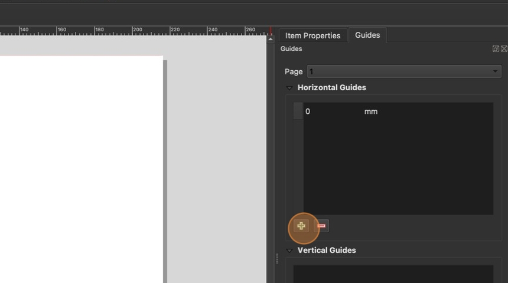

9. Add the following Horizontal and Vertical Guides:

    For **Portrait Layout:**

    - Horizontal guides at 1 inch and 10 inches
    - Vertical guides at 1 inch and 7.5 inches

    For **Landscape Layouts**:

    - Horizontal guides at 1 inch and 7.5 inches
    - Vertical guides at 1 inch and 10 inches

10. Click "Apply to All Pages"

    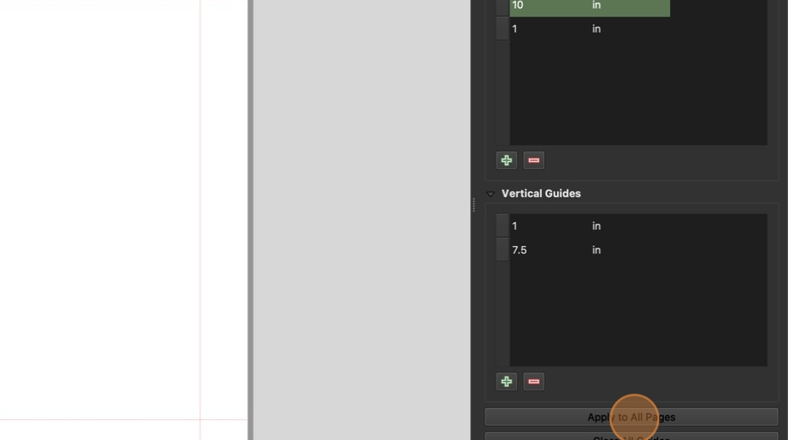

    Use page guides to maintain margins on your print layout. Do not place layout items outside of the orange guide lines.
    

11. Add a small map in the corner of your layout. Be sure to keep all elements within your marked guides.

    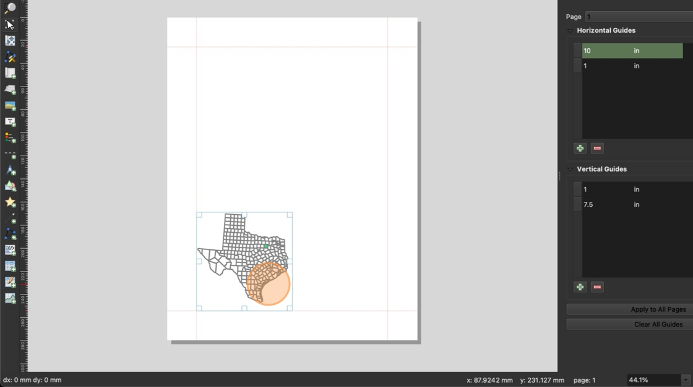

12. Right click the map and select **Item Properties..**

    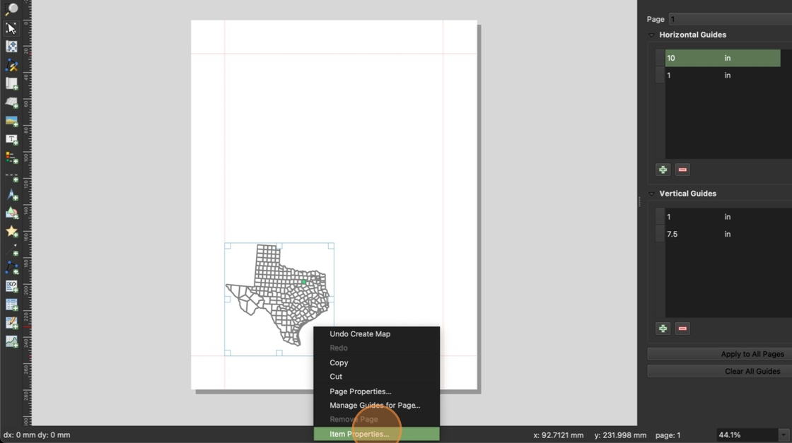

13. Click "Lock layers". This will prevent the map from updating when we add our second map.

    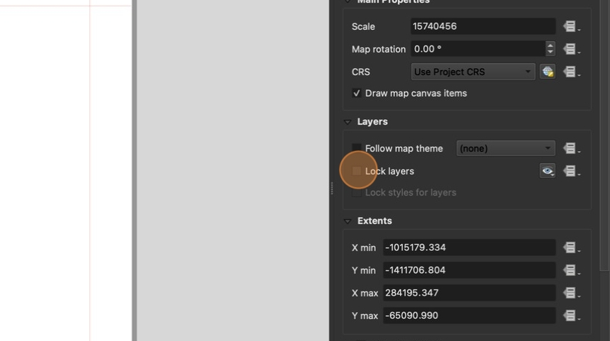

14. Click "Frame" to add a border to the map frame

    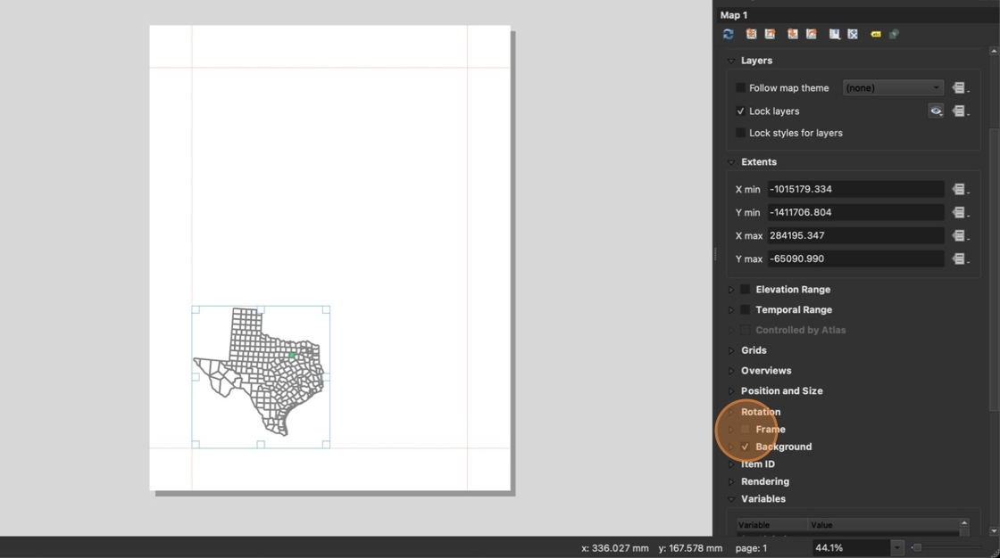

15. Switch to your main QGIS window (do not close the Layout window).  Turn on the **Population Map** group and turn off the visibility of the **Highlight Map Group**

    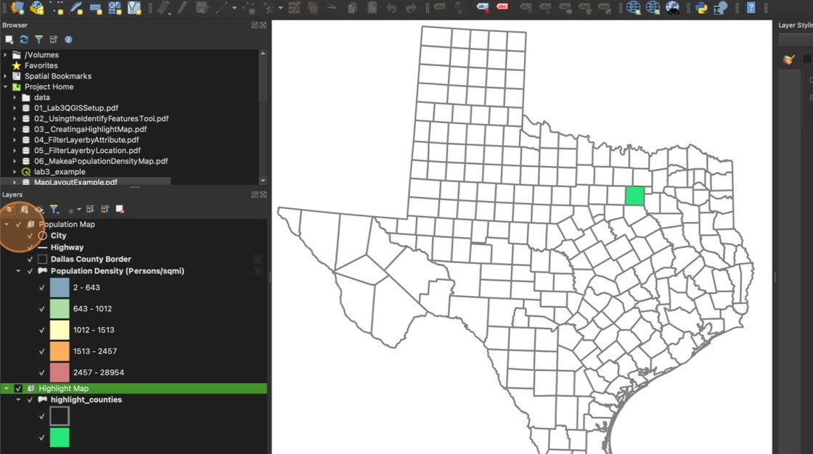

16. Zoom to the **Population Map** group and center your county in view.

    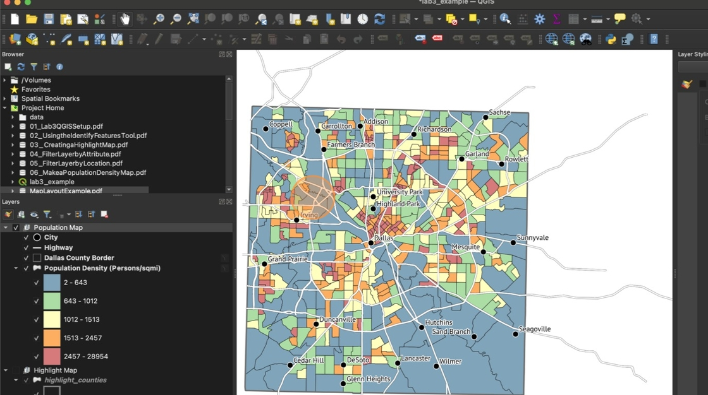

17. Add your second map frame. Remember that you can use the  "Move Map Content" button to adjust how the map appears in the layout.

    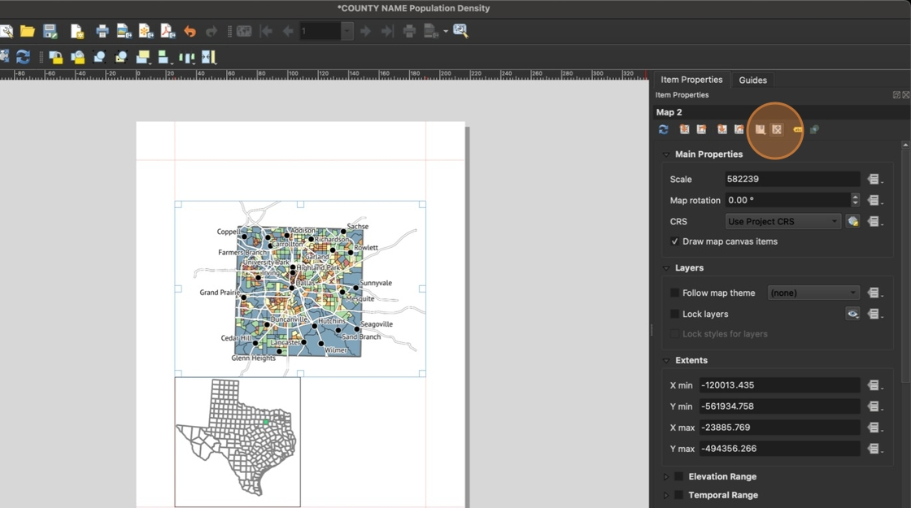

18. Add a legend to your map. Click "Only show items inside linked maps". The legend items corresponding to the Highlight Map group should disappear

    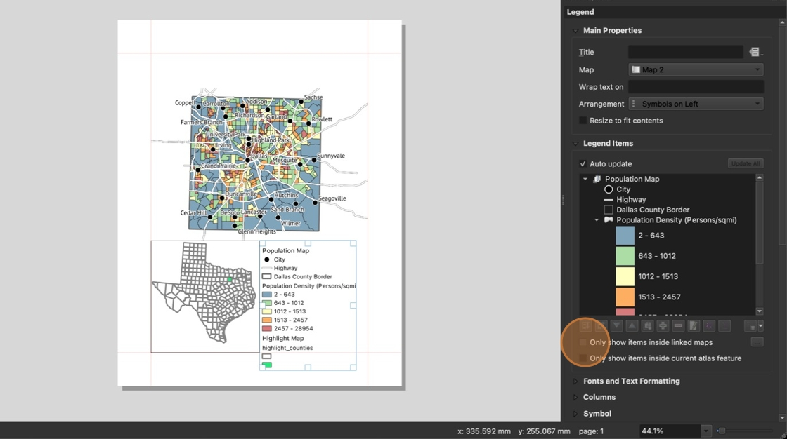

19. **Optional**: You can add a "Frame" to your legend if you think it would look better with a frame. If you select this option, you may also want to uncheck the "Resize to fit contents" option at the top of the Main Properties to prevent QGIS from resizing your legend frame automatically.

    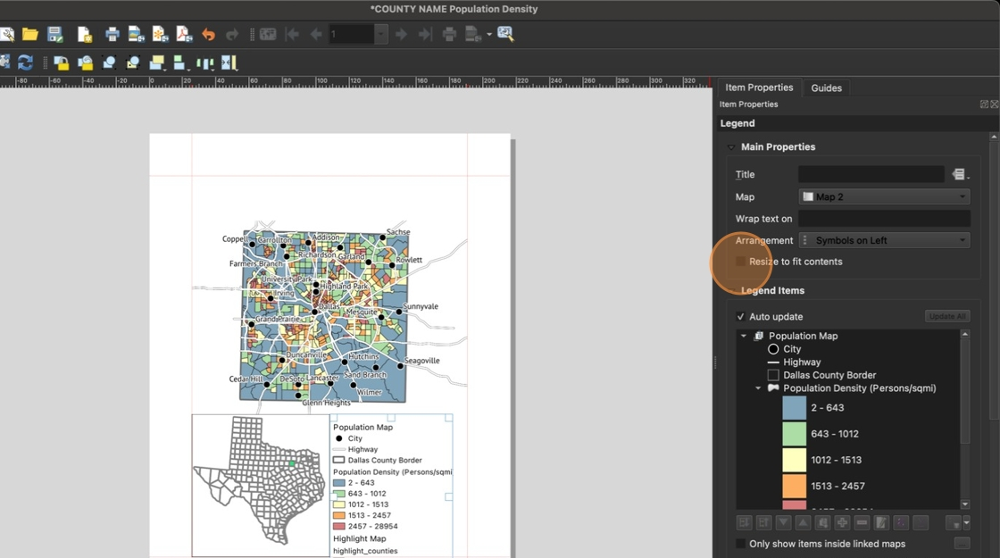

20. Click "Fonts and Text Formatting". Change the **Group Headings Font size to 0** so that the "Population Map" group label is not visible.

    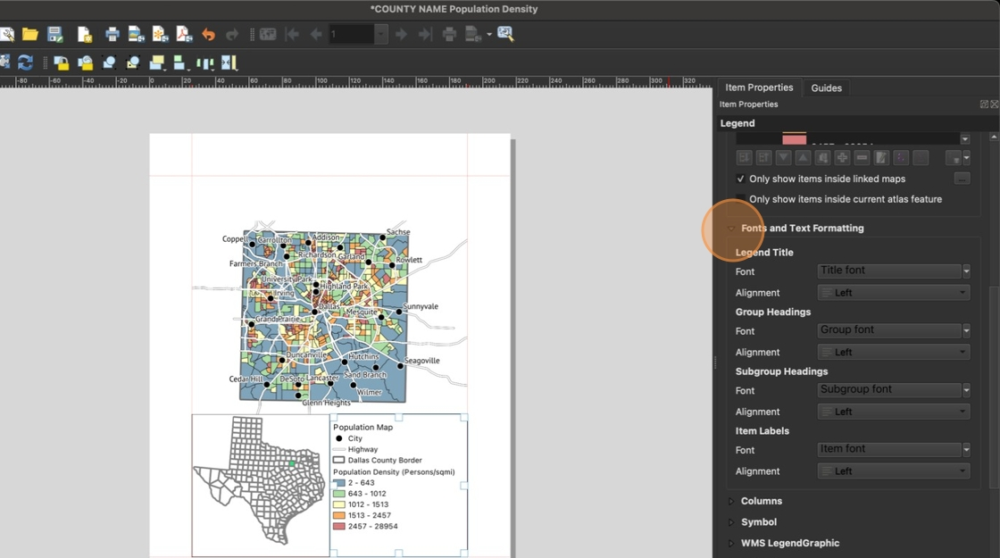

21. Add a scale bar to your layout. Make sure to select **Map 2** in the item properties to ensure the scale bar references your detailed county map and not the larger overview of Texas. Change the units to **Miles**.

    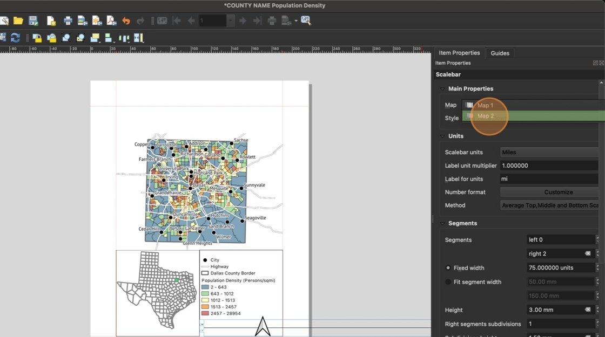

22. Add a **North Arrow** to your layout

23. Use the **Add Text** tool to add a **title**, **data source**, **name** and **date** to your layout.

24. Use the **Add Text** tool with dynamic text to add the **CRS Name** to your map.

25. Click **Export as PDF**. Save the layout under the file name FIRSTNAME_LASTNAME_lab3_report.pdf, replacing FIRSTNAME with your first name and LASTNAME with your last name

    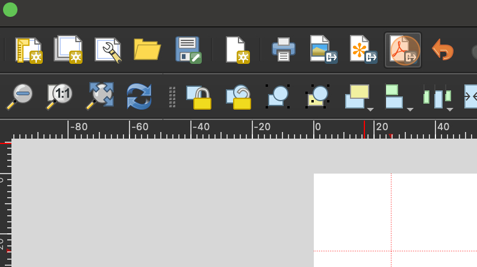

26. In the PDF Export Options, select **"Always export as vectors"** and set Image Compression to **Lossless**. Click **Save.**

    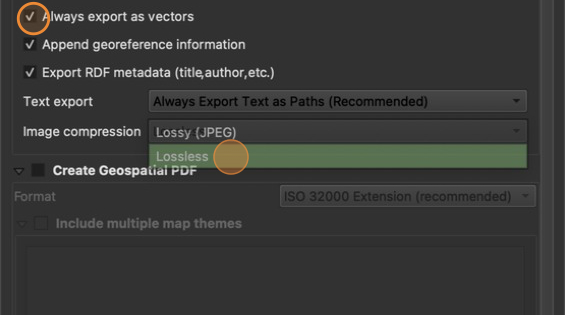

27. Open your exported layout in Adobe Acrobat to make sure it looks the way you want to. Compare it to the checklist posted with the assignment to ensure you receive all points.
