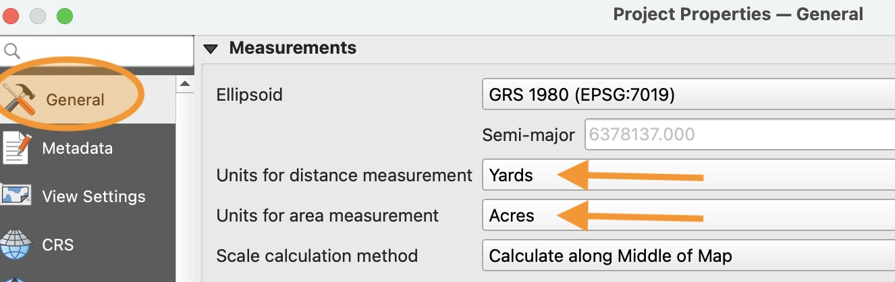
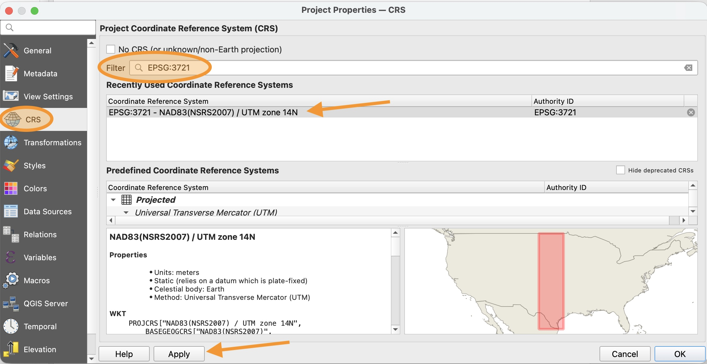
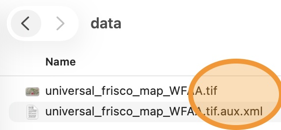
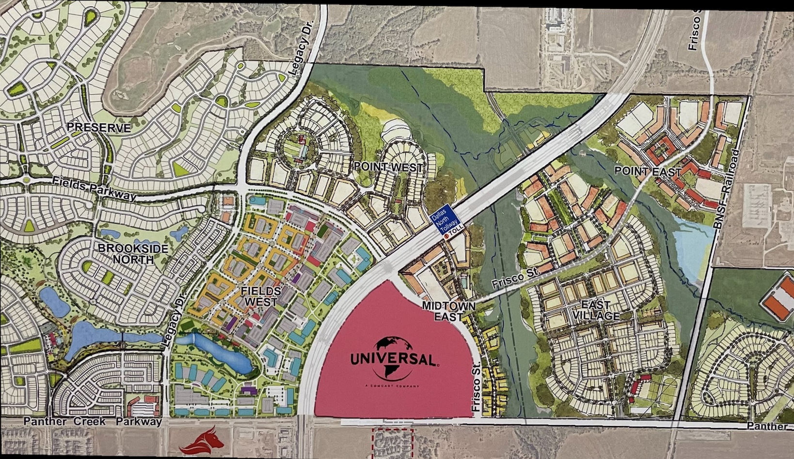
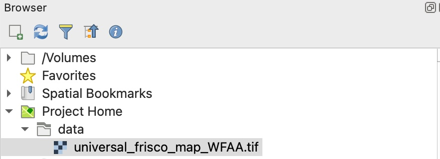
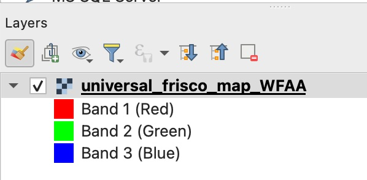
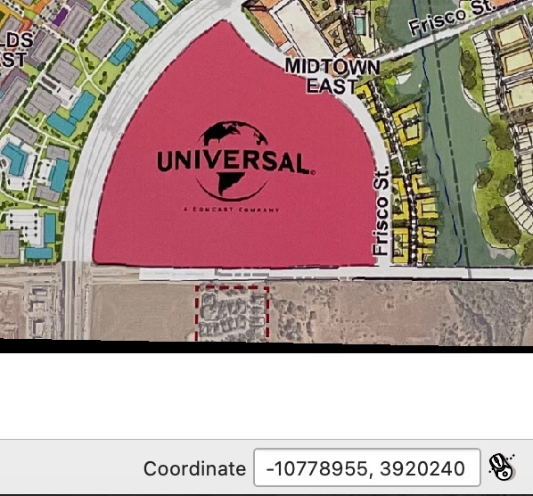

# QGIS Project Setup

1. Create a new QGIS project called `lab04` and save it in your `lab04` folder on your computer.

2. In the Menu bar, click Project > Properties

3. In the **General** section of the Properties window, change the "Units for distance measurement" to **Yards** and the "Units for area measurement" to **Acres**

    

4. In the **CRS** section of the Properties window, Filter for `EPSG:3721` and select the "NAD83(NSRS2007) / UTM zone 14N" CRS. Clic **Apply**.

    

5. Click OK to close the properties window

# Importing Georeferenced image

1. In your file manager, navigate to your `lab04/data` folder. Notice that there are two files with two different file extensions

    

    If you can't see the file extensions, you can review how to turn them on in the [Resources](../../resources) page.

2. Double click on the the `.tif` file to open it in your default image viewer. This file is a map of the proposed site of the Universal Studios Frisco Theme Park.

    

3. Double click the `.aux.xml` file to open it in your default text editor (if prompted, choose to open it in Notepad or TextEdit). This file contains metadata about the georeferenced image.

4. In your QGIS project, in the Browser panel, expand the `Project Home` and `Data` folder. Notice that only one file is visible. This is because both files are used to create a **Raster** layer that can be represented on the Earth's surface.
    

5. Drag the `universal_frisco_map_WFAA.tif` file from the Browser panel to the map panel to see the image displayed on the map. 

    Notice that a new Raster layer is added to the **Layers** panel.

    

    The three channels are red, green, and blue, to represent the three colors that a computer pixel has. Computers use these three colors, commonly called "RGB" to make every other color in the image. 

6. Hover over the image with your mouse and notice that the Coordinate reading at the bottom of the screen updates with your mouse position. This is because this is a **georeferenced** image that is associated with a specific location on the Earth's surface (e.g., Frisco, Texas).

    