# How to Create a Scratch Layer
1. Click the **New Temporary Scratch Layer** Icon in the tool bar.

    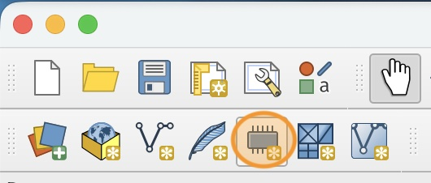

2. In the New Temporary Scratch Layer window, name the layer "Park Footprint", set the Geometry type to "Polygon" and set the CRS to EPSG:3721.

    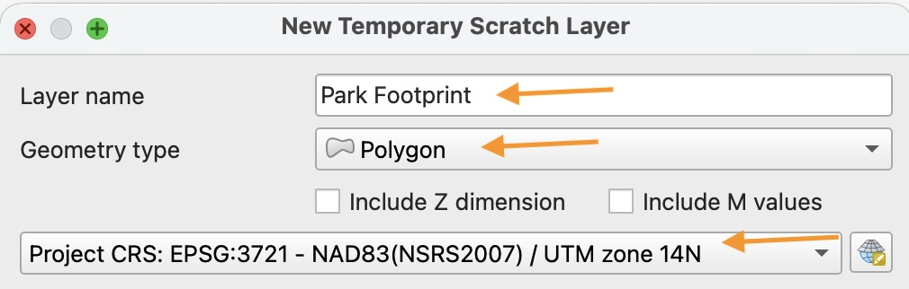

3. Add a New Field called "Name" of type "Text (string)". Click **Add to Fields List** to create the field.

    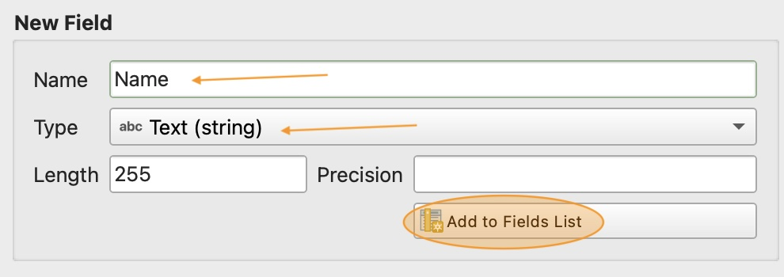

4. You can check that the field was created by looking in the Fields List at the bottom of the window.

    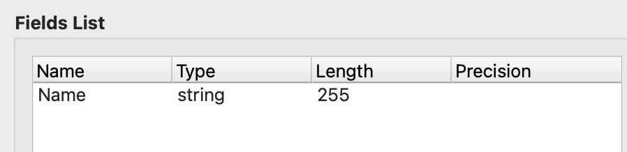

5. Click **OK** to create the layer. A new scratch layer (indicated by the memory chip icon) should appear in your Layers Panel.

Scratch layers are temporary and will disappear when you close QGIS.

# How to Draw a Polygon Feature

1. First, make sure the scratch layer is in "Edit mode", indicated by the pencil icon next to the layer name.

    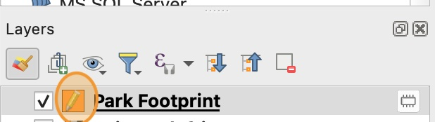

    You can toggle Edit mode on and off using the Edit Toggle button in the tool bar.

    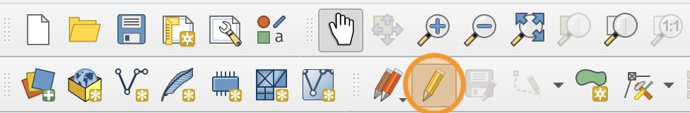

2. Click the **Add Polygon Feature** icon in the tool bar.

    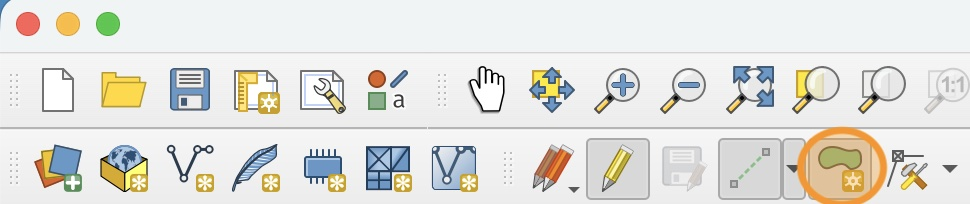

3. Click the arrow next to the add polygon feature icon and select **Digitize with Segment**.

    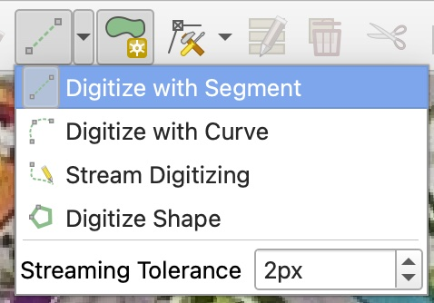

4. Click in small segments around the edge of the Park footprint in the image to draw the polygon shape. When you are done, **Right Click** to close the shape.

    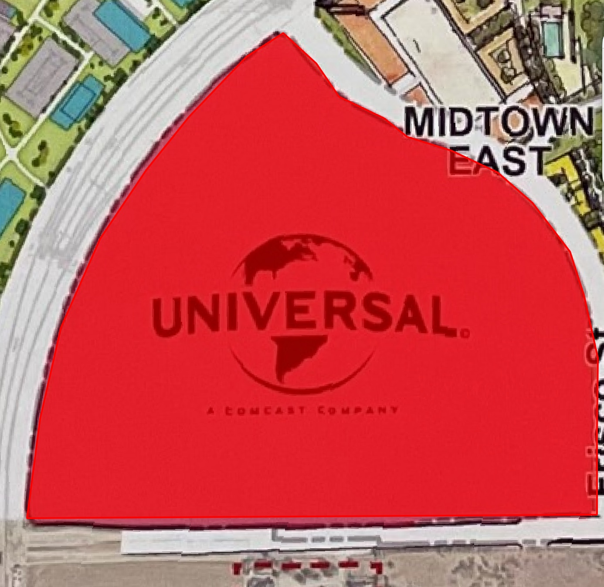

    If you make a mistake while drawing the polygon, you can use the `esc` key on your keyboard to cancel the action and start over.

5. When you close the polygon, a Feature Attributes window will appear. Enter the name of your theme park here. Click **OK**.
    
    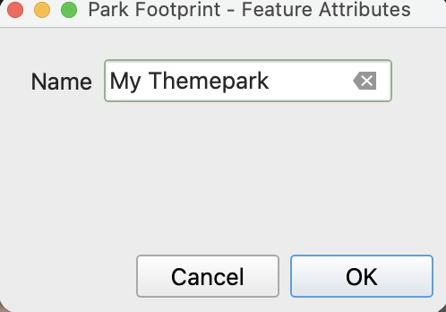

6. If you want to make small changes to the shape after you have created it, you can use the Vertex Tool to manipulate the vertex points you created.

    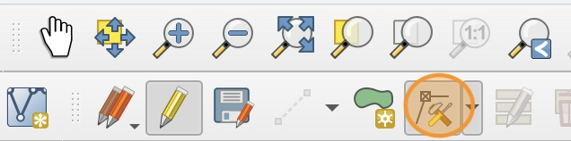

7. When you are happy with how the shape looks, save your changes using the **Save Edits** icon in the toolbar. Then toggle Edit mode **off**.

    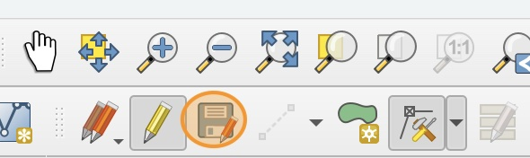

# How to Save a Scratch Layer

In order to save the layer we created and use it again after we close QGIS, we need to make the scratch layer permanent. 

1. Right click on the "Park Footprint" layer and select "Make Permanent..."

2. In the Save Scratch layer window, select the **GeoPackage** format, then next to the File Name field, click the three dots `...`.

    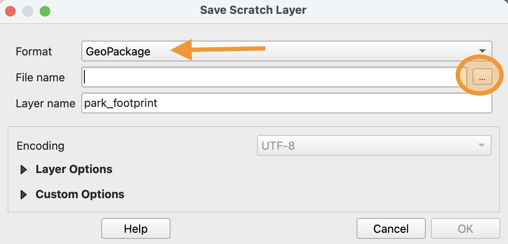

3. Navigate to your `lab04` folder and save the file under the name `footprint`.

4. Notice that now that the layer has been made permanent, the memory chip icon has disappeared.

    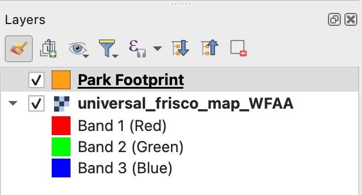