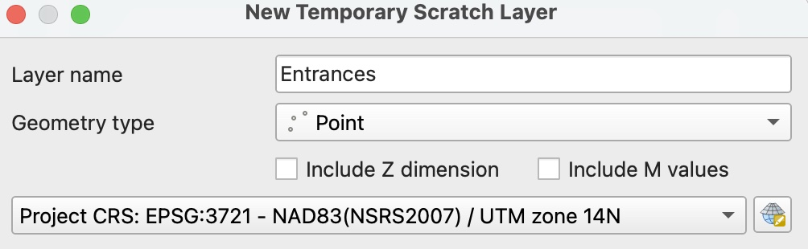
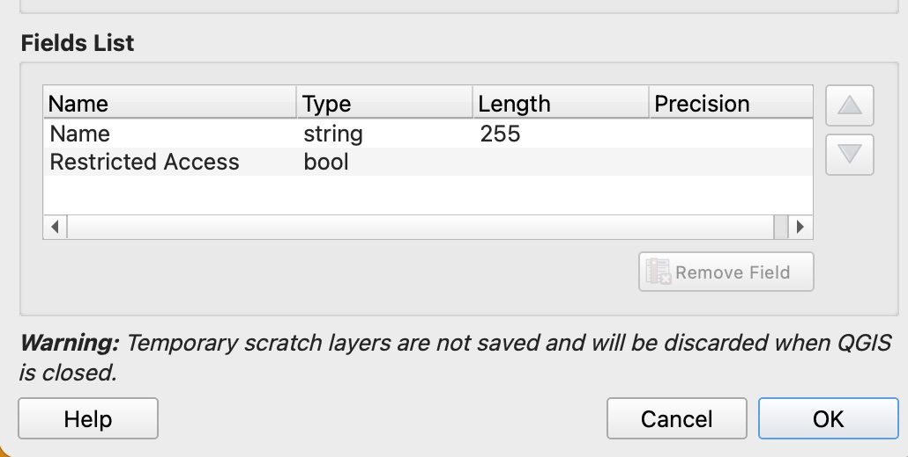
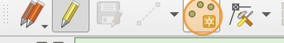
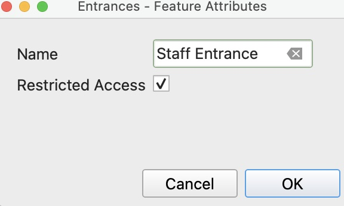
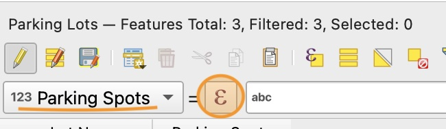
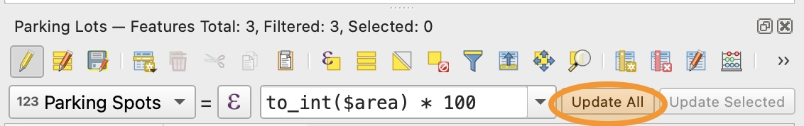
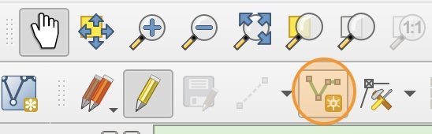
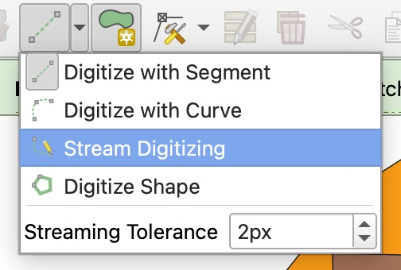

# How to add point features

1. Remove the `universal_frisco_map_WFAA` layer from your project. Now that we have the Park Footprint, we don't need this layer anymore.

2. Create a new scratch layer called "Entrances" that is Type "Point". Make sure to set the CRS to the project CRS (`EPSG:3721`).

    

3. Add a Text field called "Name".

4. Add a second field called "Restricted Access", and choose type **Boolean**. This is a True/False field. We will use this to indicate which entrances to the park are restricted (i.e., for staff only).

    

    Click **OK** to create the scratch layer.

5. Click the "Add Point Feature" icon to start creating points. 

    

6. Choose where you want to put the staff entrance and click to create the point feature. Choose an appropriate name. Notice that there is also a checkbox in the Feature Attributes Window that represents the Boolean field we added. Click the checkbox to mark this entrance as restricted. Click OK to create the feature.

    

7. Create at least two more entrances for guests with appropriate names. Do not mark these as Restricted Access.

8. If you'd like to add any more entrances, add them now.

10. Save the changes to the layer, toggle off editing, and make the layer permanent, using what you learned in the previous section.

# Adding a Parking Lots layer

1. Create a new Polygon layer called "Parking Lots" with two fields:
 - Lot Name, Type: Text (string)
 - Parking Spots, Type: integer

2. Use the Create Polygon Feature tool to draw the shape of where you want one of the parking lots. When prompted, give the lot an appropriate name, **but do not enter a number for the parking spots field**. We will automatically calculate this later.

3. Repeat step 2 to create at least one more parking lot.

4. Right click on the "Parking Lots layer and select "Open Attribute Table"

5. In the Attribute Table window, select the "Parking Spots" field from the drop-down menu and click the expression builder icon (purple epsilon symbol).

    

6. We will use an equation to estimate the number of parking spots each lot will be able to accommodate based on size. Enter this equation into the **Expression** field of the Expression Builder window.

    `to_int($area) * 100`

    Because we set the project area units to **acres** in part 1 of the lab, `$area` represents the area of each feature in acres. `to_int` is a function that rounds the area to the nearest whole number. We then multiply using the `*` symbol by a factor of `100` to estimate about 100 parking spots per acre.

7. Click **OK** to close the expression builder, then click **Update All** to update all the parking lot features using this expression.

    

8. Save your changes to the layer, toggle off Edit Mode, and make the layer permanent.

# How to add line features

1. Create a new scratch layer called "Walking Paths" of type "LineString", with one Text field called "Name". Make sure to set the CRS to the project CRS.

2. Use the **Add Line Feature** tool in the tool bar to start creating line features.

    

3. Left click along each point you want the line to pass through. Right click to end the line.

4. Add at least two walking paths with appropriate names to your park layout.

5. Save your layer edits, toggle off Edit Mode, and make the layer permanent.

# Adding Attraction Areas with Themes

1. Create a new Polygon scratch layer called "Attraction Areas" with two fields:
 - Area Name, Type: Text (string)
 - Area Theme, Type: Text (string)

2. You need to create **ten** unique attraction areas that fall into one of at least four themes. For example, you could use movie franchises for each theme, and within each theme there are multiple attraction areas related to that movie franchise.

    You can create the areas the same way we made the Park Footprint and the Parking lots, or you may want to try the **Stream Digitizing** option that lets you draw the shape with your cursor.

    

    When making each area, assign it a unique name and one of your selected themes. **Make sure every time you type the theme name you spell it the exact same way with the same capitalization and spacing.**

3. If you make any mistakes or want to make changes to the area names or themes, you can edit these values in the Attribute Table.

4. Once you have made at least ten attraction areas, save the layer changes, toggle off edit mode, and make the layer permanent.

# Adding additional features

1. Use what you learned about creating polygons, lines, and points to add any additional park features that you would like represented on your map.

    Don't forget to save your changes and make any scratch layers permanent before proceeding!