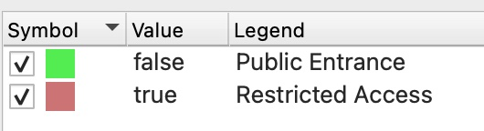
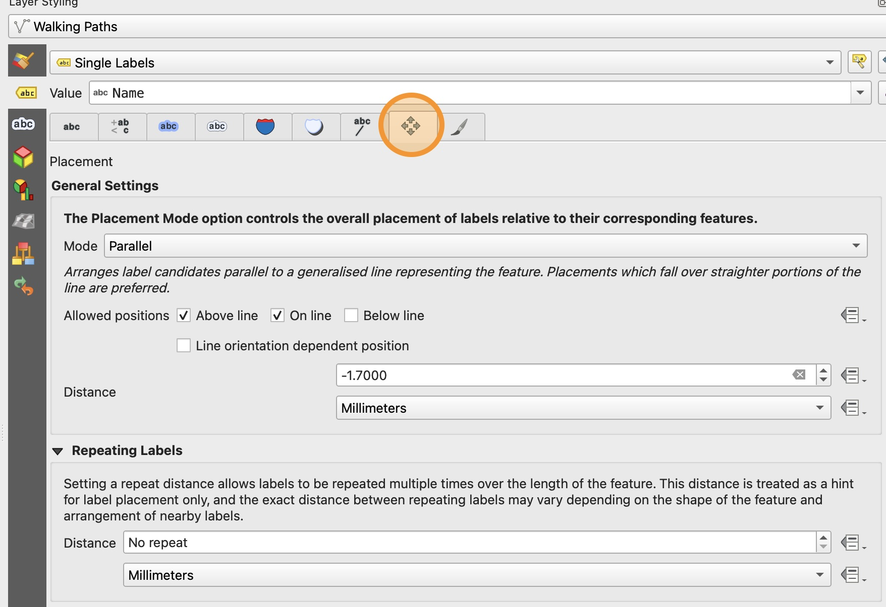

# Applying Simple Symbology

1. Update the symbology of your Park Footprint layer to a good background color for your park. This may depend on your park theme what fits best. **Do not make this layer transparent** because we will be adding a base map layer that we do not want to show through the Park Footprint layer.

2. Update the symbology of your Parking Lots layer to an appropriate color for your park theme. 

# Applying Category Symbology

1. Open the symbology for the **Entrances** layer and change it to **Categorized** based on the Value of the Restricted Access field.

2. You can click on the circle symbol to change the size and shape of the symbol as you like. Make sure that whatever symbol you choose is large enough to be clearly visible on the map, but not so large that it obscures other features.

3. Click **Classify** to automatically generate categories and remove the "all other" category by selecting it and clicking the red minus symbol.

4. Change the Legend label for the "true" category (i.e. Restricted access is TRUE) to say "Restricted access" and the "false" category (i.e., Restricted access is FALSE) to say "Public Entrance".

    

5. Change the colors for each category to match your theme, then click Apply

6. Open the Attraction Areas symbology and change it to Categorized based on the the value of the Theme field. Generate the categories using the Classify button and remove the "all others" category.

7. Check that all of your categories are unique. If you misspelled any themes, you may have duplicates and need to merge the categories.

8. Update the category colors to match each theme and apply your changes.

9. Update the Walking Paths symbology to either be a single color or different colors for each named path, depending on what looks best on your layout. 

10. You may need to increase the width of the Walking Paths symbol line to make the features more visible. You can do this by clicking the line next to the word "symbol" in the symbology window. Then you can adjust the width and stroke style of the line.

# Applying Simple and Complex Labeling

1. First apply simple labels to the Entrances and Attraction Areas layers based on the feature's Name. Adjust the size, font, color, and buffer of the labels to make sure they are all easily readable and all area labels appear on the map.

2. Add simple labels to the Walking Paths layer based on the feature's Name. Adjust the font, size, color, and buffer of the labels to make sure they are all readable.

3. In the Placements tab of the Walking Paths Label window, you can adjust how the labels appear on the path. Adjust the **Distance** to make the labels appear closer or farther away from the path. If you have particularly long paths, you may want to add **Repeating** Labels to have the name appear multiple times along the path.

    

4. Turn on Single Labels for the Parking Lots layer. For the Value, copy this expression **Exactly**:

    `"Lot Name" + '\n' + to_string("Parking Spots") + ' spots'`

    In this expression, the `+` symbol is a concatenate, which is adding all of the text strings together to make one label.

    The `\n` represents a new line, like pressing Enter or return on your keyboard.

    `to_string()` is a function that *casts* or converts the integer in the "Parking Spots" field to a text string so that it can be concatenated with the other strings.

5. Adjust the font, size, color, and buffer of this label to make sure it is clearly visible on your map.

All of your entrances, walking paths, attraction areas, and parking lots should now have clear labels.