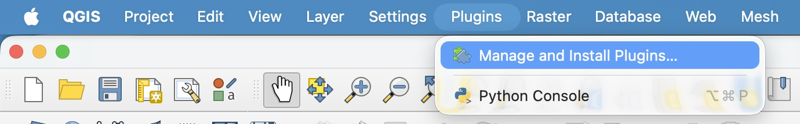
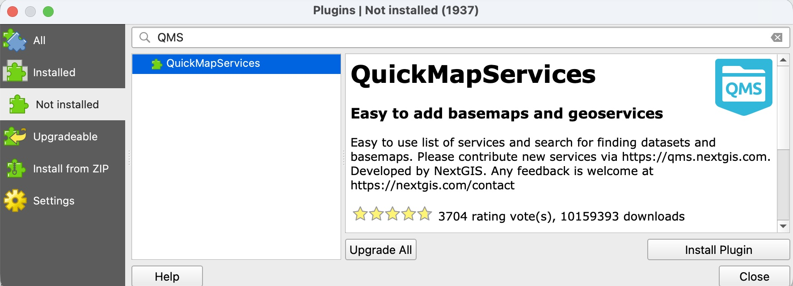
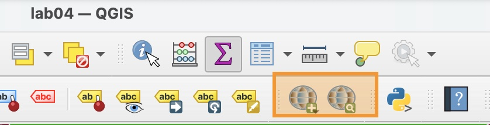
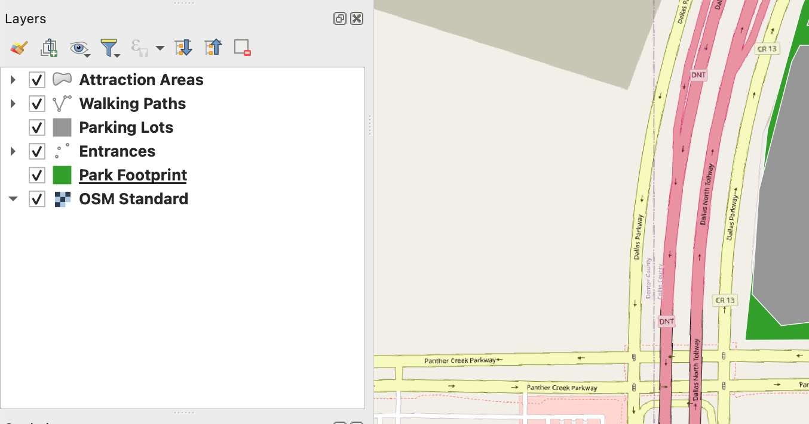

# How to Install the QMS Plugin

The Quick Map Service (QMS) is a plugin that easily 

1. In the top menu bar, select **Plugins > Manage and Install Plugins**.

    

2. In the plugins window, click on the **Not installed** section in the side bar. Search for "QMS". Select the QuickMapService Plugin and Click **Install Plugin**.

    

3. Once the installation is finished, close the Plugins window.

# How to add a base map

1. Now that you have installed the QMS plugin, you should see two new icons in your tool bar.

    

2. Click the globe icon with the + sign and select OSM > OSM Standard to add the Open Street Map basemap to your map.

3. Notice that a new Raster layer has been automatically added to the bottom of your Layers list. Also notice that the base map shows your park in exactly the correct location. This is because we used a georeferenced image to trace out the original park footprint.

    

4. Remove the OMS Standard Layer from your map.

5. Click on the globe icon with a magnifying glass to open the "Search NextGIS QMS". This is where you can search different keywords to find lots of different types of base maps. Try some of these:
    * `satellite` will return a list of satellite imagery maps
    * `road` will return a list of road maps
    * `dark` will return a list of dark or night mode maps
    * `light` will return a list of light mode maps
    * `topo`, `terrain`, or `contour` will return a list of topographic (terrain) maps

    Click **Add** to add a layer to your map. Note that not all basemaps are available for all areas, so you may have to try a few different basemaps until you find one that is visible for Frisco area and that fits well with your them.

6. Remove any extra basemap layers, keeping only the one basemap layer you chose.