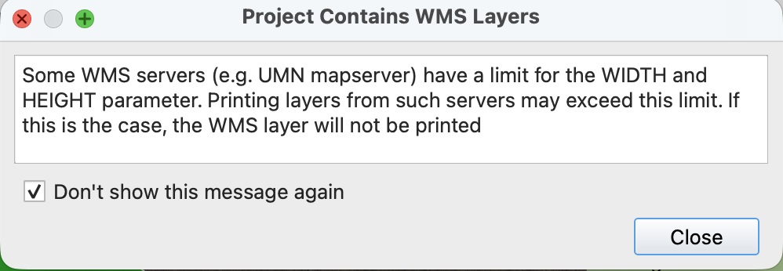
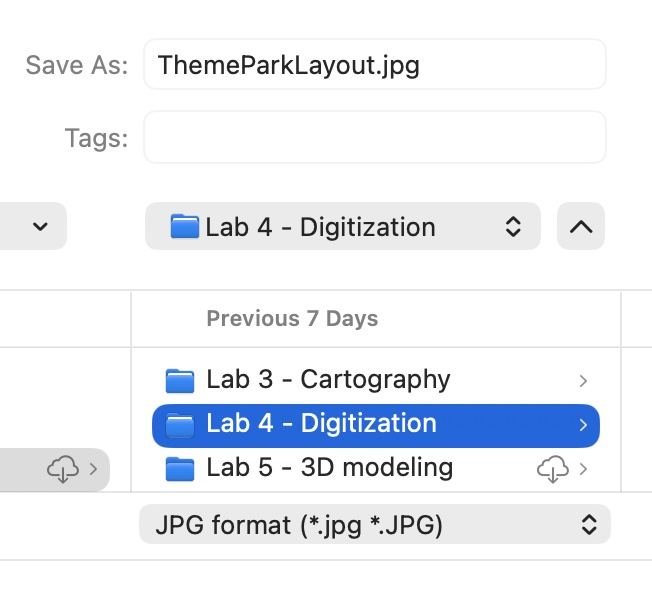

# Map Layout Requirements

Using what you learned in previous labs, create a map layout of US Letter paper size with the following elements:
* 2D Map frame appropriately sized and zoomed-in, showing the full park footprint and surrounding area
* Appropriately sized Legend with clear, professional label names.
* Appropriately sized Scale bar in **Yards**
* Appropriately sized North Arrow
* CRS Name
* Map Title
* Map Author & Date

You may adjust background colors, borders, fonts, buffers, and text size as necessary to produce a professional looking layout. Refer to the [Layout example]({{'/labs/lab04/Layout_Example.jpg' | relative_url}}){:target="_blank"}  for reference.

# How to Export your Map Layout

1. Click the "Export as Image" icon

2. You may receive a warning about "WMS Layers". This refers to our base map which is a Web Mapping Service Layer. You can ignore this warning and select "Do not show this message again" and click **Close**.

    

3. Save your file as a `JPG` Format in your `lab04` folder under the name "ThemeParkLayout.JPG"

    

4. In the Export Options set the Export Resolution to **600 dpi** and click Save.
