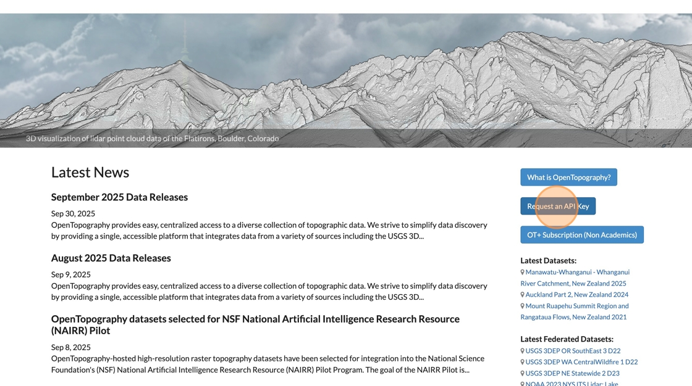
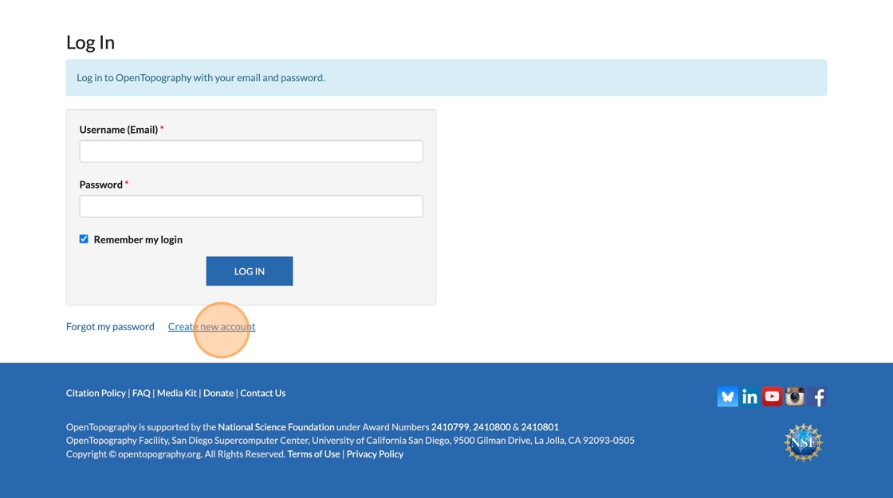
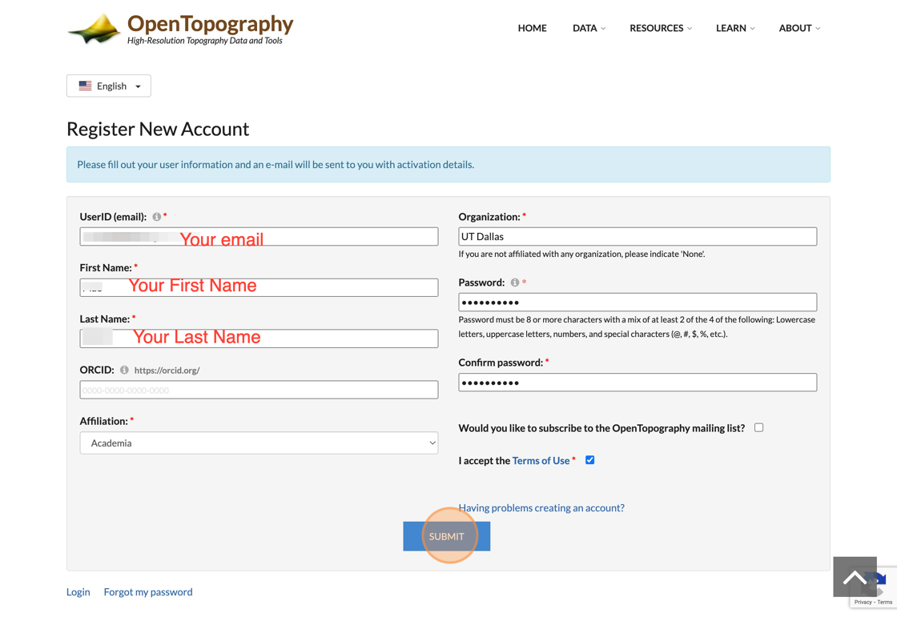
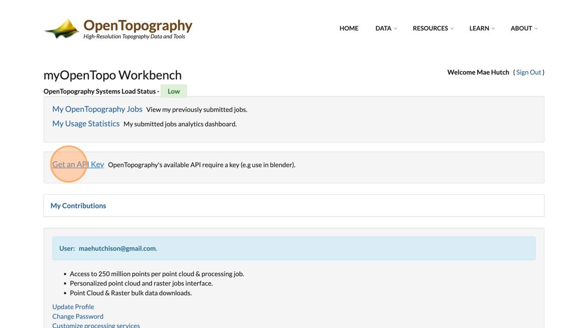
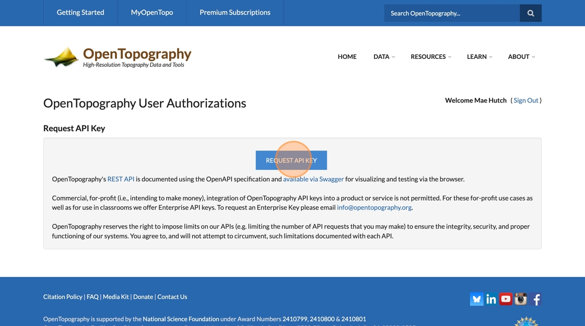
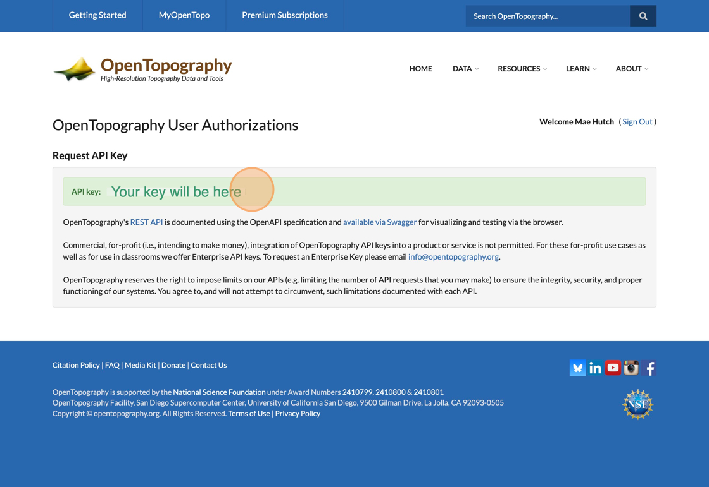

# How to Get an OpenTopography API Key

1. Navigate to [https://opentopography.org/](https://opentopography.org/)

    

2. Click "Request an API Key"

    

3. Click "Create new account"

    

4. Fill in your account information and click "Submit"

    

5. Check your email for an activation link. Click the link to finish registering your account and log in to OpenTopography

6. Click "Get an API Key"

    

7. Click Request API Key

    

8. Copy your API Key and save it somewhere you can find it again (for example, your Notes app, or text file on your desktop). **You should copy and paste the API key, do not try to re-type it**. The API key must be exactly correct to work. It is very easy to make a mistake if you try to re-type it.

    