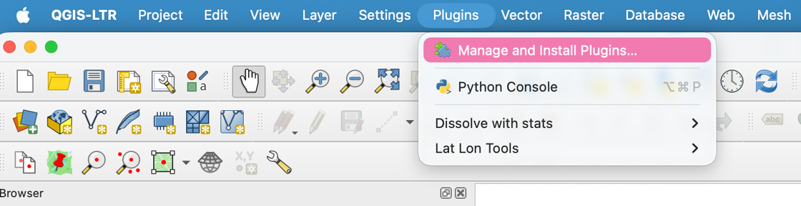
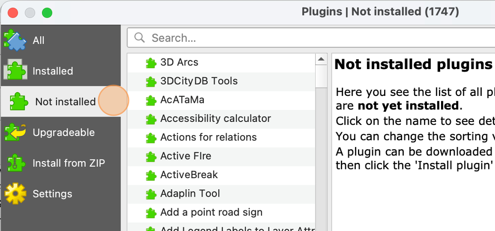
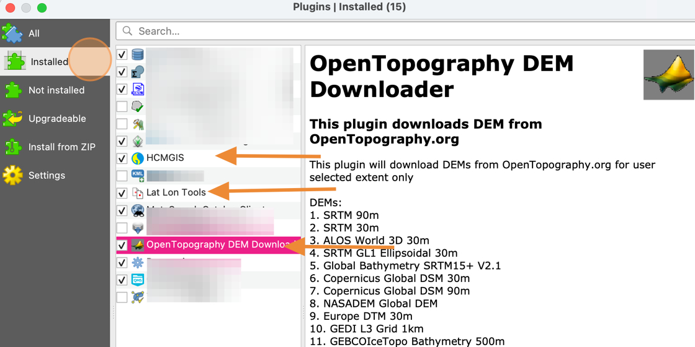

# Install Required Packages

1. In QGIS, click **Plugins &gt; Manage and Install Plugins...**

    

2. Click the **Not installed** tab

    

3. Search for these three packages and install using the **Install Plugin** button in the bottom right corner

    - Lat Lon Tools
    - OpenTopography DEM Downloader
    - HCMGIS

4. When you're done, you should be able to see all three packages in the **Installed** tab

    