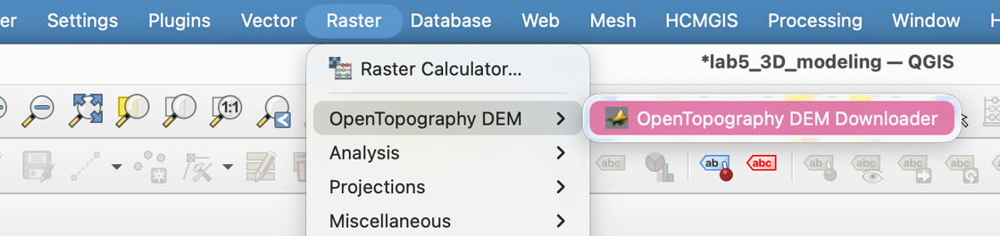
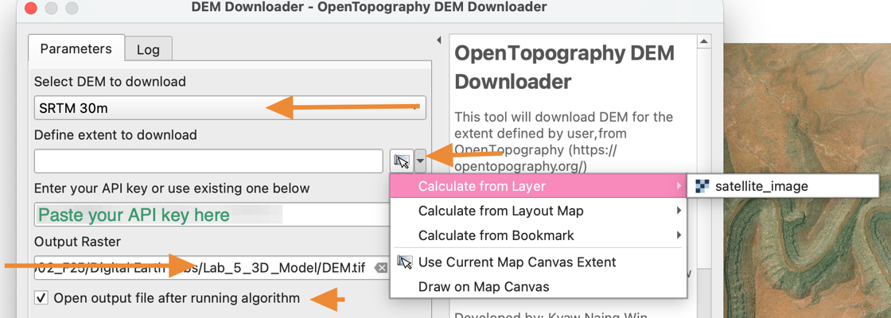
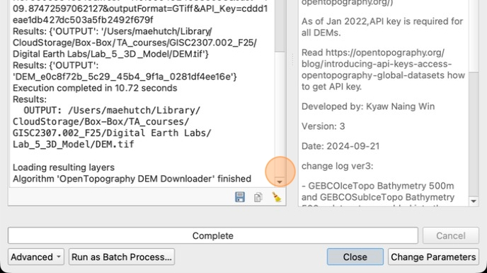
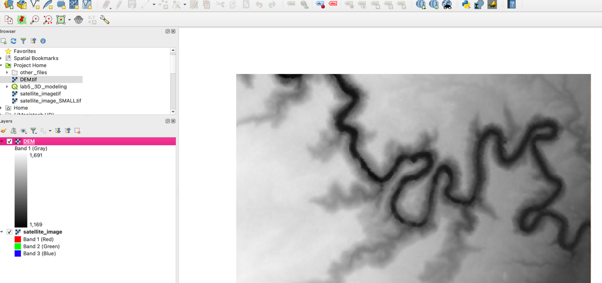

# How to Download a Digital Elevation Model (DEM)
Make sure you have installed the OpenTopography DEM Downloader plugin before starting.

Make sure you have set a **Projected CRS** before starting!

1. Click **Raster &gt; OpenTopography DEM &gt; OpenTopography DEM Downloader**

    

2. In the **DEM Downloader** window, select **SRTM 30m** DEM to download.

    Define the extent to download by clicking the small arrow on the right then selecting **Calculate from Layer &gt; satellite_image**

    Enter your API key you got from [opentopography.org](http://opentopography.org) 

    Use the three dots "..." to select the location for the Output raster

    Make sure the **Open output file after running algorithm** option is checked.

    Click **Run**

    

3. Click **Close** once the download is complete

    

4. You should now see the DEM on your map and in your Layers panel.

    