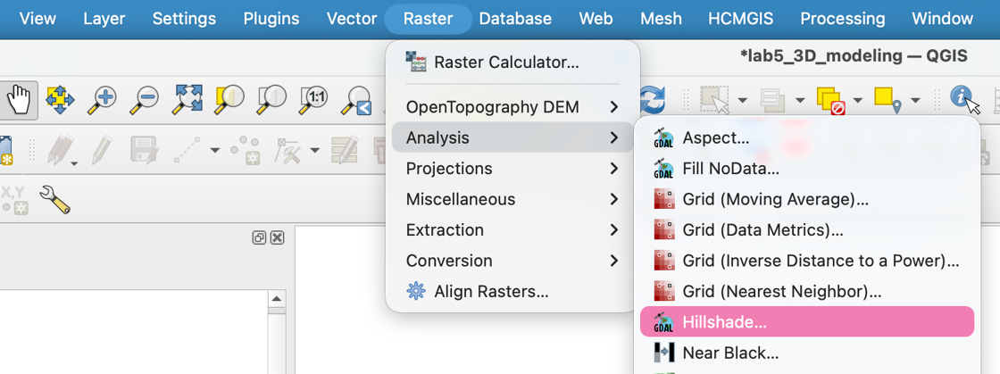
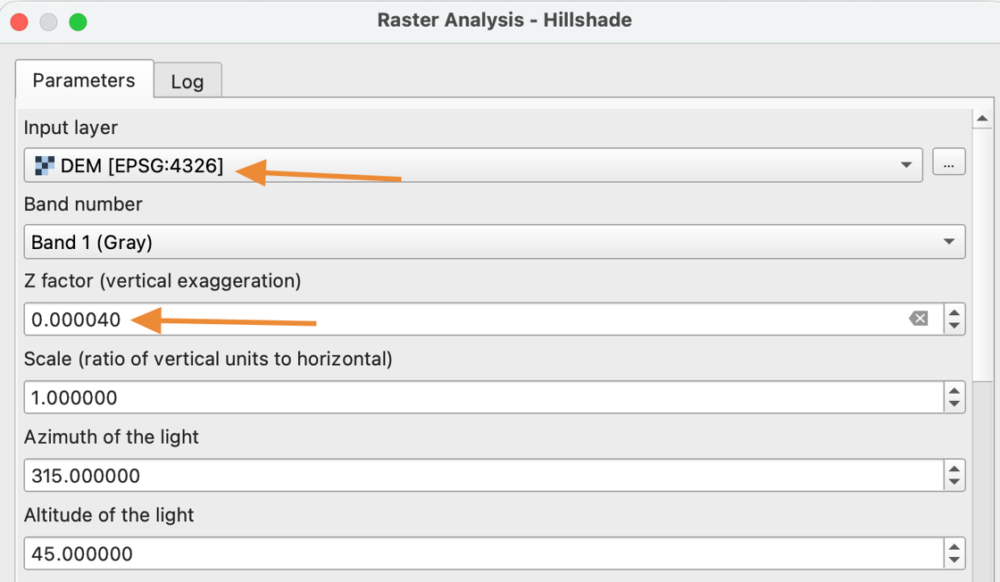
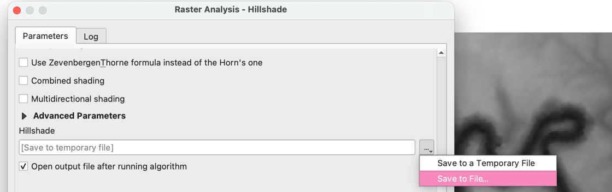
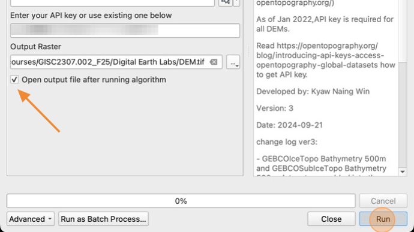
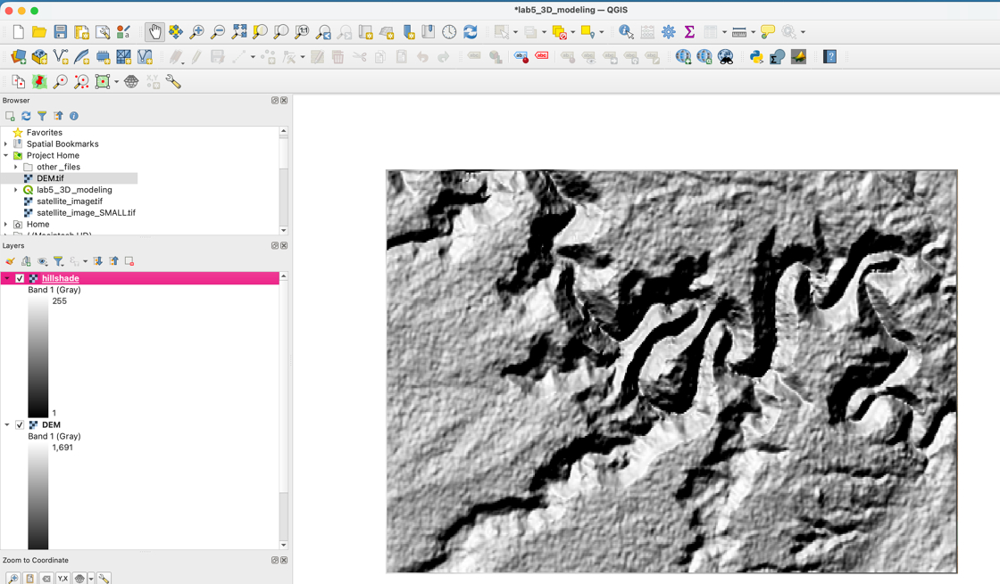

# How to create a hillshade image from a DEM

1. Click **Raster &gt; Analysis &gt; "Hillshade…"**

    

2. In the Raster Analysis window, make sure your **DEM** is selected as the Input layer.

    Set the **Z factor** to 0.00004

    The **Azimuth** and **Altitude** settings control where the simulated sun would appear in the sky. You can adjust these settings to change the time of day and affect how the shadows appear on the terrain. for now, leave them at their default values.

    

3. Scroll down in the Raster Analysis window and use the three dots "..." to select a file location to save the Hillshade layer.

    Save the image under the name **hillshade.tif** in your Lab 5 folder.

    

4. Make sure the **Open output file** option is checked.

    Click **"Run"**

    

5. Once the calculation in finished, click **close** to close the Raster Analysis window.

6. Your hillshade layer should now be visible on the Map.

    