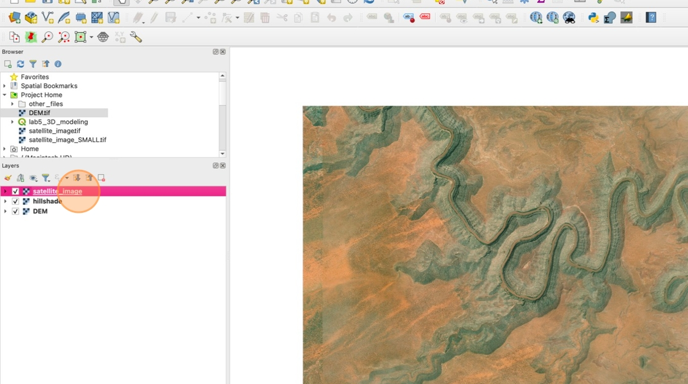
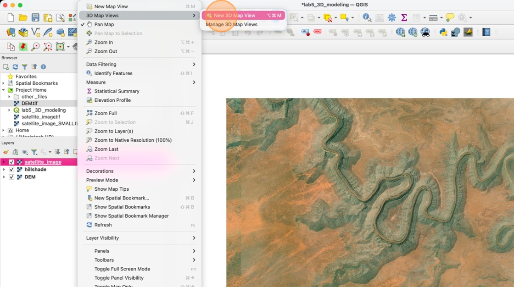
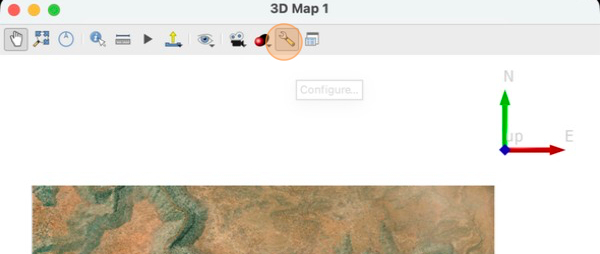
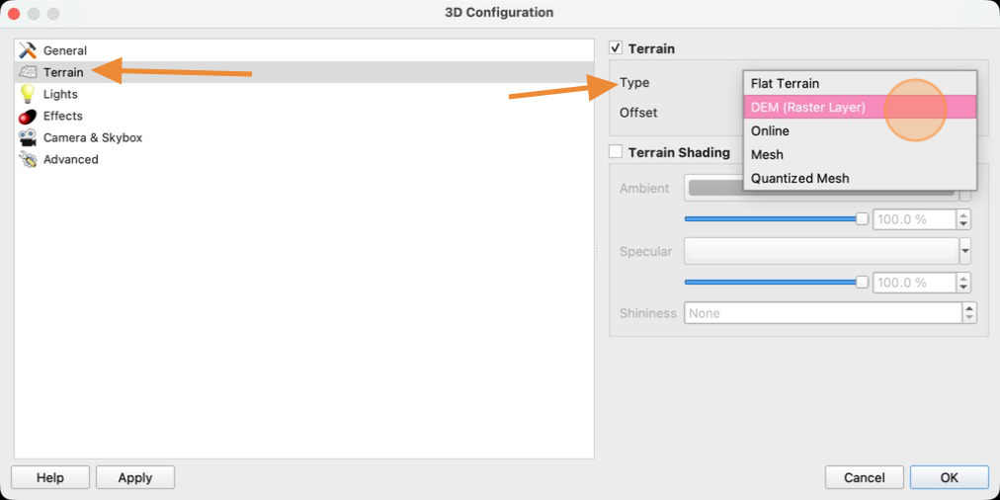
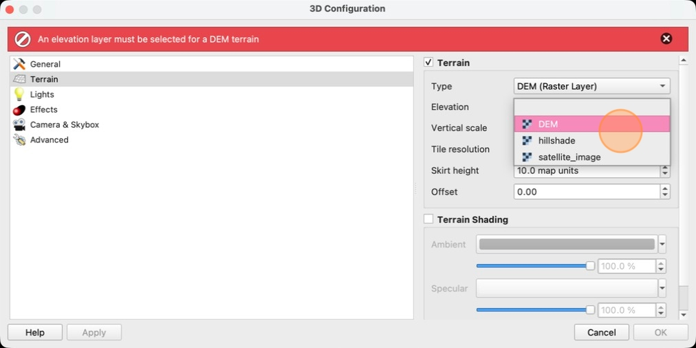
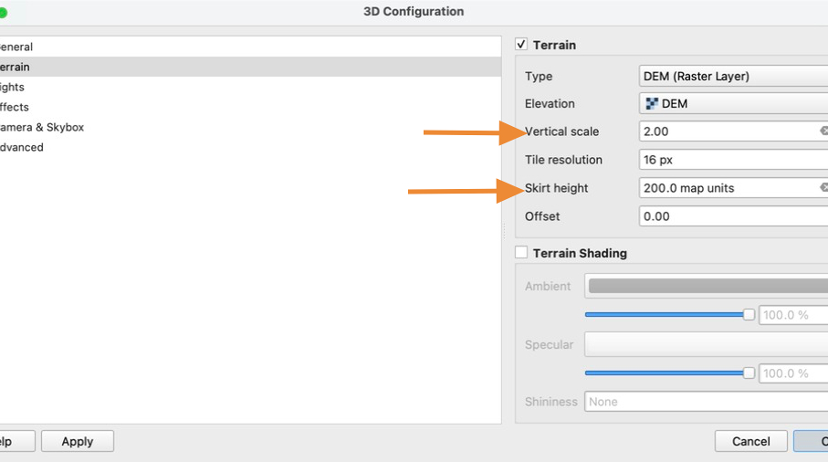
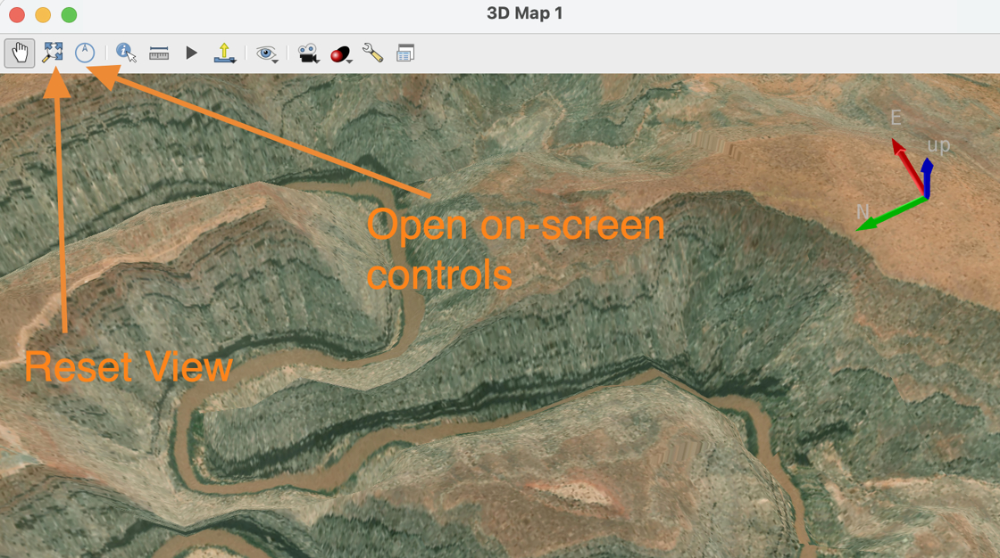

# How to make a 3D view in QGIS

1. Move the **satellite_image** layer to the top of your Layers pane so that it is visible on the map.

    

2. Click "New 3D Map View"

    

3. Click the **Configure** button (wrench icon)

    

4. In the **3D Configuration** window, click the **Terrain** panel and set the **Type** to **DEM (Raster Layer)**
    

5. Set the **Elevation** to your **DEM** layer

    

6. Set the **Vertical Scale** to 2. This emphasizes the 3D features.

    Set the **Skirt height** to 200. This setting prevents holes in your 3D model that sometimes appear on steep cliff faces that were not photographed by the satellite.

    Click **OK**

    

    The 3D map may take several seconds to load. Whenever you see the "Loading tile" message, do not try to move the camera or the map.

7. Adjust the 3D map until you have a scene you like. Try to minimize the amount of blank space so that only the rendered ground is visible.

    Use your mouse to click and drag the map. Hold the **shift** key and click and drag to rotate the camera. You can also click the **compass icon** to open on-screen controls or the **magnifying glass icon** to reset to the original view.

    

 If you accidentally close the 3D Map window, you can reopen it from the main QGIS window by selecting **View&gt; 3D Map Views &gt; 3D Map 1**

