# How to Make a Postcard layout

Make sure your 3D Map View is still open before starting

1. Create a new layout called "postcard"

2. In the **Page Properties**, set the **Size** to **Custom,** then set the dimensions to 6 x 4.25 inches

    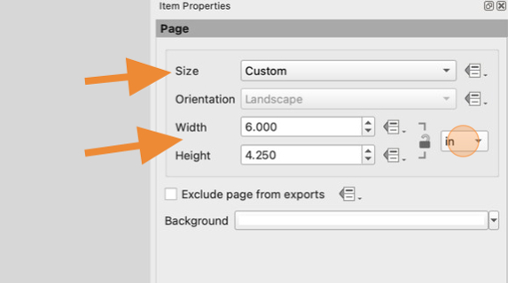

3. Click "Add 3D Map"

    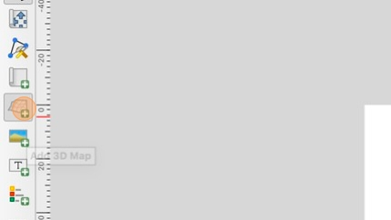

4. Click and drag to draw the frame for your 3D View. Adjust the edges so that the frame covers the entire postcard. The frame will say "Scene not set"

    In the 3D View Item Properties pane click "Copy Settings from a 3D View…" and select **3D Map 1**

    It may take several seconds for the 3D view to appear.

    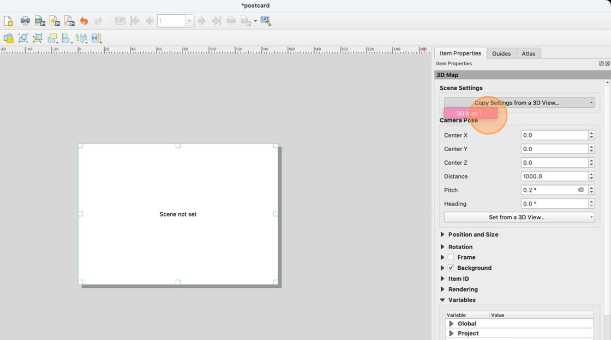

5. Once the 3D map loads, click "Add Pages…"

    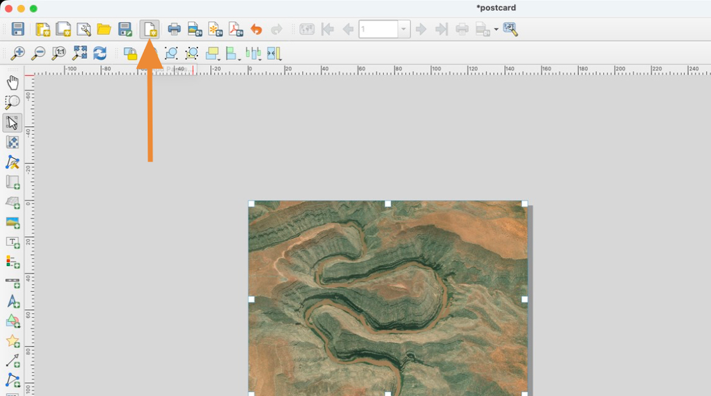

6. In the "Insert Pages" window, add another postcard-sized page.

    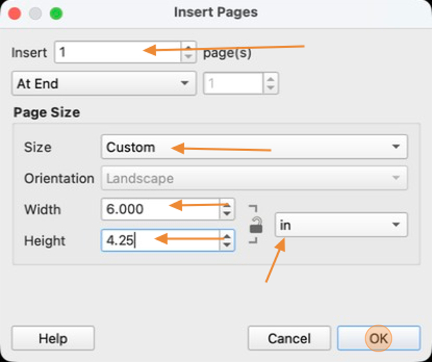

7. Click **Add Rectangle**

    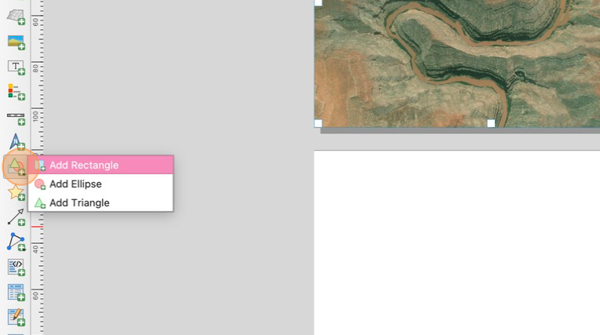

8. Draw a small rectangle in the top right corner of the second page, about where a postage stamp would go

    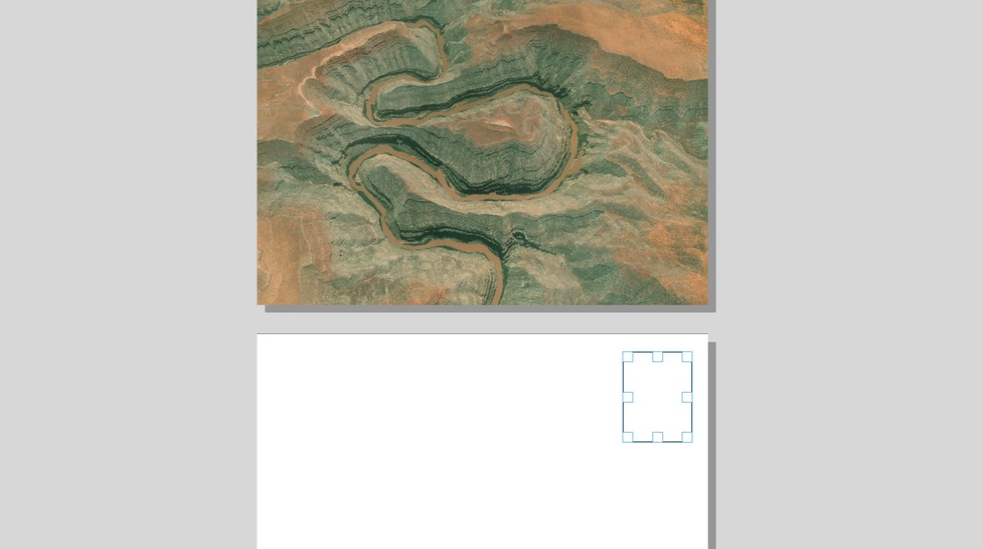

9. Right click on the rectangle and open its **Item Properties** pane. Adjust the width and height to be the same dimensions as a US Postal Stamp (0.87 x 0.98 inches)

    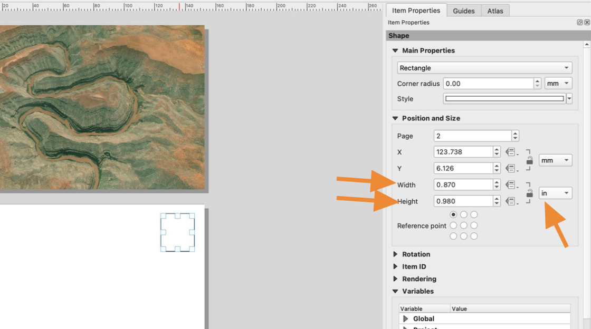

10. Click "Add Arrow"

    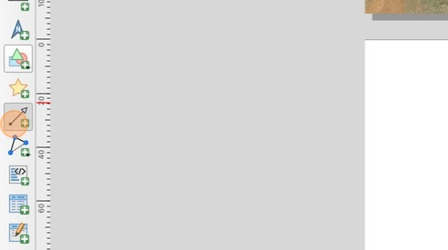

11. Draw a line underneath the space for the stamp by clicking once at the beginning and end of where you want the line to be. Right click to stop drawing.

    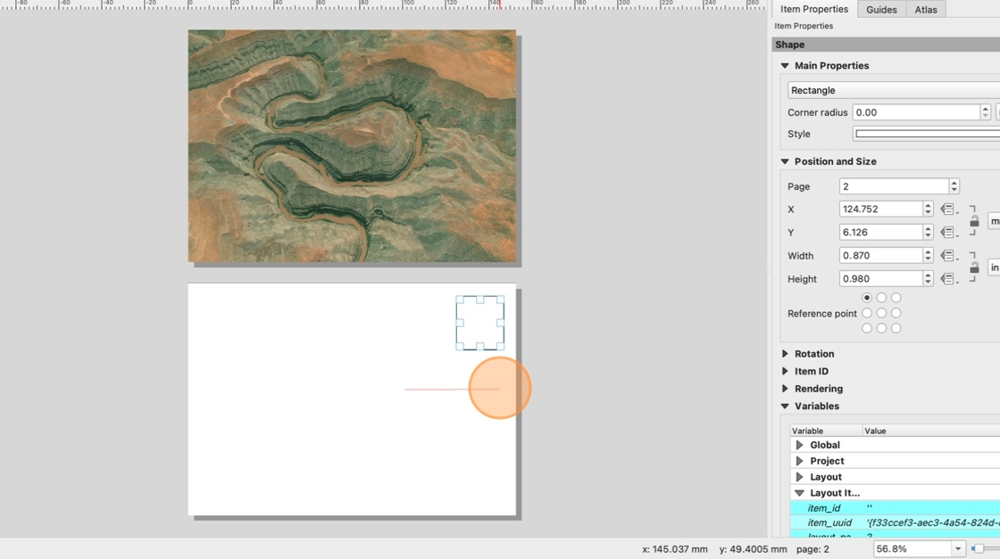

12. In the arrow Item Properties pane, chose **None** for the End Marker

    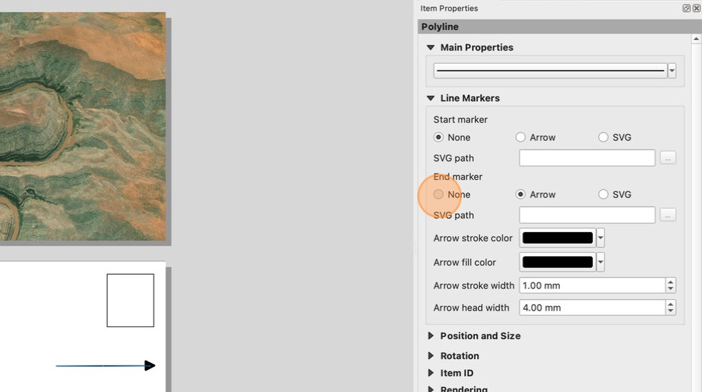

13. select the line and pres  ctrl + c  on your keyboard to copy it (cmd+c on Mac).

    Press ctrl/cmd + v on the keyboard three times to paste three more lines. Roughly align these under your first line. These will be our address lines.

    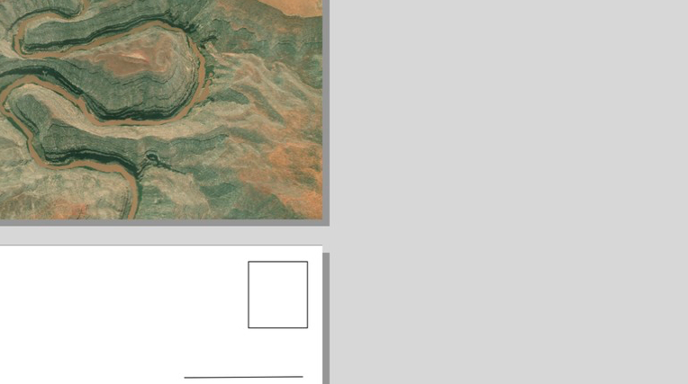

14. Click a blank space to the left of the lines and drag the mouse over the lines to select all four at once

    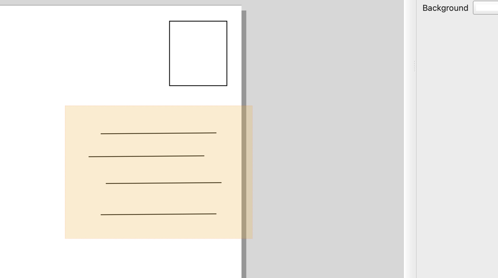

15. In the toolbar, click **Align Left**.

    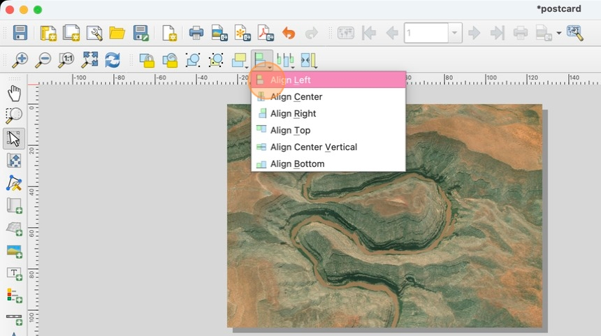

16. In the toolbar, click **Distribute Top Edges**

    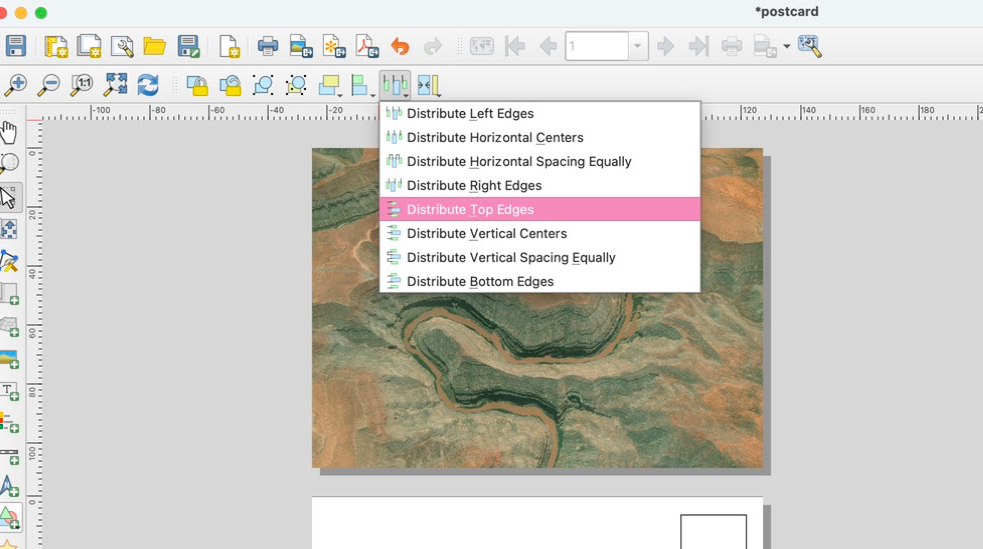

17. Check that your address lines are now equally spaced and aligned

    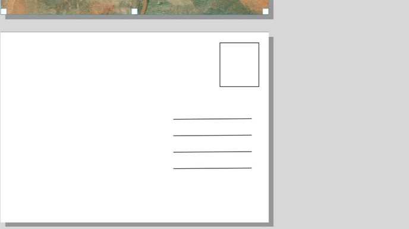

18. Close your 3D Map 1 View. This will prevent the 3D map on our layout from updating when we change the map.

    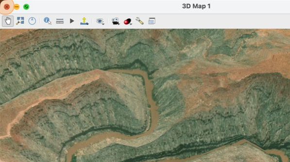

19. In the main QGIS window, uncheck the "satellite_image" layer to hide it so that we can see our hillshade layer

    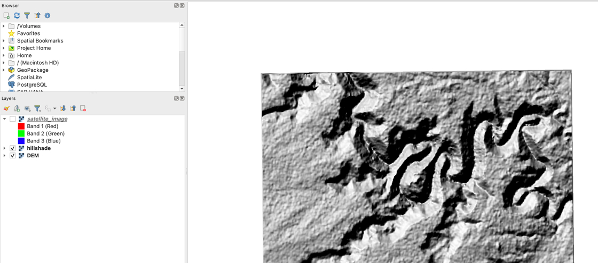

20. Add a 2D map to the back side of your postcard. You should see your hillshade layer

    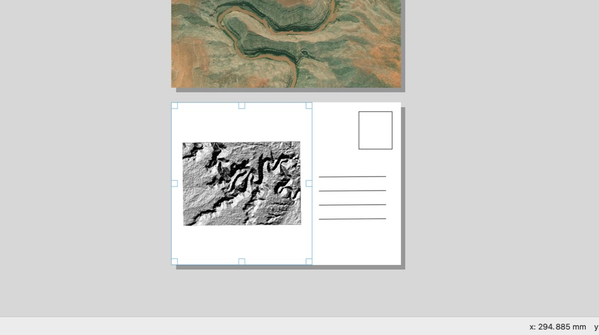

21. Use the interact with map button in the Item Properties pane to interact with the 2D map and adjust the view so that there is no white space. It's OK if some of your hillshade layer is cut off

    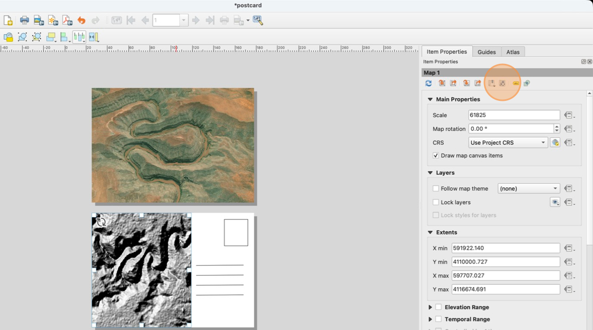

22. Click "Lock layers"

    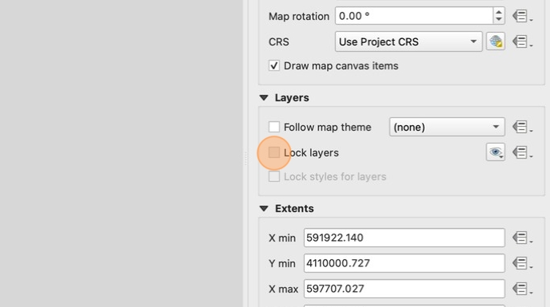

23. Scroll down to the Rendering section of the Item Properties pane for the hillshade map, and set the **Opacity** to **30%.** This will make our map light enough that someone could write a message over it when they use the postcard

    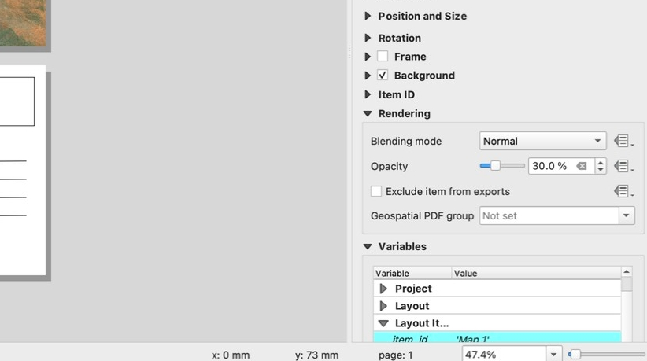

24. Use the text tool to add a the name of the location.

    Use a second text box to add the state or country in a smaller font.

    This text can in any font and can be on the front or back of the postcard (on page 1 or page 2), but make sure you leave enough space on the back so someone could hand write a message on the card.

    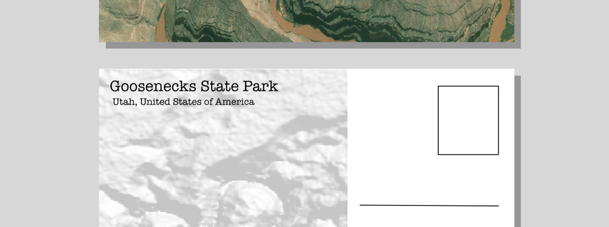

25. We also need to add our layer credits. Add another text box on the second page (back of the postcard) and add the credits for the DEM and imagery layers:

    `NASA Shuttle Radar Topography Mission (SRTM)(2013). Shuttle Radar Topography Mission (SRTM) Global. Distributed by OpenTopography. https://doi.org/10.5069/G9445JDF.
    Esri World Imagery`

    Make the **text font size 8**

    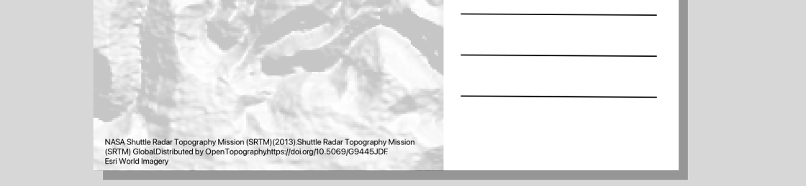

26. Export your postcard as a PDF. Turn in the postcard design with your completed lab checklist

