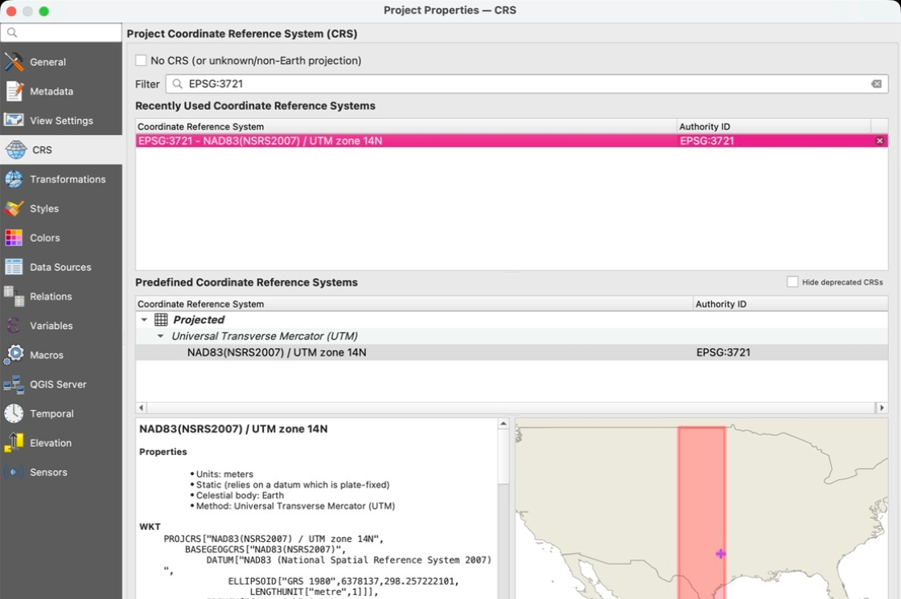
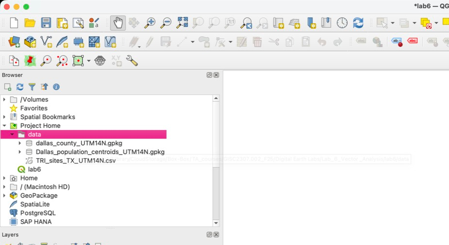
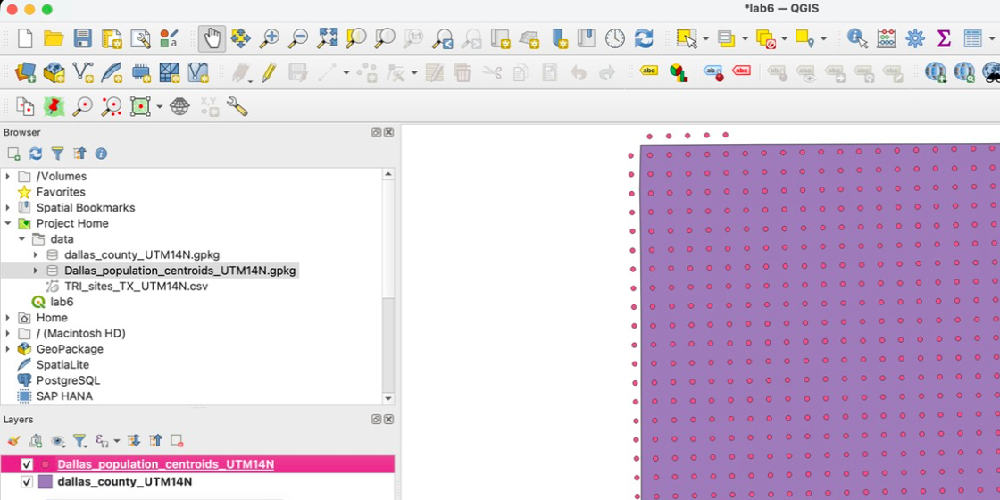
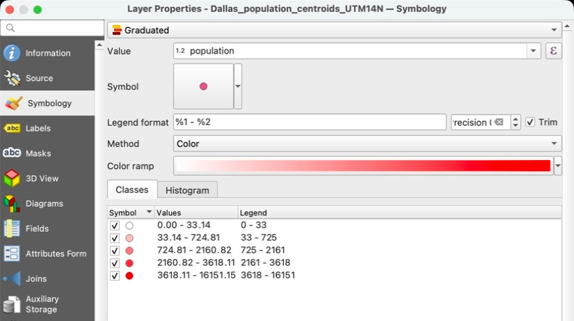
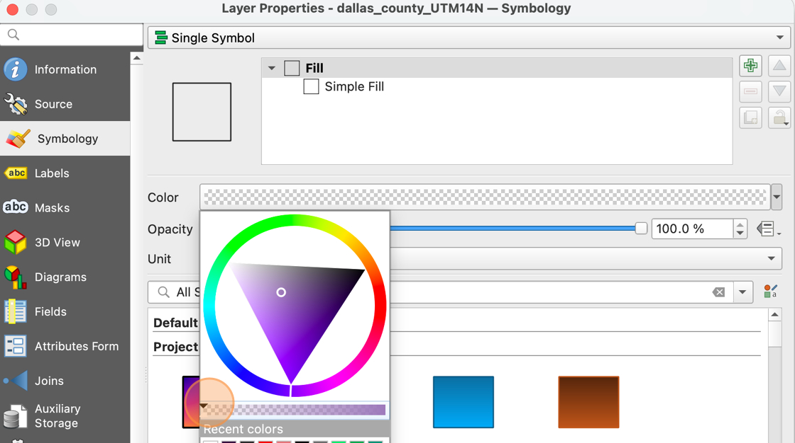
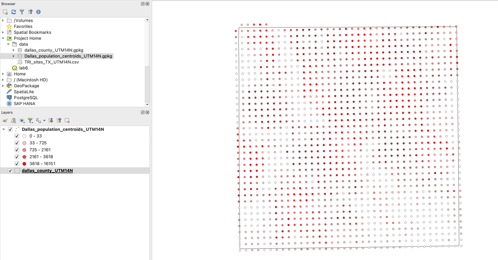

# Project Setup

1. Create a lab 6 folder on your computer. Download the lab 6 "data" folder from eLearning and save this to your lab 6 folder. Unzip (extract) the data folder if you computer does not unzip it automatically

2. Create a blank QGIS project and name it "lab6". Save the project in the **same folder** as your unzipped data folder

3. Use what you learned in labs 4 and 5 to **change the project CRS to EPSG:3721** (NAD83 NSRS2007 / UTM zone 15N)

    

4. In the **Browser** panel, expand your **Project Home** folder, then expand your **Data** folder. You should see three data files:

    - *dallas_county_UTM14N.gpkg* -- this is the border of Dallas County
    - *Dallas_population_centroids_UTM14N.gpkg --* these are population estimates for every square mile in and around Dallas County
    - TRI_sites_TX_UTM14N.csv -- this is a table of Toxic Release Inventory (TRI) sites in Texas

    

    If you don't see the **Browser Panel**, you can reopen it by clicking View &gt; Panels &gt; Browser
    

5. Add "dallas_county_UTM14N.gpkg" and "Dallas_population_centroids_UTM14N" to your map by clicking and dragging each item from the **Browser Panel** to the **Layers Panel**

    

6. Use what you learned in previous labs to change the **Symbology** of the "Dallas_population_centroids_UTM14N" layer to **Graduated** on the value "population". You can choose any color and number of categories, as you like.

    

7. Use what you learned in previous labs to change the **Fill symbology** of the "dallas_county_UTM14N" layer to **transparent**

    

We now have a map outlining Dallas County, with points showing us the approximate population across the county

    