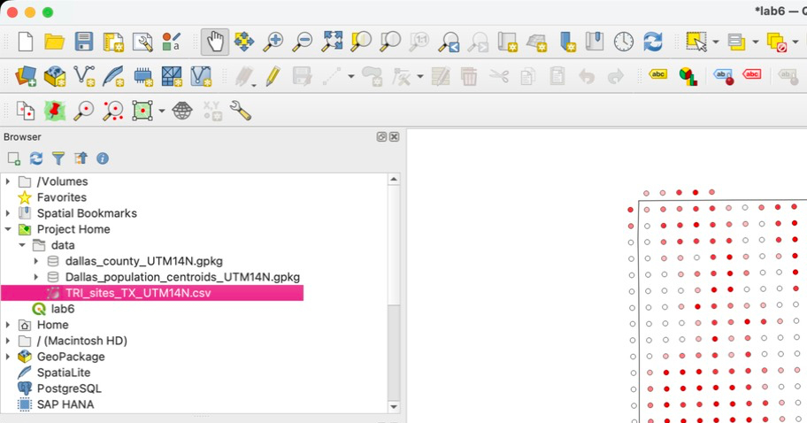
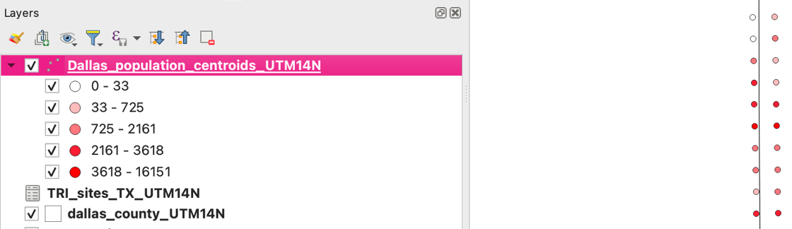
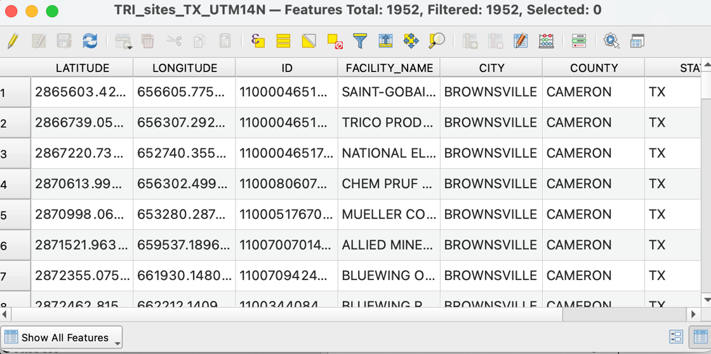
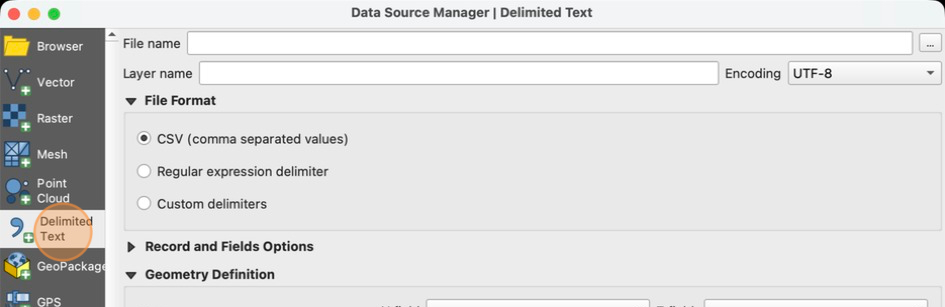
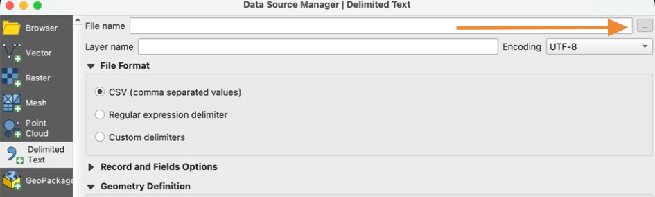
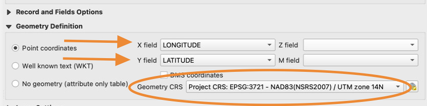
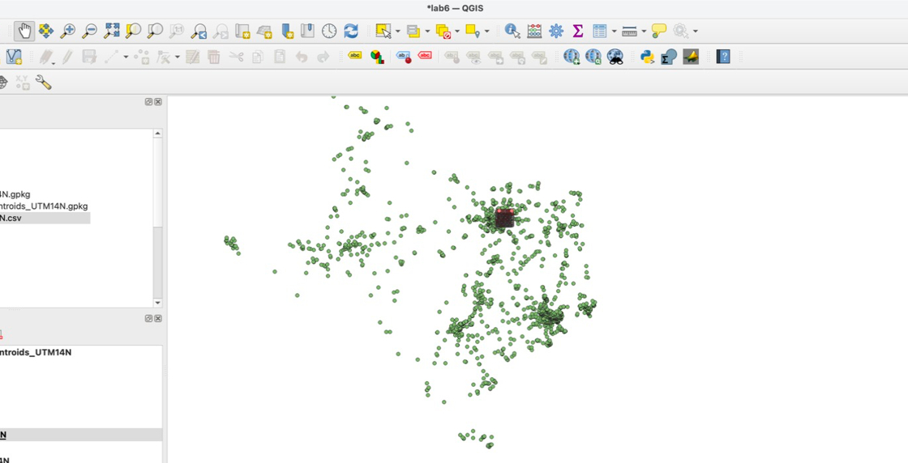
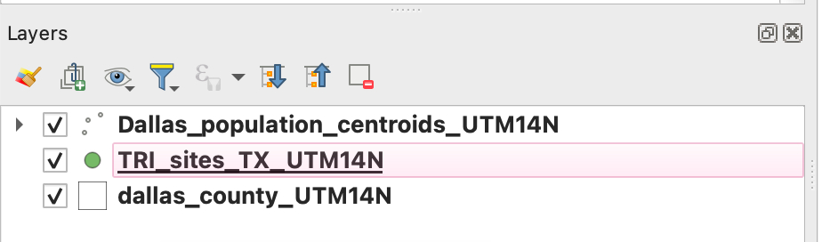

# How to add point data from a table

1. Try adding the "TRI_sites_TX_UTM14N.csv" file the same way we added the first two layers, by dragging the file from the **Browser panel** to the **Layers Panel**

    

2. Notice that no new data appeared on the map, and the new TRI layer has a **Table Icon** next to it. This is because this is a **CSV file** which stands for Comma Separated Values. Essentially this is a text file that represents a table of data

    

3. Right click "TRI_sites_TX_UTM14N" and select "Open Attribute Table". Now we can see the values of our table, which contains information about each Toxic Release Site. Notice that the table is **georeferenced**, meaning there is already location data (latitude and longitude) associated with each row of the table.

    

4. We do not see any new points on the map because QGIS does not automatically recognize this file a point layer. We need to specifically tell QGIS to plot this layer.

    Close the **Attribute Table Window** and open the **Data Source Manager**

5. Click "Delimited Text" in the **Data Source Manager** window

    

6. Click "…" next to the **File name** field and navigate to your lab 6 data folder. Select the *TRI_sites_TX_UTM14N.csv* file

    

7. In the **Geometry Definition** section, set the **X field** to the **LONGITUDE** column, set the **Y field** to the **LATITUDE** column, and set the **Geometry CRS** to **EPSG:3721 - NAD83(NSR2007) / UTM zone 14N**

    

    Double and triple check your values in step 7! If these settings are incorrect, all of your calculations in this lab will be incorrect!
    

8. Click **Add** then close the Data Source Manager window.

9. Zoom out on the map -- you can now see all the Toxic Release sites in Texas

    

10. Remove the TRI **table** that we added in step 1. You should now only have three layers in your project

    

