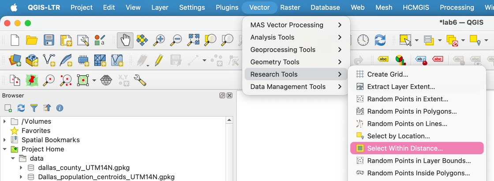
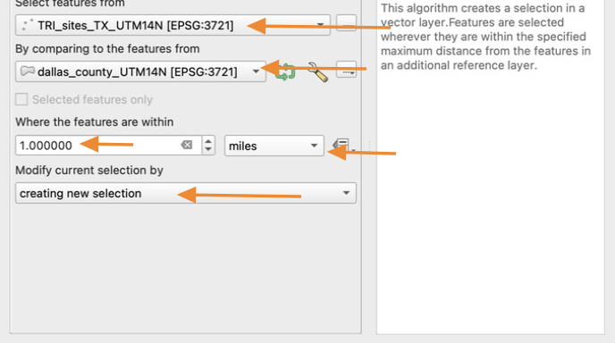
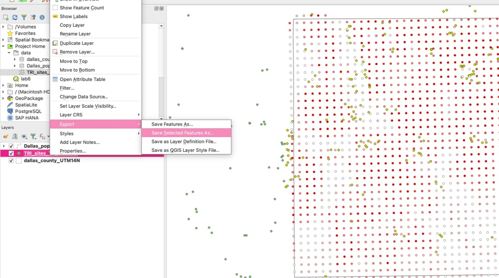
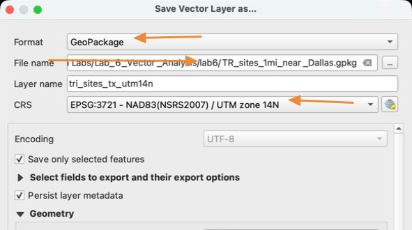
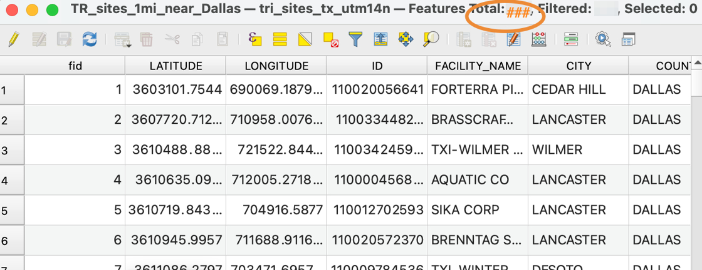

# How to use the Select Within Distance tool

The select within distance tool only works between two layers with the same Projection and CRS.

1. Click **Vector &gt; Research Tools &gt;** "Select Within Distance…"

    

2. Select features from the **TRI_sites_TX_UTM14N**  layer, by comparing to the features from the **dallas_county_UTM14N** layer, where the features are within **1 mile**. Click **Run**

    

3. Notice that the sites near Dallas County are now highlighted yellow. Save these selected features as a new file

    

    If the option to "**save selected features as..."** is grayed out, it means step 2 did not work and you need to try again.
    

4. save the new layer in your lab 6 folder as "TR_sites_1mi_near_Dallas.gpkg". Make sure the CRS is set to EPSG: 3721, UTM zone 14N

    

5. Remove the original TRI_sites_TX layer from the layer panel, so that only the sites near Dallas are visible

6. Open the attribute table of your new TR_sites_1mi_near_Dallas layer and take note of how many sites are within 1 mile of Dallas County. You will need to include this number in your final Layout

    

