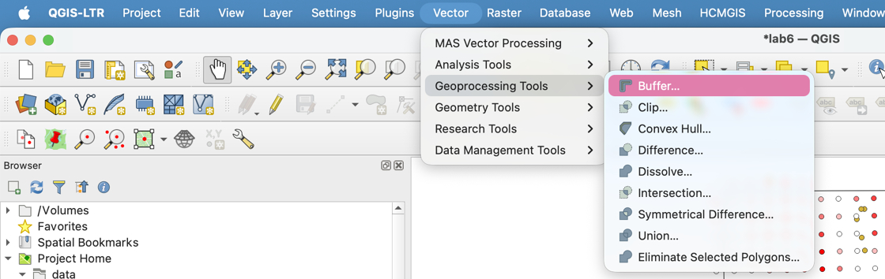
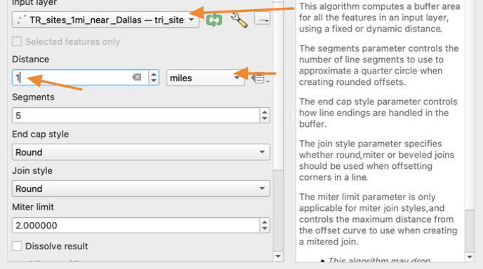
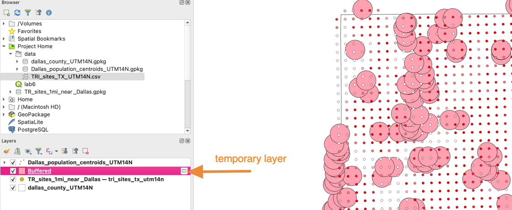

# How to Create Buffer Layer

1. Click **Vector &gt; Geoprocessing Tools &gt; Buffer…**

    

2. For **Input layer** select the **TR_sites_1mi_near_Dallas** layer

    For **Distance**, select **1 mile**

    

3. Click **Run**. When the process is complete, click **Close**.

4. We now have a layer of 1-mile buffers around every TR site. Notice that by default, the buffer layer is a temporary layer. This means if you close QGIS, this layer will disappear.

    

5. Examine the Attribute Table of our new **Buffered** layer. Notice that it is exactly the same as the original TRI_sites table.

