# How to join attributes by location

1. Click **Processing &gt;** "Toolbox"

    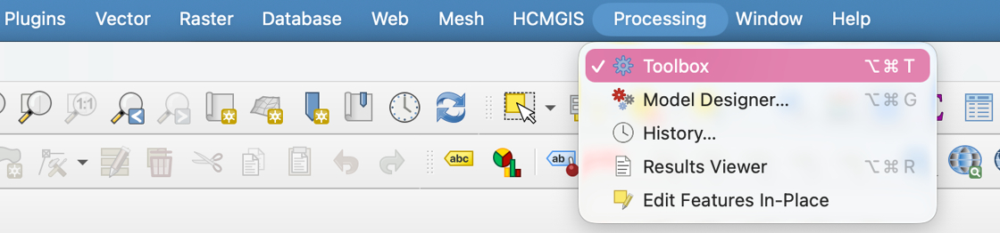

2. Search for "summary" and double-click "Join attributes by location (summary)" under **Vector general**

    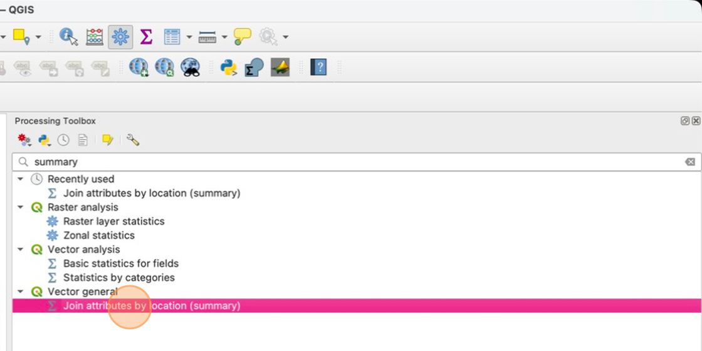

3. We want to **Join to features in** the Buffered layer, **where the features intersect** **by comparing to** the Dallas_population_centroids layer.

    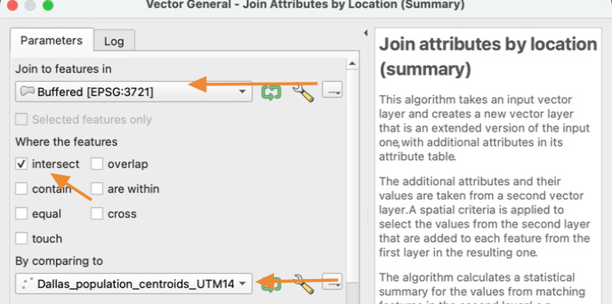

4. Click the three dots next to the **Fields to summarize** option, then select "population" and click **OK**.

    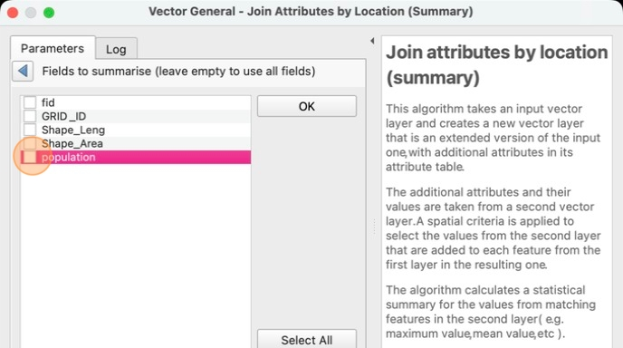

5. Click the three dots next to the **Summaries to calculate** option, then select "sum" and click **OK**

    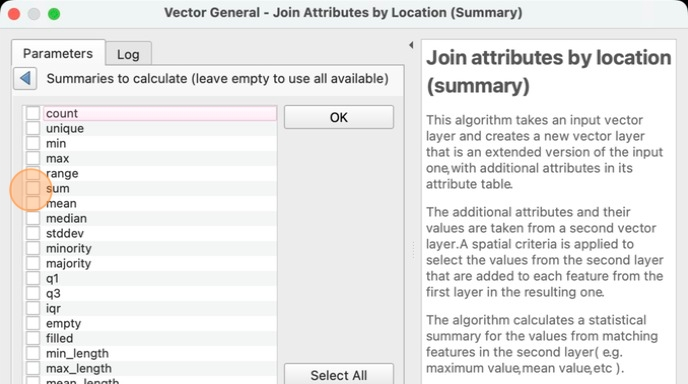

6. Click the three dots next to the **Joined layer** option, then click "Save to File…"

    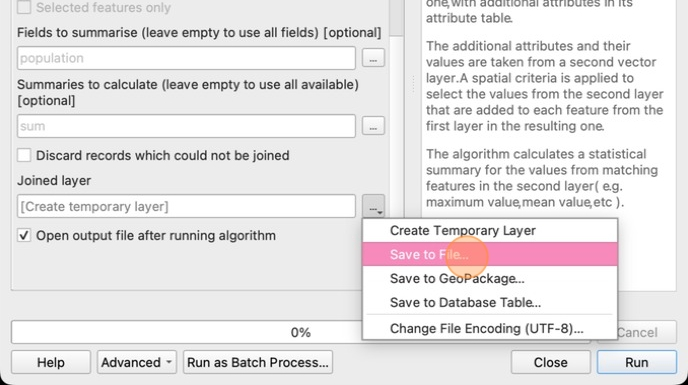

7. save the file as "affected_population.gpkg" in your **lab 6 folder**

    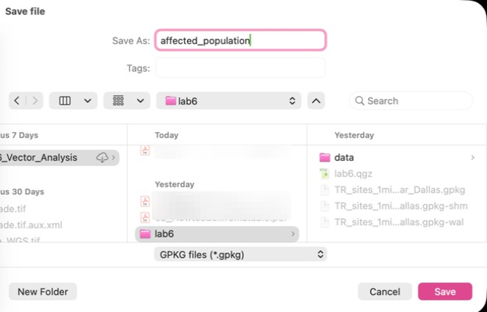

8. Make sure the "Open output file after running" option is selected then click "Run"

    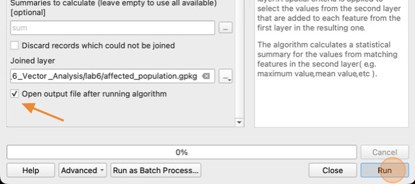

9. Click **close** when the operation completes

10. Change the symbology of the **affected_population** layer to **Graduated** by the value of the **population_sum** field. You can pick any color ramp and number of categories that you like.

    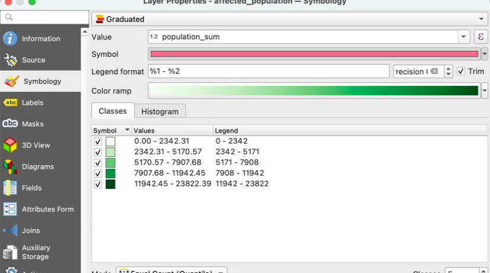

11. Click the colored bar next to **Symbol** to open **Symbol Settings**

    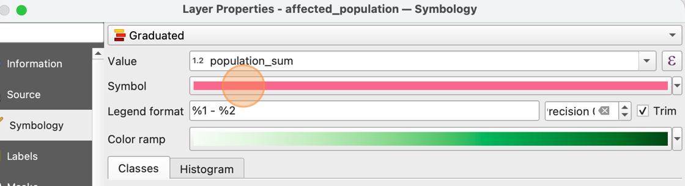

12. Click "Simple Fill" to select it

    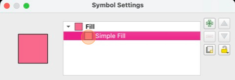

13. Click the down arrow next to **Stroke color** and select **Transparent Stroke**

    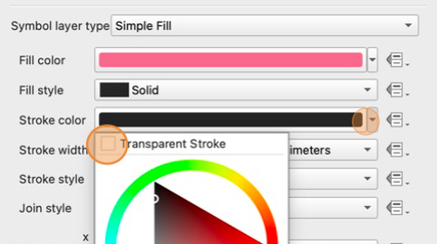

14. Click **OK** to apply the stroke color settings

15. In the affected_population symbology window, change the opacity to 50%. Click **OK** to apply the symbology

    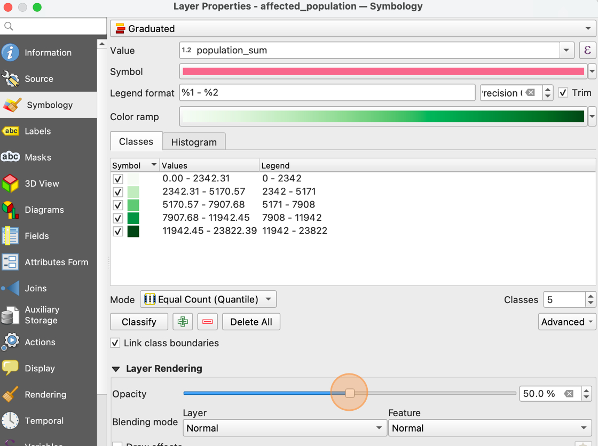

16. Remove the temporary layer called **Buffer** from the layer panel

    We now have a buffer layer that is color-coded by the population within 1 mile of each site. This will be assessed on your final layout.

    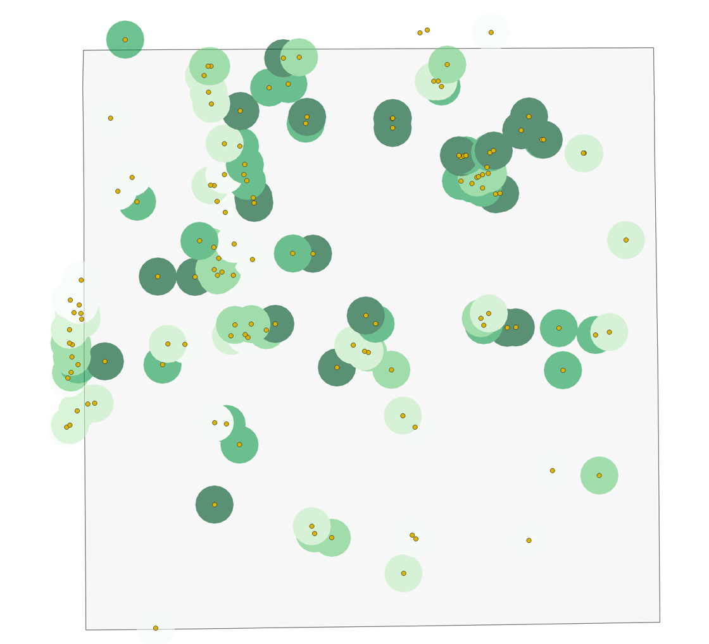

17. To the see the total population affected by all the sites, we can use the **Show statistical summary tool** we learned about in Lab 2. Take note of the Sum of all the populations affected: this number needs to be included in your final layout

    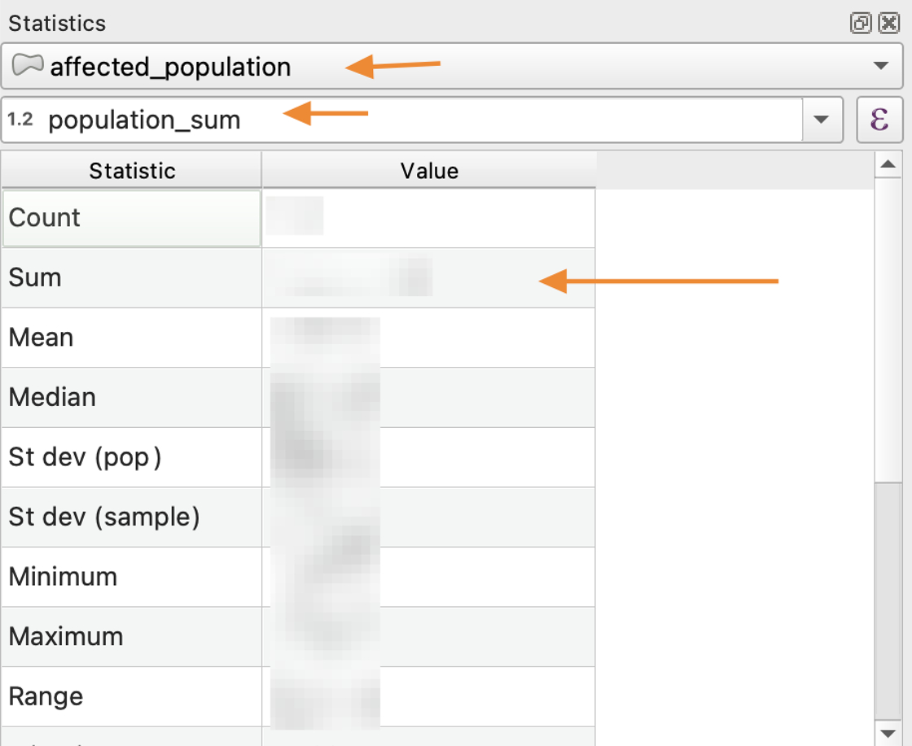

    The statistical summary tool may show large numbers in **Scientific Notation**. Be sure to convert the number to standard notation when including it on your layout. 

18. Open the "Join attributes by location (summary)" tool from the Processing toolbox.

19. Now we want to count how many Toxic Release (TR) sites are inside Dallas County. Set the tool to **Join to features in** dallas_county_UTM14N **Where the features intersect** **By comparing to** TR_sites_1mi_near_dallas

    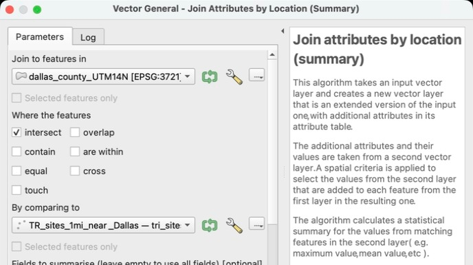

20. Select **Fields to Summarize** as **ID** and the **Summaries to calculate** as "unique". This will count the number of unique station IDs that are for stations inside the Dallas County Borders. Save the Joined layer as "Dallas_county_TR_summary.gpkg" in your lab 6 folder, and click **Run**.

    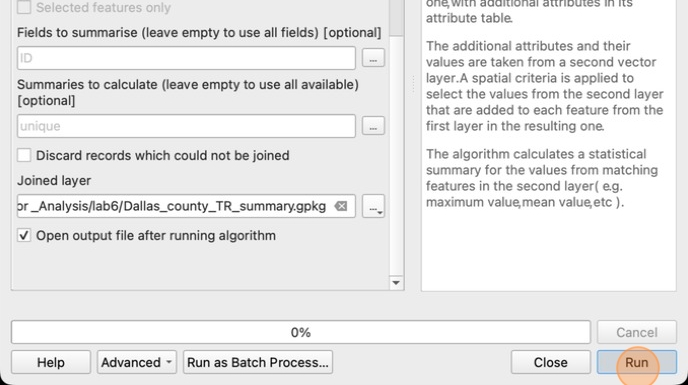

21. When the operation completes, click **Close**

22. Remove the Dallas_county_UTM14  and the population_centroids layers from your layer panel

23. Open the attribute table of your new Dallas_county_TR_summary layer. Note the ID_unique column, which is the result of our join operation. This is how many TR sites lie within the borders of Dallas County. Take note of this number to include on your map layout

    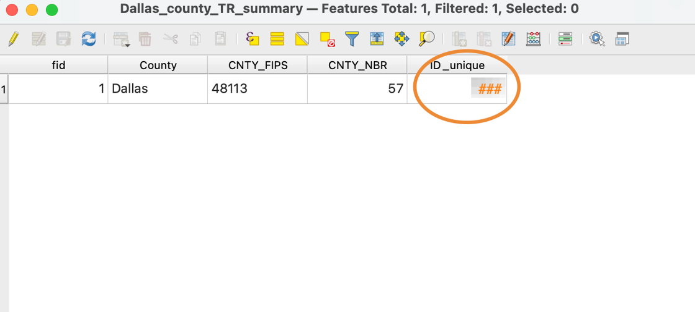

