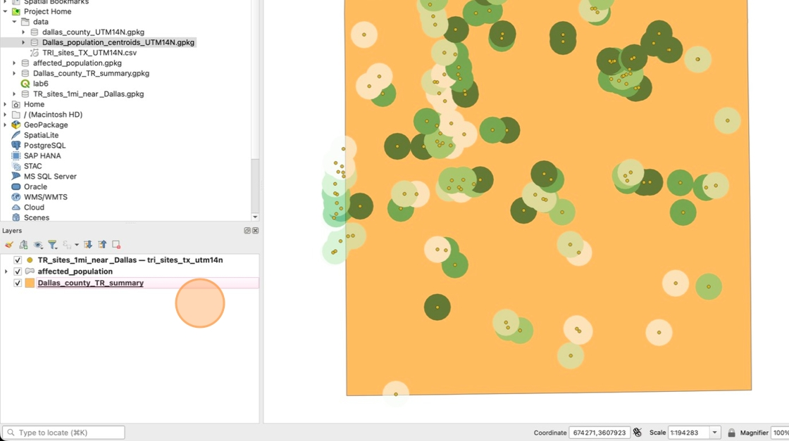
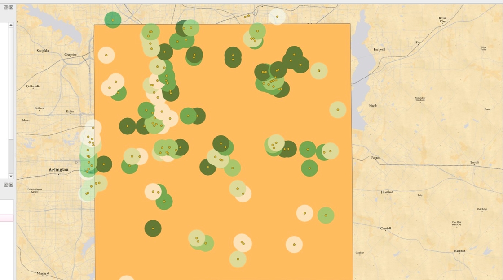
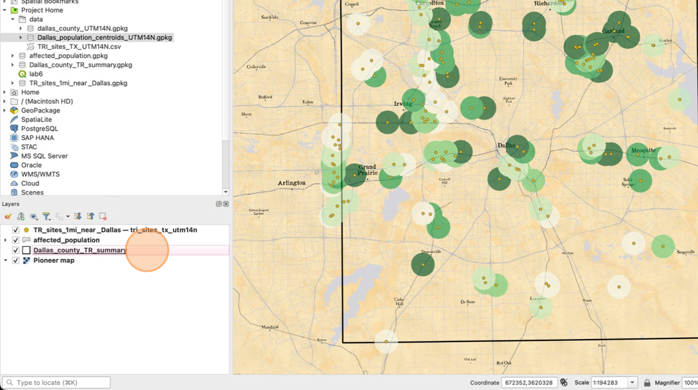
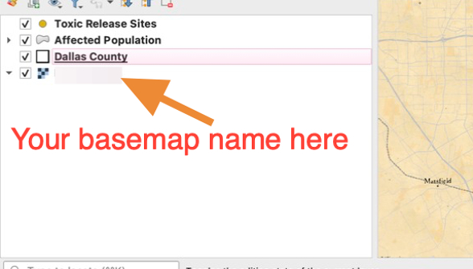
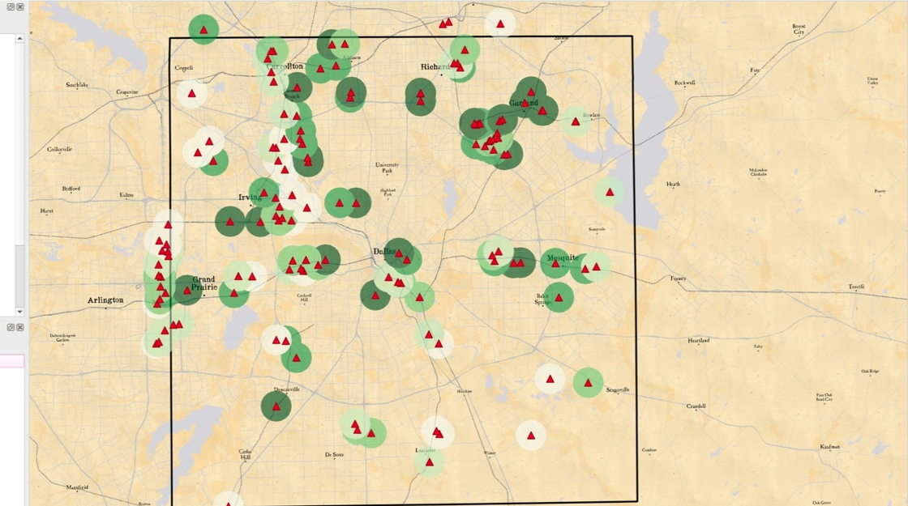
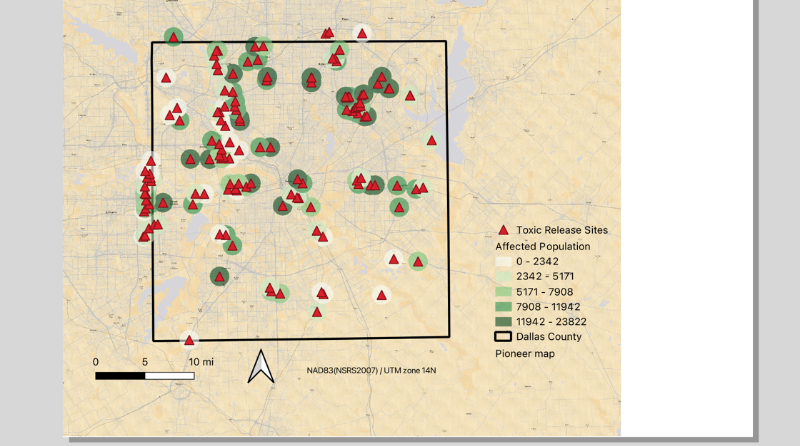
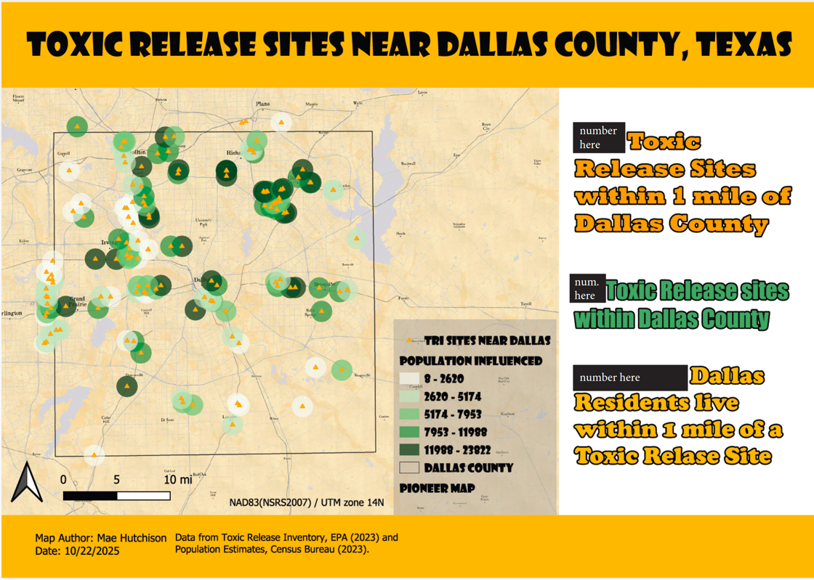

# Lab 6 Layout Requirements

1. Make sure you only have three layers in your project:

    - TR_sites_1mi_near_Dallas
    - affected_populations
    - Dallas_county_TR_summary

    

2. Use what you learned in lab 4 to add a base map from the Quick Map Service or using HCMGIS from lab 5. It can be any base map you like, as long as it is visible in your final layout

    

3. Update the Dallas_county_TR_Summary to have a transparent fill so that the basemap can be clearly seen inside the county

    

4. Rename all your layers to appropriate names for how they will be displayed on the map legend

    

5. Change the Toxic Release Sites Symbology to any non-circle shape (it can be a triangle, square, rhombus, star, etc.)

    

6. Create a new print layout called "Toxic Release Sites". You may adjust the page size and orientation to any size you like. You do not need to set any page guides or margins for this layout.

7. Add a map, scale bar (in miles), north arrow, legend, and CRS information to your layout. You may adjust the fonts, backgrounds, and text sizes however you like

    

8. Decide if you want to complete the remainder of the layout requirements in QGIS or in another software of your choice such as PowerPoint, Canva, etc. 

    If you want to use another software, export the current layout as an image file such as JPG or PNG and add the map image to the software you'd like to use.

    If you want to stay in QGIS, add the remaining required elements to your layout using the skills you learned in previous labs, and export the final layout as a PDF file.

    It is recommended that you **do not use Keynote or Pages Mac software** to complete this assignment. These files are not compatible with eLearning. If you turn in a .pages or .keynote file, you will receive a **zero** for this lab.

9. Add a title, map author, and date to your layout

10. Add the following data source information to your layout:

    `Data from Toxic Release Inventory, EPA (2023) and Population Estimates, Census Bureau (2023).`

11. Add the three summary statistics you calculated during the lab:

    - Number of Toxic Release Sites within 1 mile of Dallas County
    - Number of Toxic Release Sites within the borders of Dallas County
    - Total Dallas County Population living within 1 mile of a Toxic Release Site

    Bonus: You can receive up to 10 bonus points for creativity and style of your layout. Adjust fonts, colors, and sizes of elements to create a unique and appealing design.
    

    

12. Use your lab report checklist to double check that you have included all required elements

13. Save your final layout as a .PDF file and upload it to eLearning with your Lab Report checklist