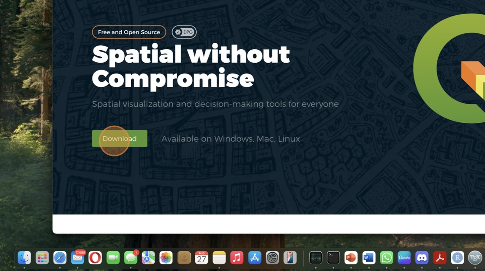
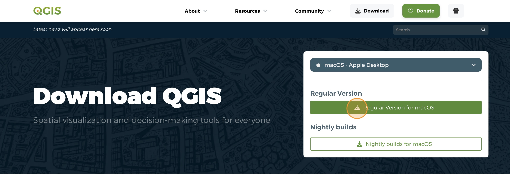
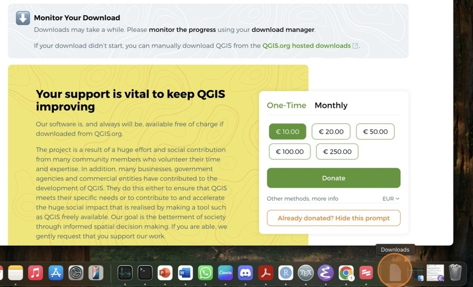
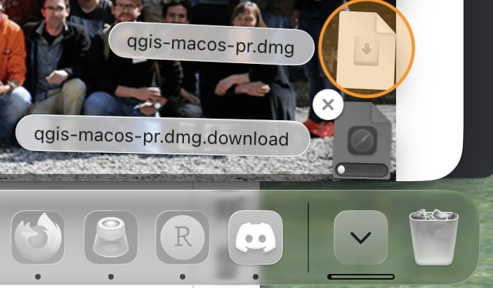
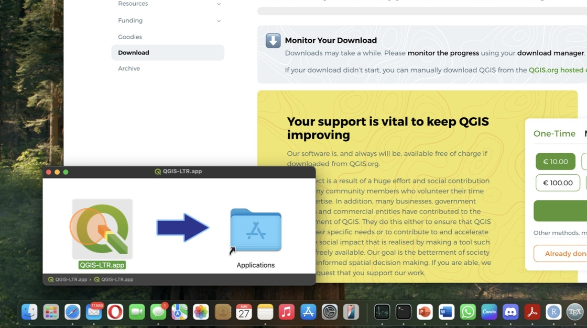
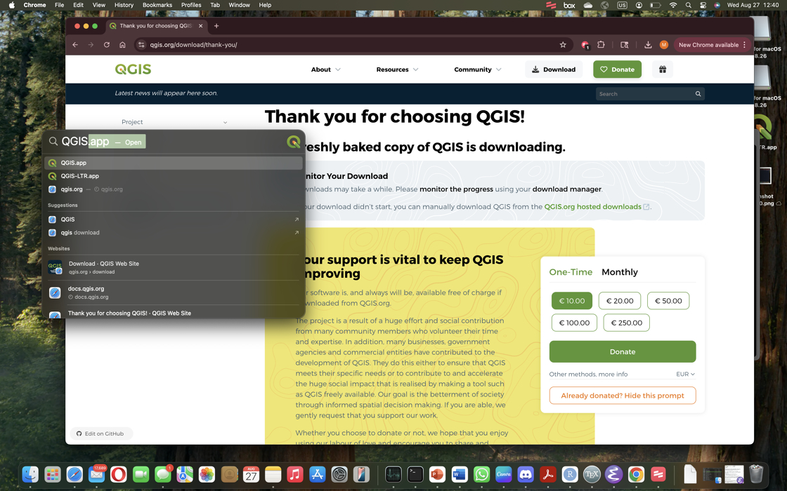
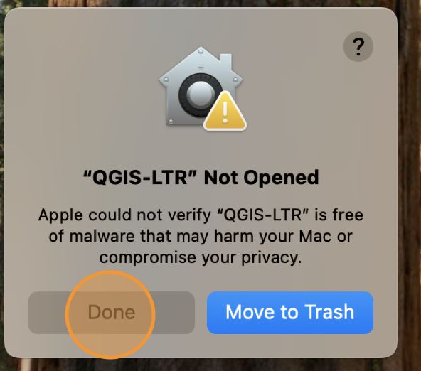
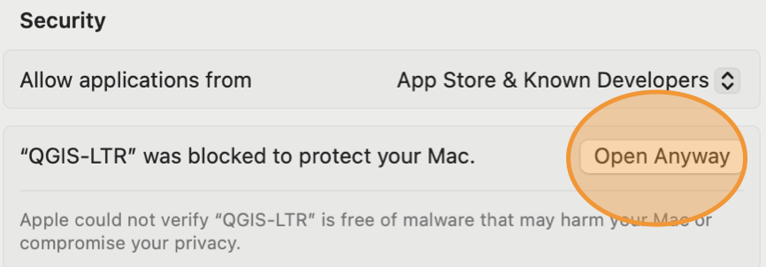

# Install QGIS on MacOS

This guide works for most Macs and Mac Books (both Intel and Apple Silicon processors). 

*If you have an Apple Silicon processor (Mac laptops made after 2020), you may be prompted to install Rosetta during the installation. Please accept and install this software when prompted*

1\. Navigate to [QGIS.org](https://QGIS.org){:target="_blank"} in your browser

2\. Click **Download**

3\. Click **Skip it and go to download**

4\. Click **Regular Version for macOS**. The download should start automatically. 

 

5\. Once the download is **complete**, click **"Downloads" Folder** in your dock. 

 *Note that the download is quite large and may take a up to an hour to complete, depending on your Internet speed*

6\. Click the **qgis-macos-pr.dmg** file

*You only need to click once. The file may take a few seconds to open.*

7\. Click and drag "QGIS-PR.app" to the "Applications" folder

8\. **Press Command (⌘) key and space bar** at the same time to open Spotlight search. **Type "QGIS"**. When the app appears in the results, **press the return key** to open the application.

If you get a security warning when trying to open the file, click "Done" (do not move it to Trash).

Navigate to your security settings and click "Open Anyway"

DO NOT update QGIS after your first installation. Even if QGIS prompts you to, always dismiss the notification. For this class, it is important that all students are using the same version of QGIS.