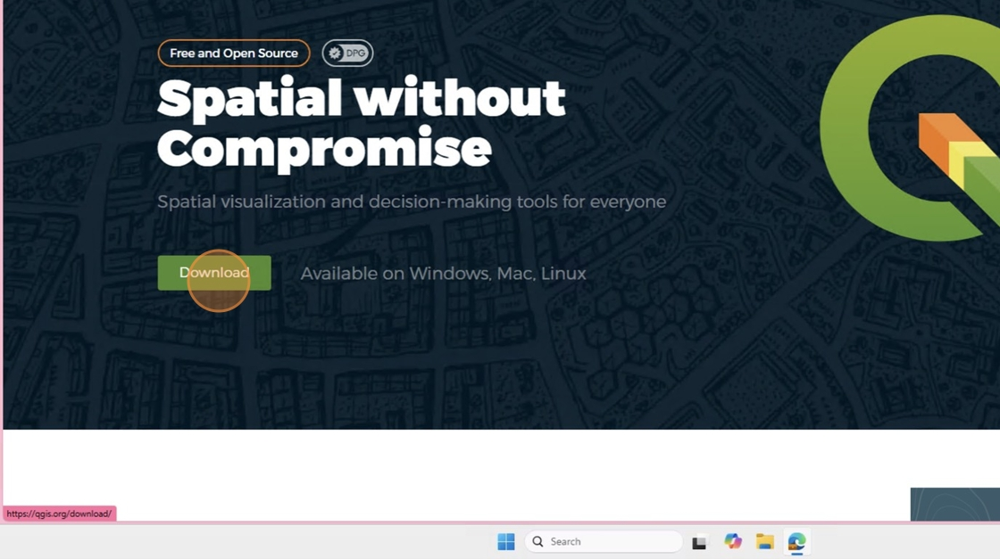
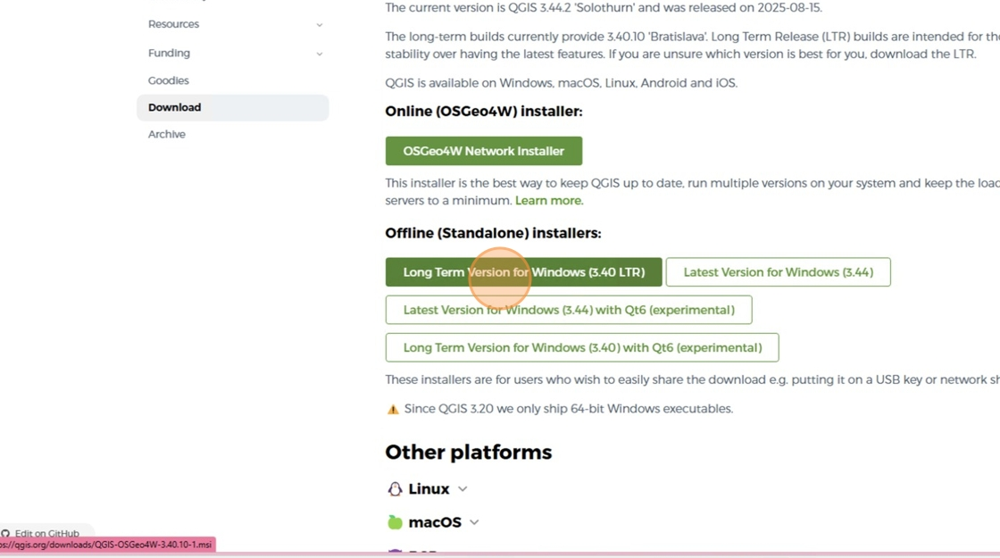
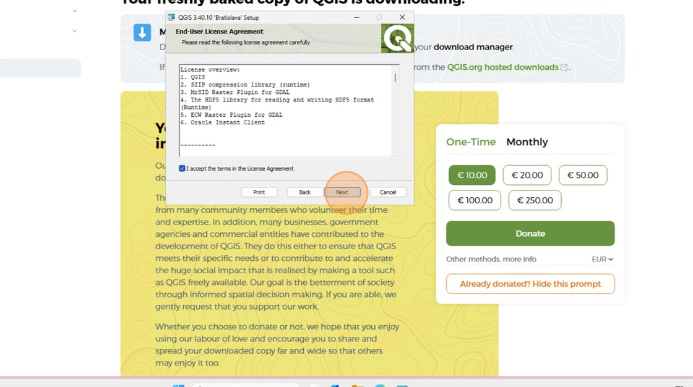
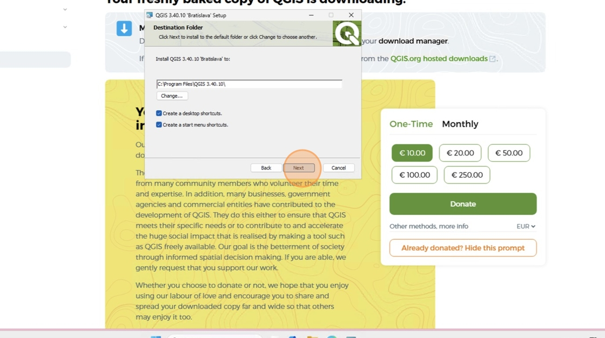
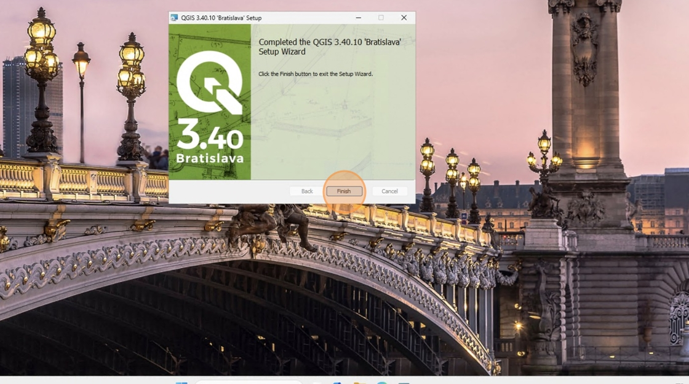
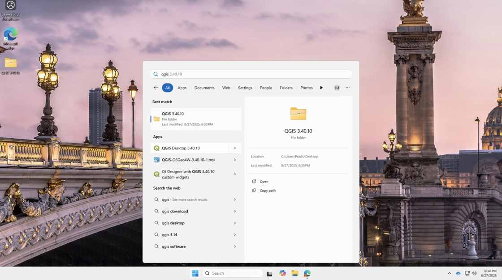
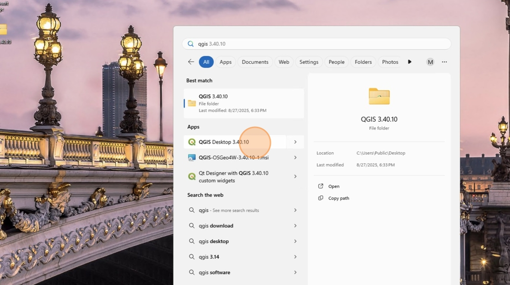

# Install QGIS on Windows

This guide works for PCs and Laptops running Windows 10 or 11. **Download and installation of the software may take up to an hour to complete**

1\. Navigate to [QGIS.org](https://QGIS.org){:target="_blank"} in your browser

2\. Click **Download**

3\. Click **Skip it and go to download**

4\. Click **Long Term Version for Windows (3.40 LTR)**

5\. Once the download is complete, click **"Downloads"** Icon in your browser and then click the **QGIS-OSGeo4W.msi** file

*Note that the download is quite large and may take a few minutes to complete.*

6\. In the installer window, click **Next**

7\. Agree to the License Agreement and click **Next**

8\. Click **Next**

9\. Click **Install**

10\. Click **Finish**

11\. Press the Windows key (⊞) to open the Start Menu and type **QGIS**

12\. Under the **Apps** section, click **QGIS Desktop** to open the application

DO NOT update QGIS after your first installation. Even if QGIS prompts you to, always dismiss the notification. For this class, it is important that all students are using the same version of QGIS.